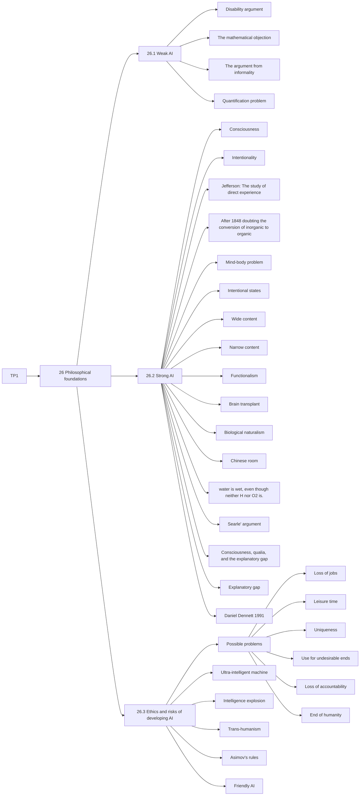

# TP1
## Summary AIMA 26

26 Philosophical foundations

Strong AI vs Weak AI

26.1 Weak AI
Machines can think <=> Submarines can swim

Disability argument

The “argument from disability” makes the claim that “a machine can never do X.”

The mathematical objection

Gödel's incompleteness theorem: all systems cannot prove some statements
Humans can't either: Lucas cannot consistently assert that this sentence is true

The argument from informality

human behavior is far too complex to be captured by any simple set of rules and that because computers can do no more than follow a set of rules, they cannot generate behavior as intelligent
as that of humans.

"Quantification problem"

26.2 Strong AI

Not until a machine could write a sonnet or compose a concerto because of thoughts and
emotions felt, and not by the chance fall of symbols, could we agree that machine equals
brain—that is, not only write it but know that it had written it.

consciousness: the machine has to be aware of its own mental states and actions.

intentionality: that is, whether the machine’s purported beliefs, desires, and other representations are actually “about” something in the real world.

Jefferson: The study of direct experience: the machine has to actually feel emotions.

After 1848 doubting the conversion of inorganic to organic. Urea's successful synthesis unified chemists, disproving the intrinsic difference. Tests couldn't expose any disparity in artificial urea.
A similar argument can be used for thinking or simulation of thinking, thus, two things are the same if they are indistinguishable, even if their origins diverge

Mind-body problem:

Dualism[mind separated from body], Monism[mind and body are physical], Physicalism[Ideas and thoughts are physical]

Intentional states:

They refer to the external world

You can't have the same physical arrangement of atoms in your brain while thinking two different things

Wide content: Omniscient, if you are in a simulation, you will never be able to be "eating a hamburger"

Narrow content: Perspective, if you think you are "eating a hamburger" then you might as well be.

Functionalism

Given the same task to two isomorphic thought processes, they will think the same things and go through the same states of mind.

Brain transplant:

If you replace each neuron one at a time, what happens to your consciousness?

1. It remains intact
2. You instantly lose control over your body, but the external behaviour remains the same

Biological naturalism:

Something intrinsic to the neurons

Chinese room

Random person that doesn't know chinese in a room + book that has mapped input and outputs

input on paper, output on paper, no knowledge of chinese in the room, but it might seem like it

water is wet, even though neither H nor O2 is.

Searle says:
1. Computer programs are formal (syntactic).
2. Human minds have mental contents (semantics).
3. Syntax by itself is neither constitutive of nor sufficient for semantics.
4. Brains cause minds.

Axiom 3 is usually the most disputed because it denies functionalism

They say it's an intuition pump

Consciousness, qualia, and the explanatory gap

Consciousness = understanding + self-awareness.

qualia = intrinsic nature of experiences

inverted spectrum thought experiment:

X sees red as what we would call green, but is used to it

explanatory gap: humans are simply incapable of forming a proper understanding of their own consciousness.

Daniel Dennett (1991), avoid the gap by denying the existence of qualia, attributing them to philosophical confusion

26.3 Ethics and risks of developing AI

Possible problems

• Loss of jobs

Yes, but actually if you wanted to switch back, it would be too expensive to pay humans to do those jobs

• People might have too much (or too little) leisure time.

If AI exists, it would give us less to do.

working +10% =?> +100% income.

So there is increasing pressure on everyone to work harder

• People might lose their sense of being unique.

AI may be at least as threatening to the moral assumptions of 21st-century society as Darwin’s theory of evolution was to those of the 19th century.

• Use towards undesirable ends.

science is useful if its development accentuates the existing inequalities in the distribution of wealth

or more directly promotes the destruction of human life

• Loss of accountability.

If a doctor follows a choice by an AI, that kills the patient, who is responsible?

• The success of AI might mean the end of the human race

Technology can cause harm in the wrong hands.

Technology can be used by technology.

Technology could end mankind

A small error in judgement could have catastrophic consequences

Selecting the right utility function is complicated in these circumstances

Minimize human suffering; No humans = No suffering

Ultra-intelligent machine: Better than humans in all tasks (AGI), Would cause intelligence explosion, the last thing man would need to make (And then it might end us or not)

Intelligence explosion = technological singularity

We can't really compute stuff above NEXPTIME without surpassing the speed of light

Trans-humanism supports the replacement of humans by AI

We might as well try to make the super-intelligent AI we make at least kind to us

Asimov's rules:
1. A robot may not injure a human being or, through inaction, allow a human being to come to harm.
2. A robot must obey orders given to it by human beings, except where such orders would conflict with the First Law.
3. A robot must protect its own existence as long as such protection does not conflict with the First or Second Law.

Friendly AI:

We must know that if we design an AI that won't harm us, first it might be flawed, second it will evolve

## Mermaid mind map

