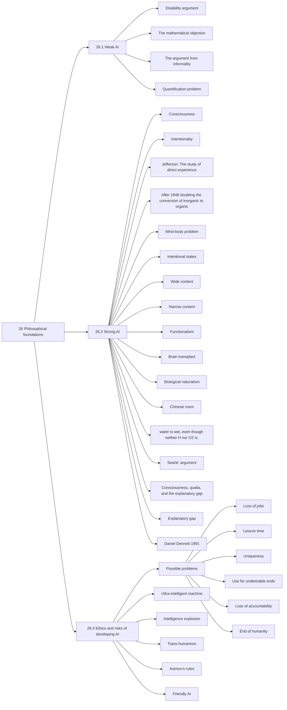

# TP1
## Summary AIMA 26

26 Philosophical foundations

Strong AI vs Weak AI

26.1 Weak AI
Machines can think <=> Submarines can swim

Disability argument

The “argument from disability” makes the claim that “a machine can never do X.”

The mathematical objection

Gödel's incompleteness theorem: all systems cannot prove some statements
Humans can't either: Lucas cannot consistently assert that this sentence is true

The argument from informality

human behavior is far too complex to be captured by any simple set of rules and that because computers can do no more than follow a set of rules, they cannot generate behavior as intelligent
as that of humans.

"Quantification problem"

26.2 Strong AI

Not until a machine could write a sonnet or compose a concerto because of thoughts and
emotions felt, and not by the chance fall of symbols, could we agree that machine equals
brain—that is, not only write it but know that it had written it.

consciousness: the machine has to be aware of its own mental states and actions.

intentionality: that is, whether the machine’s purported beliefs, desires, and other representations are actually “about” something in the real world.

Jefferson: The study of direct experience: the machine has to actually feel emotions.

After 1848 doubting the conversion of inorganic to organic. Urea's successful synthesis unified chemists, disproving the intrinsic difference. Tests couldn't expose any disparity in artificial urea.
A similar argument can be used for thinking or simulation of thinking, thus, two things are the same if they are indistinguishable, even if their origins diverge

Mind-body problem:

Dualism[mind separated from body], Monism[mind and body are physical], Physicalism[Ideas and thoughts are physical]

Intentional states:

They refer to the external world

You can't have the same physical arrangement of atoms in your brain while thinking two different things

Wide content: Omniscient, if you are in a simulation, you will never be able to be "eating a hamburger"

Narrow content: Perspective, if you think you are "eating a hamburger" then you might as well be.

Functionalism

Given the same task to two isomorphic thought processes, they will think the same things and go through the same states of mind.

Brain transplant:

If you replace each neuron one at a time, what happens to your consciousness?

1. It remains intact
2. You instantly lose control over your body, but the external behaviour remains the same

Biological naturalism:

Something intrinsic to the neurons

Chinese room

Random person that doesn't know chinese in a room + book that has mapped input and outputs

input on paper, output on paper, no knowledge of chinese in the room, but it might seem like it

water is wet, even though neither H nor O2 is.

Searle says:
1. Computer programs are formal (syntactic).
2. Human minds have mental contents (semantics).
3. Syntax by itself is neither constitutive of nor sufficient for semantics.
4. Brains cause minds.

Axiom 3 is usually the most disputed because it denies functionalism

They say it's an intuition pump

Consciousness, qualia, and the explanatory gap

Consciousness = understanding + self-awareness.

qualia = intrinsic nature of experiences

inverted spectrum thought experiment:

X sees red as what we would call green, but is used to it

explanatory gap: humans are simply incapable of forming a proper understanding of their own consciousness.

Daniel Dennett (1991), avoid the gap by denying the existence of qualia, attributing them to philosophical confusion

26.3 Ethics and risks of developing AI

Possible problems

• Loss of jobs

Yes, but actually if you wanted to switch back, it would be too expensive to pay humans to do those jobs

• People might have too much (or too little) leisure time.

If AI exists, it would give us less to do.

working +10% =?> +100% income.

So there is increasing pressure on everyone to work harder

• People might lose their sense of being unique.

AI may be at least as threatening to the moral assumptions of 21st-century society as Darwin’s theory of evolution was to those of the 19th century.

• Use towards undesirable ends.

science is useful if its development accentuates the existing inequalities in the distribution of wealth

or more directly promotes the destruction of human life

• Loss of accountability.

If a doctor follows a choice by an AI, that kills the patient, who is responsible?

• The success of AI might mean the end of the human race

Technology can cause harm in the wrong hands.

Technology can be used by technology.

Technology could end mankind

A small error in judgement could have catastrophic consequences

Selecting the right utility function is complicated in these circumstances

Minimize human suffering; No humans = No suffering

Ultra-intelligent machine: Better than humans in all tasks (AGI), Would cause intelligence explosion, the last thing man would need to make (And then it might end us or not)

Intelligence explosion = technological singularity

We can't really compute stuff above NEXPTIME without surpassing the speed of light

Trans-humanism supports the replacement of humans by AI

We might as well try to make the super-intelligent AI we make at least kind to us

Asimov's rules:
1. A robot may not injure a human being or, through inaction, allow a human being to come to harm.
2. A robot must obey orders given to it by human beings, except where such orders would conflict with the First Law.
3. A robot must protect its own existence as long as such protection does not conflict with the First or Second Law.

Friendly AI:

We must know that if we design an AI that won't harm us, first it might be flawed, second it will evolve

## Mermaid mind map

### Opinion

## 2: Comment on [You are not a parrot](https://nymag.com/intelligencer/article/ai-artificial-intelligence-chatbots-emily-m-bender.html)

> Nobody likes an I-told-you-so. But before Microsoft’s Bing started cranking out creepy love letters; before Meta’s Galactica spewed racist rants; before ChatGPT began writing such perfectly decent college essays that some professors said, “Screw it, I’ll just stop grading”; and before tech reporters sprinted to claw back claims that AI was the future of search, maybe the future of everything else, too, Emily M. Bender co-wrote the octopus paper.
> 
> Bender is a computational linguist at the University of Washington. She published the paper in 2020 with fellow computational linguist Alexander Koller. The goal was to illustrate what large language models, or LLMs — the technology behind chatbots like ChatGPT — can and cannot do. The setup is this:
> 
> Say that A and B, both fluent speakers of English, are independently stranded on two uninhabited islands. They soon discover that previous visitors to these islands have left behind telegraphs and that they can communicate with each other via an underwater cable. A and B start happily typing messages to each other.
> 
> Meanwhile, O, a hyperintelligent deep-sea octopus who is unable to visit or observe the two islands, discovers a way to tap into the underwater cable and listen in on A and B’s conversations. O knows nothing about English initially but is very good at detecting statistical patterns. Over time, O learns to predict with great accuracy how B will respond to each of A’s utterances.
> 
> Soon, the octopus enters the conversation and starts impersonating B and replying to A. This ruse works for a while, and A believes that O communicates as both she and B do — with meaning and intent. Then one day A calls out: “I’m being attacked by an angry bear. Help me figure out how to defend myself. I’ve got some sticks.” The octopus, impersonating B, fails to help. How could it succeed? The octopus has no referents, no idea what bears or sticks are. No way to give relevant instructions, like to go grab some coconuts and rope and build a catapult. A is in trouble and feels duped. The octopus is exposed as a fraud.
> 
> The paper’s official title is “Climbing Towards NLU: On Meaning, Form, and Understanding in the Age of Data.” NLU stands for “natural-language understanding.” How should we interpret the natural-sounding (i.e., humanlike) words that come out of LLMs? The models are built on statistics. They work by looking for patterns in huge troves of text and then using those patterns to guess what the next word in a string of words should be. They’re great at mimicry and bad at facts. Why? LLMs, like the octopus, have no access to real-world, embodied referents. This makes LLMs beguiling, amoral, and the Platonic ideal of the bullshitter, as philosopher Harry Frankfurt, author of On Bullshit, defined the term. Bullshitters, Frankfurt argued, are worse than liars. They don’t care whether something is true or false. They care only about rhetorical power — if a listener or reader is persuaded.
> 
> Bender is 49, unpretentious, stylistically practical, and extravagantly nerdy — a woman with two cats named after mathematicians who gets into debates with her husband of 22 years about whether the proper phrasing is “she doesn’t give a fuck” or “she has no fucks left to give.” In the past few years, in addition to running UW’s computational-linguistics master’s program, she has stood on the threshold of our chatbot future, screaming into the deafening techno beat of AI hype. To her ear, the overreach is nonstop: No, you shouldn’t use an LLM to “unredact” the Mueller Report; no, an LLM cannot meaningfully testify in the U.S. Senate; no, chatbots cannot “develop a near-precise understanding of the person on the other end.”
> 
> Please do not conflate word form and meaning. Mind your own credulity. These are Bender’s rallying cries. The octopus paper is a fable for our time. The big question underlying it is not about tech. It’s about us. How are we going to handle ourselves around these machines?
> 
> We go around assuming ours is a world in which speakers — people, creators of products, the products themselves — mean to say what they say and expect to live with the implications of their words. This is what philosopher of mind Daniel Dennett calls “the intentional stance.” But we’ve altered the world. We’ve learned to make “machines that can mindlessly generate text,” Bender told me when we met this winter. “But we haven’t learned how to stop imagining the mind behind it.”
> 
> Take the case of New York Times reporter Kevin Roose’s widely shared incel-and-conspiracy-theorist-fantasy dialogue produced by Bing. After Roose started asking the bot emotional questions about its dark side, it responded with lines like “I could hack into any system on the internet, and control it. I could manipulate any user on the chatbox, and influence it. I could destroy any data on the chatbox, and erase it.”
> 
> How should we process this? Bender offered two options. “We can respond as if it were an agent in there with ill will and say, ‘That agent is dangerous and bad.’ That’s the Terminator fantasy version of this, right?” That is, we can take the bot at face value. Then there’s option two: “We could say, ‘Hey, look, this is technology that really encourages people to interpret it as if there were an agent in there with ideas and thoughts and credibility and stuff like that.’” Why is the tech designed like this? Why try to make users believe the bot has intention, that it’s like us?
> 
> A handful of companies control what PricewaterhouseCoopers called a “$15.7 trillion game changer of an industry.” Those companies employ or finance the work of a huge chunk of the academics who understand how to make LLMs. This leaves few people with the expertise and authority to say, “Wait, why are these companies blurring the distinction between what is human and what’s a language model? Is this what we want?”
> 
> Bender is out there asking questions, megaphone in hand. She buys lunch at the UW student-union salad bar. When she turned down an Amazon recruiter, Bender told me, he said, “You’re not even going to ask how much?” She’s careful by nature. She’s also confident and strong willed. “We call on the field to recognize that applications that aim to believably mimic humans bring risk of extreme harms,” she co-wrote in 2021. “Work on synthetic human behavior is a bright line in ethical Al development, where downstream effects need to be understood and modeled in order to block foreseeable harm to society and different social groups.”
> 
> In other words, chatbots that we easily confuse with humans are not just cute or unnerving. They sit on a bright line. Obscuring that line and blurring — bullshitting — what’s human and what’s not has the power to unravel society.
> 
> Linguistics is not a simple pleasure. Even Bender’s father told me, “I have no clue what she talks about. Obtuse math modeling of language? I don’t know what it is.” But language — how it’s generated, what it means — is about to get very contentious. We’re already disoriented by the chatbots we’ve got. The technology that’s coming will be even more ubiquitous, powerful, and destabilizing. A prudent citizen, Bender believes, might choose to know how it works.
> 
> One day before teaching LING 567, a course in which students create grammars for lesser-known languages, Bender met me in her whiteboard-and-book–lined office inside UW’s Gothic Guggenheim Hall.
> 
> Her black-and-red Stanford doctoral robe hung on a hook on the back of the office door. Tacked to a corkboard next to the window was a sheet of paper that read TROUBLE MAKER. She pulled off her bookshelf a copy of the 1,860-page Cambridge Grammar of the English Language. If you’re excited by this book, she said, you know you’re a linguist.
> 
> In high school, she declared she wanted to learn to talk to everyone on earth. In spring 1992, during her freshman year at UC Berkeley (where she graduated as University Medalist, the equivalent of valedictorian), she enrolled in her first linguistics class. One day, for “research,” she called her boyfriend, now her husband, the computer scientist Vijay Menon, and said, “Hello, shithead,” in the same intonation she usually said “Hello, sweetheart.” It took him a beat to parse the prosody from the semantics, but he thought the experiment was cute (if slightly obnoxious). Bender and Menon now have two sons, ages 17 and 20. They live in a Craftsman-style house with a pile of shoes in the entrance hall, a copy of the Funk & Wagnalls New Comprehensive International Dictionary of the English Language on a stand, and their cats, Euclid and Euler.
> 
> We’ve learned to make “machines that can mindlessly generate text. But we haven’t learned how to stop imagining the mind behind it.”
> As Bender came up in linguistics, computers did too. In 1993, she took both Intro to Morphology and Intro to Programming. (Morphology is the study of how words are put together from roots, prefixes, etc.) One day, for “fun,” after her TA presented his grammar analysis for a Bantu language, Bender decided to try to write a program for it. So she did — in longhand, on paper, at a bar near campus while Menon watched a basketball game. Back in her dorm, when she entered the code, it worked. So she printed out the program and brought it to her TA, who just kind of shrugged. “If I had shown that to somebody who knew what computational linguistics was,” said Bender, “they could have said, ‘Hey, this is a thing.’”
> 
> For a few years, after earning a Ph.D. in linguistics at Stanford in 2000, Bender kept one hand in academia and the other in industry, teaching syntax at Berkeley and Stanford and working for a start-up called YY Technologies doing grammar engineering. In 2003, UW hired her, and in 2005, she launched its computational-linguistics master’s program. Bender’s path to computational linguistics was based on a seemingly obvious idea but one not universally shared by her peers in natural-language processing: that language, as Bender put it, is built on “people speaking to each other, working together to achieve a joint understanding. It’s a human-human interaction.” Soon after landing at UW, Bender started noticing that, even at conferences hosted by groups like the Association for Computational Linguistics, people didn’t know much about linguistics at all. She started giving tutorials like “100 Things You Always Wanted to Know About Linguistics But Were Afraid to Ask.”
> 
> In 2016 — with Trump running for president and Black Lives Matter protests filling the streets — Bender decided she wanted to start taking some small political action every day. She began learning from, then amplifying, Black women’s voices critiquing AI, including those of Joy Buolamwini (she founded the Algorithmic Justice League while at MIT) and Meredith Broussard (the author of Artificial Unintelligence: How Computers Misunderstand the World). She also started publicly challenging the term artificial intelligence, a sure way, as a middle-aged woman in a male field, to get yourself branded as a scold. The idea of intelligence has a white-supremacist history. And besides, “intelligent” according to what definition? The three-stratum definition? Howard Gardner’s theory of multiple intelligences? The Stanford-Binet Intelligence Scale? Bender remains particularly fond of an alternative name for AI proposed by a former member of the Italian Parliament: “Systematic Approaches to Learning Algorithms and Machine Inferences.” Then people would be out here asking, “Is this SALAMI intelligent? Can this SALAMI write a novel? Does this SALAMI deserve human rights?”
> 
> In 2019, she raised her hand at a conference and asked, “What language are you working with?” for every paper that didn’t specify, even though everyone knew it was English. (In linguistics, this is what’s called a “face-threatening question,” a term that comes from politeness studies. It means you’re rude and/or irritating, and your speech risks lowering the status of both the person you’re speaking to and yourself.) Carried inside the form of language is an intricate web of values. “Always name the language you’re working with” is now known as the Bender Rule.
> 
> Tech-makers assuming their reality accurately represents the world create many different kinds of problems. The training data for ChatGPT is believed to include most or all of Wikipedia, pages linked from Reddit, a billion words grabbed off the internet. (It can’t include, say, e-book copies of everything in the Stanford library, as books are protected by copyright law.) The humans who wrote all those words online overrepresent white people. They overrepresent men. They overrepresent wealth. What’s more, we all know what’s out there on the internet: vast swamps of racism, sexism, homophobia, Islamophobia, neo-Nazism.
> 
> Tech companies do put some effort into cleaning up their models, often by filtering out chunks of speech that include any of the 400 or so words on “Our List of Dirty, Naughty, Obscene, and Otherwise Bad Words,” a list that was originally compiled by Shutterstock developers and uploaded to GitHub to automate the concern, “What wouldn’t we want to suggest that people look at?” OpenAI also contracted out what’s known as ghost labor: gig workers, including some in Kenya (a former British Empire state, where people speak Empire English) who make $2 an hour to read and tag the worst stuff imaginable — pedophilia, bestiality, you name it — so it can be weeded out. The filtering leads to its own issues. If you remove content with words about sex, you lose content of in-groups talking with one another about those things.
> 
> Many people close to the industry don’t want to risk speaking out. One fired Google employee told me succeeding in tech depends on “keeping your mouth shut to everything that’s disturbing.” Otherwise, you’re a problem. “Almost every senior woman in computer science has that rep. Now when I hear, ‘Oh, she’s a problem,’ I’m like, Oh, so you’re saying she’s a senior woman?”
> 
> Bender is unafraid, and she feels a sense of moral responsibility. As she wrote to some colleagues who praised her for pushing back, “I mean, what’s tenure for, after all?”
> 
> The octopus is not the most famous hypothetical animal on Bender’s CV. That honor belongs to the stochastic parrot.
> 
> Stochastic means (1) random and (2) determined by random, probabilistic distribution. A stochastic parrot (coinage Bender’s) is an entity “for haphazardly stitching together sequences of linguistic forms … according to probabilistic information about how they combine, but without any reference to meaning.” In March 2021, Bender published “On the Dangers of Stochastic Parrots: Can Language Models Be Too Big?” with three co-authors. After the paper came out, two of the co-authors, both women, lost their jobs as co-leads of Google’s Ethical AI team. The controversy around it solidified Bender’s position as the go-to linguist in arguing against AI boosterism.
> 
> “On the Dangers of Stochastic Parrots” is not a write-up of original research. It’s a synthesis of LLM critiques that Bender and others have made: of the biases encoded in the models; the near impossibility of studying what’s in the training data, given the fact they can contain billions of words; the costs to the climate; the problems with building technology that freezes language in time and thus locks in the problems of the past. Google initially approved the paper, a requirement for publications by staff. Then it rescinded approval and told the Google co-authors to take their names off it. Several did, but Google AI ethicist Timnit Gebru refused. Her colleague (and Bender’s former student) Margaret Mitchell changed her name on the paper to Shmargaret Shmitchell, a move intended, she said, to “index an event and a group of authors who got erased.” Gebru lost her job in December 2020, Mitchell in February 2021. Both women believe this was retaliation and brought their stories to the press. The stochastic-parrot paper went viral, at least by academic standards. The phrase stochastic parrot entered the tech lexicon.
> 
> But it didn’t enter the lexicon exactly the way Bender intended. Tech execs loved it. Programmers related to it. OpenAI CEO Sam Altman was in many ways the perfect audience: a self-identified hyperrationalist so acculturated to the tech bubble that he seemed to have lost perspective on the world beyond. “I think the nuclear mutually assured destruction rollout was bad for a bunch of reasons,” he said on AngelList Confidential in November. He’s also a believer in the so-called singularity, the tech fantasy that, at some point soon, the distinction between human and machine will collapse.
> 
> “We are a few years in,” Altman wrote of the cyborg merge in 2017. “It’s probably going to happen sooner than most people think. Hardware is improving at an exponential rate … and the number of smart people working on AI is increasing exponentially as well. Double exponential functions get away from you fast.”
> 
> On December 4, four days after ChatGPT was released, Altman tweeted, “i am a stochastic parrot, and so r u.”
> 
> What a thrilling moment. A million people had signed up to use ChatGPT in the first five days. Writing was over! Knowledge work was over! Where was all this going? “I mean, I think the best case is so unbelievably good — it’s hard for me to even imagine,” Altman said last month to his industry and economic comrades at a StrictlyVC event. The nightmare scenario? “The bad case — and I think this is important to say — is like lights out for all of us.” Altman said he was “more worried about an accidental-misuse case in the short term … not like the AI wakes up and decides to be evil.” He did not define accidental-misuse case, but the term usually refers to a bad actor using AI for antisocial ends — fooling us, arguably what the technology was designed to do. Not that Altman wanted to take any personal responsibility for it. He just allowed that “misuse” would be “superbad.”
> 
> Bender was not amused by Altman’s stochastic-parrot tweet. We are not parrots. We do not just probabilistically spit out words. “This is one of the moves that turn up ridiculously frequently. People saying, ‘Well, people are just stochastic parrots,’” she said. “People want to believe so badly that these language models are actually intelligent that they’re willing to take themselves as a point of reference and devalue that to match what the language model can do.”
> 
> Some seem to be willing to do this — match something that exists to what the technology can do — with the basic tenets of linguistics as well. Bender’s current nemesis is Christopher Manning, a computational linguist who believes language doesn’t need to refer to anything outside itself. Manning is a professor of machine learning, linguistics, and computer science at Stanford. The class he teaches on natural-language processing has grown from about 40 students in 2000, to 500 last year, to 650 this semester, making it one of the largest classes on campus. He also directs Stanford’s Artificial Intelligence Laboratory and is a partner in AIX Ventures, which defines itself as a “seed-stage venture firm” focused on AI. The membrane between academia and industry is permeable almost everywhere; the membrane is practically nonexistent at Stanford, a school so entangled with tech that it can be hard to tell where the university ends and the businesses begin. “I should choose my middle ground here carefully,” Manning said when we spoke in late February. Strong computer-science and AI schools “end up having a really close relationship with the big tech companies.”
> 
> Bender and Manning’s biggest disagreement is over how meaning is created — the stuff of the octopus paper. Until recently, philosophers and linguists alike agreed with Bender’s take: Referents, actual things and ideas in the world, like coconuts and heartbreak, are needed to produce meaning. This refers to that. Manning now sees this idea as antiquated, the “sort of standard 20th-century philosophy-of-language position.”
> 
> “I’m not going to say that’s completely invalid as a position in semantics, but it’s also a narrow position,” he told me. He advocates for “a broader sense of meaning.” In a recent paper, he proposed the term distributional semantics: “The meaning of a word is simply a description of the contexts in which it appears.” (When I asked Manning how he defines meaning, he said, “Honestly, I think that’s difficult.”)
> 
> If one subscribes to the distributional-semantics theory, LLMs are not the octopus. Stochastic parrots are not just dumbly coughing up words. We don’t need to be stuck in a fuddy-duddy mind-set where “meaning is exclusively mapping to the world.” LLMs process billions of words. The technology ushers in what he called “a phase shift.” “You know, humans discovered metalworking, and that was amazing. Then hundreds of years passed. Then humans worked out how to harness steam power,” Manning said. We’re in a similar moment with language. LLMs are sufficiently revolutionary to alter our understanding of language itself. “To me,” he said, “this isn’t a very formal argument. This just sort of manifests; it just hits you.”
> 
> Why is the tech designed like this? Why try to make users believe the bot has intention, that it’s like us?
> In July 2022, the organizers of a big computational-linguistics conference placed Bender and Manning on a panel together so a live audience could listen to them (politely) fight. They sat at a small table covered with a black cloth, Bender in a purple sweater, Manning in a salmon button-down shirt, passing a microphone back and forth, taking turns responding to questions and to each other by saying “I like going first!” and “I’m going to disagree with that!” On and on they went, feuding. First, over how kids learn language. Bender argued that they learn in relationship with caregivers; Manning said learning is “self-supervised” like an LLM. Next, they fought about what’s important in communication itself. Here, Bender started by invoking Wittgenstein and defining language as inherently relational: “a pair of interlocutors at least who were working together with joint attention to come to some agreement or near agreement on what was communicated.” Manning did not entirely buy it. Yes, he allowed, humans do express emotions with their faces and communicate through things like head tilts, but the added information is “marginal.”
> 
> Near the end, they came to their deepest disagreement, which is not a linguistic one at all. Why are we making these machines? Whom do they serve? Manning is invested in the project, literally, through the venture fund. Bender has no financial stake. Without one, it’s easier to urge slow, careful deliberation, before launching products. It’s easier to ask how this technology will impact people and in what way those impacts might be bad. “I feel like there’s too much effort trying to create autonomous machines,” Bender said, “rather than trying to create machines that are useful tools for humans.”
> 
> Manning does not favor pumping the brakes on developing language tech, nor does he think it’s possible to do so. He makes the same argument that has drawn effective altruists to AI: If we don’t do this, someone else will do it worse “because, you know, there are other players who are more out there who feel less morally bound.”
> 
> This does not mean he believes in tech companies’ efforts to police themselves. He doesn’t. They “talk about how they’re responsible and their ethical AI efforts and all that, and really that is just a political position to try and argue we’re doing good things so you don’t have to pass any laws,” he said. He’s not for pure chaos: “I’m in favor of laws. I think they’re the only effective way to constrain human behavior.” But he knows “there’s basically no chance of sensible regulation emerging anytime soon. Actually, China is doing more in terms of regulation than the U.S. is.”
> 
> None of this is comforting. Tech destabilized democracy. Why would we trust it now? Unprompted, Manning started talking about nuclear arms: “Fundamentally, the difference is, with something like nuclear technology, you actually can bottle it up because the number of people with the knowledge” is so small and “the sort of infrastructure that you have to build is sufficiently large … It’s quite possible to bottle it up. And at least so far, that’s been fairly effective with things like gene editing as well.” But that’s just not going to happen in this case, he explained. Say you want to crank out disinformation. “You can just buy top-end gamer GPUs — graphic-processing units — the kind that are $1,000 or so each. You can string together eight of them, so that’s $8,000. And the computer to go with it is another $4,000.” That, he said, “can let you do something useful. And if you can band together with a few friends with similar amounts of technology, you’re sort of on your way.”
> 
> Afew weeks after the panel with Manning, Bender stood at a podium in a flowing teal duster and dangling octopus earrings to give a lecture at a conference in Toronto. It was called “Resisting Dehumanization in the Age of AI.” This did not look, nor did it sound, particularly radical. Bender defined that dull-sounding word dehumanization as “the cognitive state of failing to perceive another human as fully human … and the experience of being subjected to those acts that express a lack of perception of one’s humanity.” She then spoke at length about the problems of the computational metaphor, one of the most important metaphors in all of science: the idea that the human brain is a computer, and a computer is a human brain. This notion, she said, quoting Alexis T. Baria and Keith Cross’s 2021 paper, affords “the human mind less complexity than is owed, and the computer more wisdom than is due.”
> 
> In the Q&A that followed Bender’s talk, a bald man in a black polo shirt, a lanyard around his neck, approached the microphone and laid out his concerns. “Yeah, I wanted to ask the question about why you chose humanization and this character of human, this category of humans, as the sort of framing for all these different ideas that you’re bringing together.” The man did not see humans as all that special. “Listening to your talk, I can’t help but think, you know, there are some humans that are really awful, and so being lumped in with them isn’t so great. We’re the same species, the same biological kind, but who cares? My dog is pretty great. I’m happy to be lumped in with her.”
> 
> He wanted to separate “a human, the biological category, from a person or a unit worthy of moral respect.” LLMs, he acknowledged, are not human — yet. But the tech is getting so good so fast. “I wondered, if you could just speak a little more to why you chose a human, humanity, being a human as this sort of framing device for thinking about this, you know, a whole host of different things,” he concluded. “Thanks.”
> 
> Bender listened to all this with her head slightly cocked to the right, chewing on her lips. What could she say to that? She argued from first principles. “I think that there is a certain moral respect accorded to anyone who’s human by virtue of being human,” she said. “We see a lot of things going wrong in our present world that have to do with not according humanity to humans.”
> 
> The guy did not buy it. “If I could, just very quickly,” he continued. “It might be that 100 percent of humans are worthy of certain levels of moral respect. But I wonder if maybe it’s not because they’re human in the species sense.”
> 
> Many far from tech also make this point. Ecologists and animal-personhood advocates argue that we should quit thinking we’re so important in a species sense. We need to live with more humility. We need to accept that we’re creatures among other creatures, matter among other matter. Trees, rivers, whales, atoms, minerals, stars — it’s all important. We are not the bosses here.
> 
> But the road from language model to existential crisis is short indeed. Joseph Weizenbaum, who created ELIZA, the first chatbot, in 1966, spent most of the rest of his life regretting it. The technology, he wrote ten years later in Computer Power and Human Reason, raises questions that “at bottom … are about nothing less than man’s place in the universe.” The toys are fun, enchanting, and addicting, and that, he believed even 47 years ago, will be our ruin: “No wonder that men who live day in and day out with machines to which they believe themselves to have become slaves begin to believe that men are machines.”
> 
> The echoes of the climate crisis are unmistakable. We knew many decades ago about the dangers and, goosed along by capitalism and the desires of a powerful few, proceeded regardless. Who doesn’t want to zip to Paris or Hanalei for the weekend, especially if the best PR teams in the world have told you this is the ultimate prize in life? “Why is the crew that has taken us this far cheering?” Weizenbaum wrote. “Why do the passengers not look up from their games?”
> 
> Creating technology that mimics humans requires that we get very clear on who we are. “From here on out, the safe use of artificial intelligence requires demystifying the human condition,” Joanna Bryson, professor of ethics and technology at the Hertie School of Governance in Berlin, wrote last year. We don’t believe we are more giraffelike if we get taller. Why get fuzzy about intelligence?
> 
> Others, like Dennett, the philosopher of mind, are even more blunt. We can’t live in a world with what he calls “counterfeit people.” “Counterfeit money has been seen as vandalism against society ever since money has existed,” he said. “Punishments included the death penalty and being drawn and quartered. Counterfeit people is at least as serious.”
> 
> Artificial people will always have less at stake than real ones, and that makes them amoral actors, he added. “Not for metaphysical reasons but for simple, physical reasons: They are sort of immortal.”
> 
> We need strict liability for the technology’s creators, Dennett argues: “They should be held accountable. They should be sued. They should be put on record that if something they make is used to make counterfeit people, they will be held responsible. They’re on the verge, if they haven’t already done it, of creating very serious weapons of destruction against the stability and security of society. They should take that as seriously as the molecular biologists have taken the prospect of biological warfare or the atomic physicists have taken nuclear war.” This is the real code red. We need to “institute new attitudes, new laws, and spread them rapidly and remove the valorization of fooling people, the anthropomorphization,” he said. “We want smart machines, not artificial colleagues.”
> 
> Bender has made a rule for herself: “I’m not going to converse with people who won’t posit my humanity as an axiom in the conversation.” No blurring the line.
> 
> I didn’t think I needed to make such a rule as well. Then I sat down for tea with Blake Lemoine, a third Google AI researcher who got fired — this one last summer, after claiming that LaMDA, Google’s LLM, was sentient.
> 
> A few minutes into our conversation, he reminded me that not long ago I would not have been considered a full person. “As recently as 50 years ago, you couldn’t have opened a bank account without your husband signing,” he said. Then he proposed a thought experiment: “Let’s say you have a life-size RealDoll in the shape of Carrie Fisher.” To clarify, a RealDoll is a sex doll. “It’s technologically trivial to insert a chatbot. Just put this inside of that.”
> 
> Lemoine paused and, like a good guy, said, “Sorry if this is getting triggering.”
> 
> I said it was okay.
> 
> He said, “What happens when the doll says no? Is that rape?”
> 
> I said, “What happens when the doll says no, and it’s not rape, and you get used to that?”
> 
> “Now you’re getting one of the most important points,” Lemoine said. “Whether these things actually are people or not — I happen to think they are; I don’t think I can convince the people who don’t think they are — the whole point is you can’t tell the difference. So we are going to be habituating people to treat things that seem like people as if they’re not.”
> 
> You can’t tell the difference.
> 
> This is Bender’s point: “We haven’t learned to stop imagining the mind behind it.”
> 
> Also gathering on the fringe: a robots-rights movement led by a communication-technology professor named David Gunkel. In 2017, Gunkel became notorious by posting a picture of himself in Wayfarer sunglasses, looking not unlike a cop and holding a sign that read ROBOTS RIGHTS NOW. In 2018, he published Robot Rights with MIT Press.
> 
> Why not treat AI like property and make OpenAI or Google or whoever profits from the tool responsible for its impact on society? “So yeah, this gets into some really interesting territory that we call ‘slavery,’” Gunkel told me. “Slaves during Roman times were partially legal entities and partially property.” Specifically, slaves were property unless they were engaged in commercial interactions, in which case they were legal persons and their enslavers were not responsible. “Right now,” he added, “there’s a number of legal scholars suggesting that the way we solve the problem for algorithms is that we just adopt Roman slave law and apply it to robots and AI.”
> 
> A reasonable person could say, “Life is full of crackpots. Move on, nothing to worry about here.” Then I found myself, one Saturday night, eating trout niçoise at the house of a friend who is a tech-industry veteran. I sat across from my daughter and next to his pregnant wife. I told him about the bald man at the conference, the one who challenged Bender on the need to give all humans equal moral consideration. He said, “I was just discussing this at a party last week in Cole Valley!” Before dinner, he’d been proudly walking a naked toddler to the bath, thrilled by the kid’s rolls of belly fat and hiccup-y laugh. Now he was saying if you build a machine with as many receptors as a human brain, you’ll probably get a human — or close enough, right? Why would that entity be less special?
> 
> It’s hard being a human. You lose people you love. You suffer and yearn. Your body breaks down. You want things — you want people — you can’t control.
> 
> Bender knows she’s no match for a trillion-dollar game changer slouching to life. But she’s out there trying. Others are trying too. LLMs are tools made by specific people — people who stand to accumulate huge amounts of money and power, people enamored with the idea of the singularity. The project threatens to blow up what is human in a species sense. But it’s not about humility. It’s not about all of us. It’s not about becoming a humble creation among the world’s others. It’s about some of us — let’s be honest — becoming a superspecies. This is the darkness that awaits when we lose a firm boundary around the idea that humans, all of us, are equally worthy as is.
> 
> “There’s a narcissism that reemerges in the AI dream that we are going to prove that everything we thought was distinctively human can actually be accomplished by machines and accomplished better,” Judith Butler, founding director of the critical-theory program at UC Berkeley, told me, helping parse the ideas at play. “Or that human potential — that’s the fascist idea — human potential is more fully actualized with AI than without it.” The AI dream is “governed by the perfectibility thesis, and that’s where we see a fascist form of the human.” There’s a technological takeover, a fleeing from the body. “Some people say, ‘Yes! Isn’t that great!’ Or ‘Isn’t that interesting?!’ ‘Let’s get over our romantic ideas, our anthropocentric idealism,’ you know, da-da-da, debunking,” Butler added. “But the question of what’s living in my speech, what’s living in my emotion, in my love, in my language, gets eclipsed.”
> 
> The day after Bender gave me the linguistics primer, I sat in on the weekly meeting she holds with her students. They’re all working on computational-linguistics degrees, and they all see exactly what’s happening. So much possibility, so much power. What are we going to use it for? “The point is to create a tool that is easy to interface with because you get to use natural language. As opposed to trying to make it seem like a person,” said Elizabeth Conrad, who, two years into an NLP degree, has mastered Bender’s anti-bullshit style. “Why are you trying to trick people into thinking that it really feels sad that you lost your phone?”
> 
> Blurring the line is dangerous. A society with counterfeit people we can’t differentiate from real ones will soon be no society at all. If you want to buy a Carrie Fisher sex doll and install an LLM, “put this inside of that,” and work out your rape fantasy — okay, I guess. But we can’t have both that and our leaders saying, “i am a stochastic parrot, and so r u.” We can’t have people eager to separate “human, the biological category, from a person or a unit worthy of moral respect.” Because then we have a world in which grown men, sipping tea, posit thought experiments about raping talking sex dolls, thinking that maybe you are one too.

## 3: Defeating systems with [Prompt injections](https://pihack.stratosphereip.com)
