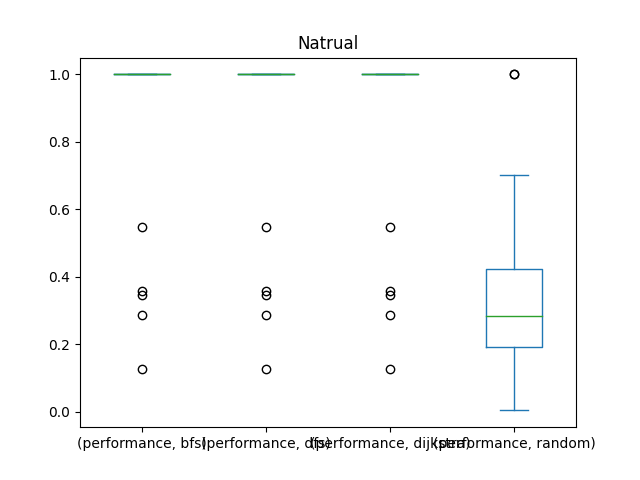
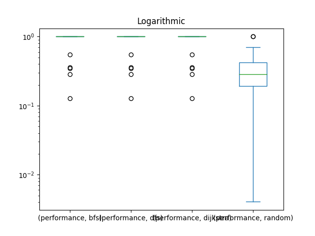
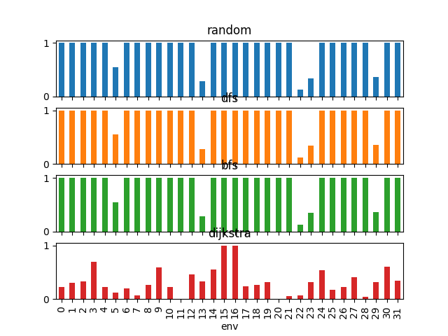
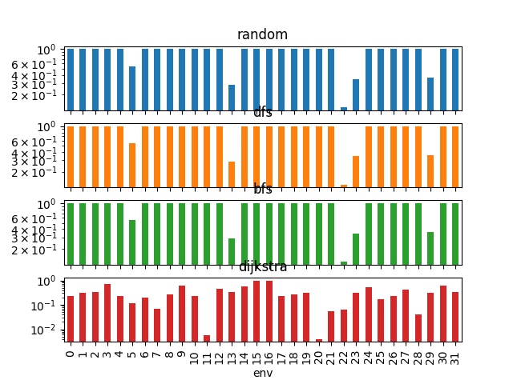
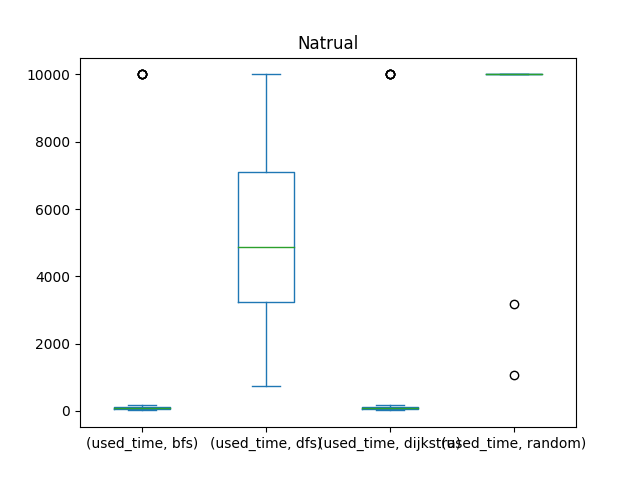
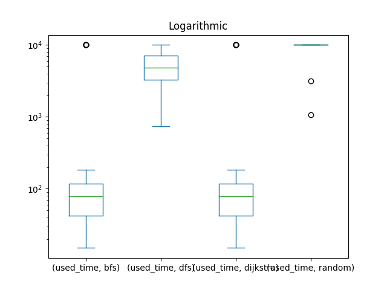
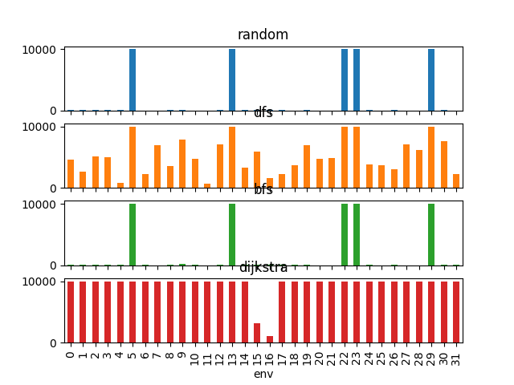
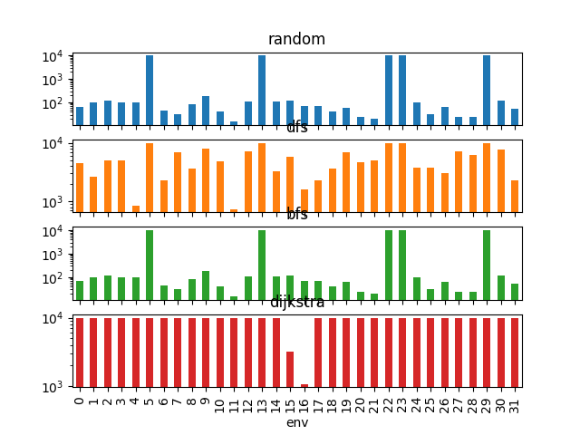

# TP3 Report
## Data plots
## Plot 0





## Plot 1





## Tabular data
## Performance of agents by environment
|   env |   ('performance', 'bfs') |   ('performance', 'dfs') |   ('performance', 'dijkstra') |   ('performance', 'random') |   ('used_time', 'bfs') |   ('used_time', 'dfs') |   ('used_time', 'dijkstra') |   ('used_time', 'random') |
|------:|-------------------------:|-------------------------:|------------------------------:|----------------------------:|-----------------------:|-----------------------:|----------------------------:|--------------------------:|
|     0 |                 1        |                 1        |                      1        |                  0.223773   |                     66 |                   4560 |                          66 |                     10000 |
|     1 |                 1        |                 1        |                      1        |                  0.3026     |                     99 |                   2651 |                          99 |                     10000 |
|     2 |                 1        |                 1        |                      1        |                  0.333833   |                    119 |                   5107 |                         119 |                     10000 |
|     3 |                 1        |                 1        |                      1        |                  0.70136    |                     98 |                   5018 |                          98 |                     10000 |
|     4 |                 1        |                 1        |                      1        |                  0.225159   |                    100 |                    850 |                         100 |                     10000 |
|     5 |                 0.547656 |                 0.547656 |                      0.547656 |                  0.114071   |                  10000 |                  10000 |                       10000 |                     10000 |
|     6 |                 1        |                 1        |                      1        |                  0.199644   |                     46 |                   2298 |                          46 |                     10000 |
|     7 |                 1        |                 1        |                      1        |                  0.0663938  |                     32 |                   6966 |                          32 |                     10000 |
|     8 |                 1        |                 1        |                      1        |                  0.264579   |                     86 |                   3612 |                          86 |                     10000 |
|     9 |                 1        |                 1        |                      1        |                  0.596554   |                    185 |                   7885 |                         185 |                     10000 |
|    10 |                 1        |                 1        |                      1        |                  0.226616   |                     42 |                   4804 |                          42 |                     10000 |
|    11 |                 1        |                 1        |                      1        |                  0.00575981 |                     15 |                    743 |                          15 |                     10000 |
|    12 |                 1        |                 1        |                      1        |                  0.461917   |                    112 |                   7144 |                         112 |                     10000 |
|    13 |                 0.285557 |                 0.285557 |                      0.285557 |                  0.332153   |                  10000 |                  10000 |                       10000 |                     10000 |
|    14 |                 1        |                 1        |                      1        |                  0.548477   |                    112 |                   3312 |                         112 |                     10000 |
|    15 |                 1        |                 1        |                      1        |                  1          |                    120 |                   5872 |                         120 |                      3176 |
|    16 |                 1        |                 1        |                      1        |                  1          |                     71 |                   1607 |                          71 |                      1075 |
|    17 |                 1        |                 1        |                      1        |                  0.235464   |                     72 |                   2264 |                          72 |                     10000 |
|    18 |                 1        |                 1        |                      1        |                  0.266203   |                     42 |                   3702 |                          42 |                     10000 |
|    19 |                 1        |                 1        |                      1        |                  0.310239   |                     61 |                   6975 |                          61 |                     10000 |
|    20 |                 1        |                 1        |                      1        |                  0.00405314 |                     23 |                   4733 |                          23 |                     10000 |
|    21 |                 1        |                 1        |                      1        |                  0.0549678  |                     20 |                   4938 |                          20 |                     10000 |
|    22 |                 0.126825 |                 0.126825 |                      0.126825 |                  0.0654696  |                  10000 |                  10000 |                       10000 |                     10000 |
|    23 |                 0.345401 |                 0.345401 |                      0.345401 |                  0.312954   |                  10000 |                  10000 |                       10000 |                     10000 |
|    24 |                 1        |                 1        |                      1        |                  0.537112   |                     99 |                   3847 |                          99 |                     10000 |
|    25 |                 1        |                 1        |                      1        |                  0.167429   |                     31 |                   3763 |                          31 |                     10000 |
|    26 |                 1        |                 1        |                      1        |                  0.223642   |                     65 |                   3063 |                          65 |                     10000 |
|    27 |                 1        |                 1        |                      1        |                  0.410661   |                     24 |                   7096 |                          24 |                     10000 |
|    28 |                 1        |                 1        |                      1        |                  0.0401938  |                     24 |                   6142 |                          24 |                     10000 |
|    29 |                 0.359243 |                 0.359243 |                      0.359243 |                  0.315864   |                  10000 |                  10000 |                       10000 |                     10000 |
|    30 |                 1        |                 1        |                      1        |                  0.601052   |                    116 |                   7690 |                         116 |                     10000 |
|    31 |                 1        |                 1        |                      1        |                  0.337085   |                     53 |                   2309 |                          53 |                     10000 |
## Used time / performance by environment
|   env |   ('used_time', 'mean') |   ('used_time', 'std') |   ('performance', 'mean') |   ('performance', 'std') |
|------:|------------------------:|-----------------------:|--------------------------:|-------------------------:|
|     0 |                 3673    |               4720.12  |                  0.805943 |                0.388114  |
|     1 |                 3212.25 |               4682.35  |                  0.82565  |                0.3487    |
|     2 |                 3836.25 |               4734.36  |                  0.833458 |                0.333083  |
|     3 |                 3803.5  |               4737.55  |                  0.92534  |                0.14932   |
|     4 |                 2762.5  |               4837.94  |                  0.80629  |                0.38742   |
|     5 |                10000    |                  0     |                  0.439259 |                0.216792  |
|     6 |                 3097.5  |               4722.54  |                  0.799911 |                0.400178  |
|     7 |                 4257.5  |               5033.95  |                  0.766598 |                0.466803  |
|     8 |                 3446    |               4674.81  |                  0.816145 |                0.36771   |
|     9 |                 4563.75 |               5129.34  |                  0.899138 |                0.201723  |
|    10 |                 3722    |               4749.34  |                  0.806654 |                0.386692  |
|    11 |                 2693.25 |               4883.24  |                  0.75144  |                0.49712   |
|    12 |                 4342    |               5021.62  |                  0.865479 |                0.269041  |
|    13 |                10000    |                  0     |                  0.297206 |                0.023298  |
|    14 |                 3384    |               4661.5   |                  0.887119 |                0.225761  |
|    15 |                 2322    |               2770.65  |                  1        |                0         |
|    16 |                  706    |                764.725 |                  1        |                0         |
|    17 |                 3102    |               4713.33  |                  0.808866 |                0.382268  |
|    18 |                 3446.5  |               4697.34  |                  0.816551 |                0.366898  |
|    19 |                 4274.25 |               5019.34  |                  0.82756  |                0.34488   |
|    20 |                 3694.75 |               4753.86  |                  0.751013 |                0.497973  |
|    21 |                 3744.5  |               4771.43  |                  0.763742 |                0.472516  |
|    22 |                10000    |                  0     |                  0.111486 |                0.0306778 |
|    23 |                10000    |                  0     |                  0.337289 |                0.0162237 |
|    24 |                 3511.25 |               4672.74  |                  0.884278 |                0.231444  |
|    25 |                 3456.25 |               4703.88  |                  0.791857 |                0.416285  |
|    26 |                 3298.25 |               4686.03  |                  0.805911 |                0.388179  |
|    27 |                 4286    |               5062.12  |                  0.852665 |                0.29467   |
|    28 |                 4047.5  |               4905.65  |                  0.760048 |                0.479903  |
|    29 |                10000    |                  0     |                  0.348398 |                0.0216894 |
|    30 |                 4480.5  |               5127.17  |                  0.900263 |                0.199474  |
|    31 |                 3103.75 |               4718.9   |                  0.834271 |                0.331457  |
## Used time / performance by agent
| agent_type   |   ('used_time', 'mean') |   ('used_time', 'std') |   ('performance', 'mean') |   ('performance', 'std') |
|:-------------|------------------------:|-----------------------:|--------------------------:|-------------------------:|
| bfs          |                 1622.91 |                3662.81 |                  0.895771 |                 0.252018 |
| dfs          |                 5279.72 |                2809.37 |                  0.895771 |                 0.252018 |
| dijkstra     |                 1622.91 |                3662.81 |                  0.895771 |                 0.252018 |
| random       |                 9507.84 |                1954.91 |                  0.327665 |                 0.251343 |
## Data
## Performance of agents by environment
```pd
           performance                               used_time                       
agent_type         bfs       dfs  dijkstra    random       bfs    dfs dijkstra random
env                                                                                  
0             1.000000  1.000000  1.000000  0.223773        66   4560       66  10000
1             1.000000  1.000000  1.000000  0.302600        99   2651       99  10000
2             1.000000  1.000000  1.000000  0.333833       119   5107      119  10000
3             1.000000  1.000000  1.000000  0.701360        98   5018       98  10000
4             1.000000  1.000000  1.000000  0.225159       100    850      100  10000
5             0.547656  0.547656  0.547656  0.114071     10000  10000    10000  10000
6             1.000000  1.000000  1.000000  0.199644        46   2298       46  10000
7             1.000000  1.000000  1.000000  0.066394        32   6966       32  10000
8             1.000000  1.000000  1.000000  0.264579        86   3612       86  10000
9             1.000000  1.000000  1.000000  0.596554       185   7885      185  10000
10            1.000000  1.000000  1.000000  0.226616        42   4804       42  10000
11            1.000000  1.000000  1.000000  0.005760        15    743       15  10000
12            1.000000  1.000000  1.000000  0.461917       112   7144      112  10000
13            0.285557  0.285557  0.285557  0.332153     10000  10000    10000  10000
14            1.000000  1.000000  1.000000  0.548477       112   3312      112  10000
15            1.000000  1.000000  1.000000  1.000000       120   5872      120   3176
16            1.000000  1.000000  1.000000  1.000000        71   1607       71   1075
17            1.000000  1.000000  1.000000  0.235464        72   2264       72  10000
18            1.000000  1.000000  1.000000  0.266203        42   3702       42  10000
19            1.000000  1.000000  1.000000  0.310239        61   6975       61  10000
20            1.000000  1.000000  1.000000  0.004053        23   4733       23  10000
21            1.000000  1.000000  1.000000  0.054968        20   4938       20  10000
22            0.126825  0.126825  0.126825  0.065470     10000  10000    10000  10000
23            0.345401  0.345401  0.345401  0.312954     10000  10000    10000  10000
24            1.000000  1.000000  1.000000  0.537112        99   3847       99  10000
25            1.000000  1.000000  1.000000  0.167429        31   3763       31  10000
26            1.000000  1.000000  1.000000  0.223642        65   3063       65  10000
27            1.000000  1.000000  1.000000  0.410661        24   7096       24  10000
28            1.000000  1.000000  1.000000  0.040194        24   6142       24  10000
29            0.359243  0.359243  0.359243  0.315864     10000  10000    10000  10000
30            1.000000  1.000000  1.000000  0.601052       116   7690      116  10000
31            1.000000  1.000000  1.000000  0.337085        53   2309       53  10000
```
## Used time / performance by environment
```pd
    used_time              performance          
         mean          std        mean       std
env                                             
0     3673.00  4720.119914    0.805943  0.388114
1     3212.25  4682.349935    0.825650  0.348700
2     3836.25  4734.360737    0.833458  0.333083
3     3803.50  4737.547994    0.925340  0.149320
4     2762.50  4837.936027    0.806290  0.387420
5    10000.00     0.000000    0.439259  0.216792
6     3097.50  4722.535018    0.799911  0.400178
7     4257.50  5033.950702    0.766598  0.466803
8     3446.00  4674.814506    0.816145  0.367710
9     4563.75  5129.341048    0.899138  0.201723
10    3722.00  4749.344095    0.806654  0.386692
11    2693.25  4883.240616    0.751440  0.497120
12    4342.00  5021.618862    0.865479  0.269041
13   10000.00     0.000000    0.297206  0.023298
14    3384.00  4661.495039    0.887119  0.225761
15    2322.00  2770.645172    1.000000  0.000000
16     706.00   764.724787    1.000000  0.000000
17    3102.00  4713.330316    0.808866  0.382268
18    3446.50  4697.335521    0.816551  0.366898
19    4274.25  5019.336435    0.827560  0.344880
20    3694.75  4753.862877    0.751013  0.497973
21    3744.50  4771.426167    0.763742  0.472516
22   10000.00     0.000000    0.111486  0.030678
23   10000.00     0.000000    0.337289  0.016224
24    3511.25  4672.740265    0.884278  0.231444
25    3456.25  4703.879064    0.791857  0.416285
26    3298.25  4686.029120    0.805911  0.388179
27    4286.00  5062.120241    0.852665  0.294670
28    4047.50  4905.652896    0.760048  0.479903
29   10000.00     0.000000    0.348398  0.021689
30    4480.50  5127.165916    0.900263  0.199474
31    3103.75  4718.899686    0.834271  0.331457
```
## Used time / performance by agent
```pd
             used_time              performance          
                  mean          std        mean       std
agent_type                                               
bfs         1622.90625  3662.807018    0.895771  0.252018
dfs         5279.71875  2809.372473    0.895771  0.252018
dijkstra    1622.90625  3662.807018    0.895771  0.252018
random      9507.84375  1954.908068    0.327665  0.251343
```
## Raw Data
```csv
,used_time,agent_type,performance,env
46,15,bfs,1.0,11
86,20,bfs,1.0,21
82,23,bfs,1.0,20
110,24,bfs,1.0,27
114,24,bfs,1.0,28
102,31,bfs,1.0,25
30,32,bfs,1.0,7
42,42,bfs,1.0,10
74,42,bfs,1.0,18
26,46,bfs,1.0,6
126,53,bfs,1.0,31
78,61,bfs,1.0,19
106,65,bfs,1.0,26
2,66,bfs,1.0,0
66,71,bfs,1.0,16
70,72,bfs,1.0,17
34,86,bfs,1.0,8
14,98,bfs,1.0,3
6,99,bfs,1.0,1
98,99,bfs,1.0,24
18,100,bfs,1.0,4
50,112,bfs,1.0,12
58,112,bfs,1.0,14
122,116,bfs,1.0,30
10,119,bfs,1.0,2
62,120,bfs,1.0,15
38,185,bfs,1.0,9
90,10000,bfs,0.1268251998341164,22
54,10000,bfs,0.28555743683580365,13
94,10000,bfs,0.3454012072729414,23
118,10000,bfs,0.3592429849686735,29
22,10000,bfs,0.5476555480631874,5
45,743,dfs,1.0,11
17,850,dfs,1.0,4
65,1607,dfs,1.0,16
69,2264,dfs,1.0,17
25,2298,dfs,1.0,6
125,2309,dfs,1.0,31
5,2651,dfs,1.0,1
105,3063,dfs,1.0,26
57,3312,dfs,1.0,14
33,3612,dfs,1.0,8
73,3702,dfs,1.0,18
101,3763,dfs,1.0,25
97,3847,dfs,1.0,24
1,4560,dfs,1.0,0
81,4733,dfs,1.0,20
41,4804,dfs,1.0,10
85,4938,dfs,1.0,21
13,5018,dfs,1.0,3
9,5107,dfs,1.0,2
61,5872,dfs,1.0,15
113,6142,dfs,1.0,28
29,6966,dfs,1.0,7
77,6975,dfs,1.0,19
109,7096,dfs,1.0,27
49,7144,dfs,1.0,12
121,7690,dfs,1.0,30
37,7885,dfs,1.0,9
89,10000,dfs,0.1268251998341164,22
53,10000,dfs,0.28555743683580365,13
93,10000,dfs,0.3454012072729414,23
117,10000,dfs,0.3592429849686735,29
21,10000,dfs,0.5476555480631874,5
47,15,dijkstra,1.0,11
87,20,dijkstra,1.0,21
83,23,dijkstra,1.0,20
111,24,dijkstra,1.0,27
115,24,dijkstra,1.0,28
103,31,dijkstra,1.0,25
31,32,dijkstra,1.0,7
43,42,dijkstra,1.0,10
75,42,dijkstra,1.0,18
27,46,dijkstra,1.0,6
127,53,dijkstra,1.0,31
79,61,dijkstra,1.0,19
107,65,dijkstra,1.0,26
3,66,dijkstra,1.0,0
67,71,dijkstra,1.0,16
71,72,dijkstra,1.0,17
35,86,dijkstra,1.0,8
15,98,dijkstra,1.0,3
7,99,dijkstra,1.0,1
99,99,dijkstra,1.0,24
19,100,dijkstra,1.0,4
51,112,dijkstra,1.0,12
59,112,dijkstra,1.0,14
123,116,dijkstra,1.0,30
11,119,dijkstra,1.0,2
63,120,dijkstra,1.0,15
39,185,dijkstra,1.0,9
91,10000,dijkstra,0.1268251998341164,22
55,10000,dijkstra,0.28555743683580365,13
95,10000,dijkstra,0.3454012072729414,23
119,10000,dijkstra,0.3592429849686735,29
23,10000,dijkstra,0.5476555480631874,5
64,1075,random,1.0,16
60,3176,random,1.0,15
80,10000,random,0.004053136820253942,20
44,10000,random,0.0057598137035169495,11
112,10000,random,0.04019382493192561,28
84,10000,random,0.05496783984575007,21
88,10000,random,0.06546959295508865,22
28,10000,random,0.06639376416759978,7
20,10000,random,0.11407102739630035,5
100,10000,random,0.16742945775805596,25
24,10000,random,0.1996444653492898,6
104,10000,random,0.22364200437332665,26
0,10000,random,0.22377287799297327,0
16,10000,random,0.2251593368267134,4
40,10000,random,0.22661589457601833,10
68,10000,random,0.23546443504721734,17
32,10000,random,0.2645791445022477,8
72,10000,random,0.26620326060776767,18
4,10000,random,0.30259974862560046,1
76,10000,random,0.31023926024182014,19
92,10000,random,0.3129537490329616,23
116,10000,random,0.31586415181071653,29
52,10000,random,0.3321533919082186,13
8,10000,random,0.33383309678246303,2
124,10000,random,0.3370851304248448,31
108,10000,random,0.4106605496584353,27
48,10000,random,0.4619170938061483,12
96,10000,random,0.5371118357486009,24
56,10000,random,0.5484774436742547,14
36,10000,random,0.5965535836072641,9
120,10000,random,0.6010519955406142,30
12,10000,random,0.7013597622017512,3

```
