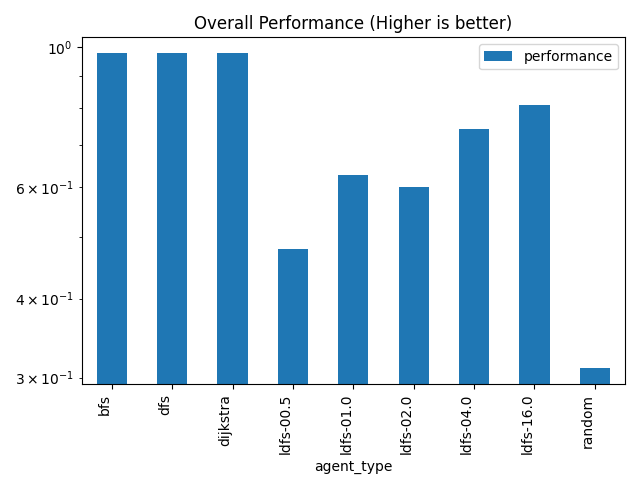
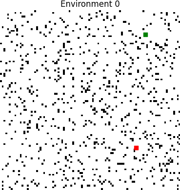
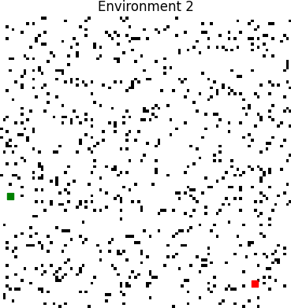
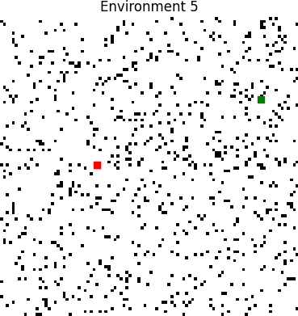
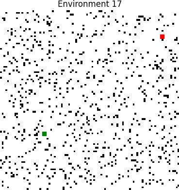

# TP3 Report (B)
## Data plots
## Performance Plot


## Used time Plot


## Overall Performance Plot


## Overall Used time Plot


## Environments
Green = Start pos

Red = Target pos













## Tabular data
### Performance of agents by environment
|   env |   ('performance', 'bfs') |   ('performance', 'dfs') |   ('performance', 'dijkstra') |   ('performance', 'ldfs-00.5') |   ('performance', 'ldfs-01.0') |   ('performance', 'ldfs-02.0') |   ('performance', 'ldfs-04.0') |   ('performance', 'ldfs-16.0') |   ('performance', 'random') |   ('used_time', 'bfs') |   ('used_time', 'dfs') |   ('used_time', 'dijkstra') |   ('used_time', 'ldfs-00.5') |   ('used_time', 'ldfs-01.0') |   ('used_time', 'ldfs-02.0') |   ('used_time', 'ldfs-04.0') |   ('used_time', 'ldfs-16.0') |   ('used_time', 'random') |
|------:|-------------------------:|-------------------------:|------------------------------:|-------------------------------:|-------------------------------:|-------------------------------:|-------------------------------:|-------------------------------:|----------------------------:|-----------------------:|-----------------------:|----------------------------:|-----------------------------:|-----------------------------:|-----------------------------:|-----------------------------:|-----------------------------:|--------------------------:|
|     0 |                 1        |                 1        |                      1        |                       0.367879 |                       1        |                       1        |                       1        |                       1        |                 0.350391    |                     94 |                   3180 |                          94 |                        10000 |                          236 |                          282 |                          990 |                         3180 |                     10000 |
|     1 |                 1        |                 1        |                      1        |                       0.38835  |                       0.38835  |                       1        |                       1        |                       0.38835  |                 1           |                    132 |                   5162 |                         132 |                        10000 |                        10000 |                          438 |                          790 |                        10000 |                      3059 |
|     2 |                 1        |                 1        |                      1        |                       0.460017 |                       0.460017 |                       1        |                       1        |                       1        |                 0.156447    |                     26 |                   4274 |                          26 |                        10000 |                        10000 |                          432 |                          878 |                         3510 |                     10000 |
|     3 |                 1        |                 1        |                      1        |                       0.367879 |                       1        |                       1        |                       1        |                       1        |                 0.0482548   |                     31 |                   1181 |                          31 |                        10000 |                          195 |                          193 |                          745 |                         1181 |                     10000 |
|     4 |                 1        |                 1        |                      1        |                       1        |                       1        |                       1        |                       1        |                       1        |                 0.0847954   |                     47 |                   3991 |                          47 |                           65 |                           77 |                          235 |                          583 |                          569 |                     10000 |
|     5 |                 1        |                 1        |                      1        |                       0.379874 |                       0.379874 |                       0.379874 |                       0.379874 |                       0.379874 |                 1           |                     68 |                   6304 |                          68 |                        10000 |                        10000 |                        10000 |                        10000 |                        10000 |                      7634 |
|     6 |                 1        |                 1        |                      1        |                       0.384462 |                       0.384462 |                       0.384462 |                       0.384462 |                       0.384462 |                 0.779725    |                    109 |                   5305 |                         109 |                        10000 |                        10000 |                        10000 |                        10000 |                        10000 |                     10000 |
|     7 |                 1        |                 1        |                      1        |                       0.341371 |                       0.341371 |                       0.341371 |                       0.341371 |                       0.341371 |                 0.337285    |                    112 |                   5348 |                         112 |                        10000 |                        10000 |                        10000 |                        10000 |                        10000 |                     10000 |
|     8 |                 1        |                 1        |                      1        |                       0.355736 |                       1        |                       1        |                       1        |                       1        |                 0.166373    |                     72 |                   2148 |                          72 |                        10000 |                          172 |                          268 |                          696 |                         2148 |                     10000 |
|     9 |                 1        |                 1        |                      1        |                       0.204854 |                       0.204854 |                       0.204854 |                       0.204854 |                       1        |                 0.0712509   |                     48 |                   1272 |                          48 |                        10000 |                        10000 |                        10000 |                        10000 |                         1272 |                     10000 |
|    10 |                 1        |                 1        |                      1        |                       1        |                       0.354385 |                       1        |                       1        |                       1        |                 0.0738022   |                     32 |                   1712 |                          32 |                           94 |                        10000 |                          288 |                          778 |                         1712 |                     10000 |
|    11 |                 1        |                 1        |                      1        |                       0.372142 |                       0.372142 |                       0.372142 |                       0.372142 |                       0.372142 |                 0.268359    |                     83 |                   6085 |                          83 |                        10000 |                        10000 |                        10000 |                        10000 |                        10000 |                     10000 |
|    12 |                 1        |                 1        |                      1        |                       1        |                       1        |                       1        |                       1        |                       1        |                 0.171254    |                     62 |                   1504 |                          62 |                           66 |                          130 |                          146 |                          540 |                         1504 |                     10000 |
|    13 |                 1        |                 1        |                      1        |                       0.362516 |                       0.362516 |                       0.362516 |                       0.362516 |                       0.362516 |                 0.291505    |                     96 |                   7344 |                          96 |                        10000 |                        10000 |                        10000 |                        10000 |                        10000 |                     10000 |
|    14 |                 1        |                 1        |                      1        |                       0.367192 |                       0.367192 |                       0.367192 |                       0.367192 |                       0.367192 |                 0.283354    |                     79 |                   7607 |                          79 |                        10000 |                        10000 |                        10000 |                        10000 |                        10000 |                     10000 |
|    15 |                 1        |                 1        |                      1        |                       0.486796 |                       0.486796 |                       1        |                       1        |                       1        |                 0.400925    |                     69 |                   2213 |                          69 |                        10000 |                        10000 |                          287 |                          643 |                         2213 |                     10000 |
|    16 |                 1        |                 1        |                      1        |                       0.452582 |                       0.452582 |                       0.452582 |                       0.452582 |                       1        |                 1           |                     59 |                   3615 |                          59 |                        10000 |                        10000 |                        10000 |                        10000 |                         2645 |                       307 |
|    17 |                 1        |                 1        |                      1        |                       1        |                       1        |                       1        |                       1        |                       1        |                 0.0323262   |                     15 |                   2267 |                          15 |                           97 |                          195 |                           47 |                          749 |                         2267 |                     10000 |
|    18 |                 1        |                 1        |                      1        |                       0.311452 |                       1        |                       1        |                       1        |                       1        |                 0.337402    |                    121 |                   1603 |                         121 |                        10000 |                          199 |                          405 |                          213 |                         1603 |                     10000 |
|    19 |                 1        |                 1        |                      1        |                       0.355716 |                       0.355716 |                       1        |                       1        |                       1        |                 0.00201894  |                     18 |                   1574 |                          18 |                        10000 |                        10000 |                          130 |                           84 |                         1132 |                     10000 |
|    20 |                 1        |                 1        |                      1        |                       0.367879 |                       0.367879 |                       1        |                       1        |                       1        |                 0.192612    |                     79 |                   3583 |                          79 |                        10000 |                        10000 |                          315 |                          617 |                         2541 |                     10000 |
|    21 |                 1        |                 1        |                      1        |                       0.280581 |                       1        |                       0.280581 |                       1        |                       1        |                 0.0939552   |                     58 |                   7356 |                          58 |                        10000 |                          288 |                        10000 |                         1166 |                         1688 |                     10000 |
|    22 |                 0.390138 |                 0.390138 |                      0.390138 |                       0.390138 |                       0.390138 |                       0.390138 |                       0.390138 |                       0.390138 |                 0.331415    |                  10000 |                  10000 |                       10000 |                        10000 |                        10000 |                        10000 |                        10000 |                        10000 |                     10000 |
|    23 |                 1        |                 1        |                      1        |                       1        |                       1        |                       1        |                       1        |                       1        |                 0.312946    |                     97 |                   2837 |                          97 |                          101 |                          199 |                          409 |                          501 |                         2837 |                     10000 |
|    24 |                 1        |                 1        |                      1        |                       0.271233 |                       1        |                       1        |                       1        |                       1        |                 0.167106    |                     78 |                   5582 |                          78 |                        10000 |                          236 |                          478 |                          894 |                          990 |                     10000 |
|    25 |                 1        |                 1        |                      1        |                       0.389303 |                       0.389303 |                       0.389303 |                       1        |                       1        |                 0.000596186 |                     14 |                   7120 |                          14 |                        10000 |                        10000 |                        10000 |                         1106 |                         1044 |                     10000 |
|    26 |                 1        |                 1        |                      1        |                       0.258396 |                       0.258396 |                       0.258396 |                       0.258396 |                       0.258396 |                 0.250909    |                    106 |                   2810 |                         106 |                        10000 |                        10000 |                        10000 |                        10000 |                        10000 |                     10000 |
|    27 |                 1        |                 1        |                      1        |                       1        |                       1        |                       1        |                       1        |                       1        |                 0.0242477   |                     27 |                   1493 |                          27 |                           37 |                           47 |                          175 |                          219 |                         1493 |                     10000 |
|    28 |                 1        |                 1        |                      1        |                       0.367417 |                       0.367417 |                       1        |                       1        |                       1        |                 0.233378    |                     97 |                    137 |                          97 |                        10000 |                        10000 |                          137 |                          137 |                          137 |                     10000 |
|    29 |                 1        |                 1        |                      1        |                       0.434699 |                       0.434699 |                       0.434699 |                       0.434699 |                       0.434699 |                 0.0897573   |                     59 |                   6731 |                          59 |                        10000 |                        10000 |                        10000 |                        10000 |                        10000 |                     10000 |
### Used time / performance by environment
|   env |   ('used_time', 'mean') |   ('used_time', 'std') |   ('performance', 'mean') |   ('performance', 'std') |
|------:|------------------------:|-----------------------:|--------------------------:|-------------------------:|
|     0 |                 3117.33 |                4091.12 |                  0.857586 |                0.282629  |
|     1 |                 4412.56 |                4494.7  |                  0.796117 |                0.305825  |
|     2 |                 4349.56 |                4489.97 |                  0.786276 |                0.332348  |
|     3 |                 2617.44 |                4209.55 |                  0.824015 |                0.358235  |
|     4 |                 1734.89 |                3346.14 |                  0.898311 |                0.305068  |
|     5 |                 7119.33 |                4211.05 |                  0.655486 |                0.326835  |
|     6 |                 7280.33 |                4346.51 |                  0.633559 |                0.302995  |
|     7 |                 7285.78 |                4342.86 |                  0.56046  |                0.329658  |
|     8 |                 2841.78 |                4140.39 |                  0.83579  |                0.329265  |
|     9 |                 5848.89 |                4941.6  |                  0.543407 |                0.435217  |
|    10 |                 2738.67 |                4169.21 |                  0.825354 |                0.35358   |
|    11 |                 7361.22 |                4320.77 |                  0.569896 |                0.324312  |
|    12 |                 1557.11 |                3221.89 |                  0.907917 |                0.276249  |
|    13 |                 7504    |                4288.98 |                  0.56712  |                0.325468  |
|    14 |                 7529.44 |                4296.02 |                  0.568813 |                0.32452   |
|    15 |                 3943.78 |                4614.1  |                  0.819391 |                0.272046  |
|    16 |                 5187.22 |                4716.99 |                  0.756703 |                0.288515  |
|    17 |                 1739.11 |                3233.98 |                  0.892481 |                0.322558  |
|    18 |                 2696.11 |                4183.25 |                  0.849873 |                0.29797   |
|    19 |                 3661.78 |                4784.17 |                  0.745939 |                0.394532  |
|    20 |                 4134.89 |                4554    |                  0.769819 |                0.348959  |
|    21 |                 4512.67 |                4678.83 |                  0.739458 |                0.39451   |
|    22 |                10000    |                   0    |                  0.383613 |                0.0195743 |
|    23 |                 1897.56 |                3243.79 |                  0.923661 |                0.229018  |
|    24 |                 3148.44 |                4242.94 |                  0.826482 |                0.345296  |
|    25 |                 5477.56 |                4782.46 |                  0.685389 |                0.391606  |
|    26 |                 7002.44 |                4563.59 |                  0.504766 |                0.371434  |
|    27 |                 1502    |                3244.95 |                  0.891583 |                0.325251  |
|    28 |                 3415.78 |                4938.19 |                  0.774246 |                0.340835  |
|    29 |                 7427.67 |                4312.5  |                  0.584806 |                0.330699  |
### Used time / performance by agent
| agent_type   |   ('used_time', 'mean') |   ('used_time', 'std') |   ('performance', 'mean') |   ('performance', 'std') |
|:-------------|------------------------:|-----------------------:|--------------------------:|-------------------------:|
| bfs          |                  399.6  |                1813.52 |                  0.979671 |                 0.111345 |
| dfs          |                 4044.6  |                2482.87 |                  0.979671 |                 0.111345 |
| dijkstra     |                  399.6  |                1813.52 |                  0.979671 |                 0.111345 |
| ldfs-00.5    |                 8015.33 |                4037.2  |                  0.490616 |                 0.265314 |
| ldfs-01.0    |                 6399.13 |                4813.55 |                  0.603936 |                 0.310692 |
| ldfs-02.0    |                 4488.83 |                4902.67 |                  0.720604 |                 0.32802  |
| ldfs-04.0    |                 4077.63 |                4589.89 |                  0.764941 |                 0.316995 |
| ldfs-16.0    |                 4522.2  |                4002.69 |                  0.789305 |                 0.304115 |
| random       |                 9366.67 |                2163.14 |                  0.28508  |                 0.289382 |
## Data
### Performance of agents by environment
```pd
           performance                                                                                 used_time                                                                         
agent_type         bfs       dfs  dijkstra ldfs-00.5 ldfs-01.0 ldfs-02.0 ldfs-04.0 ldfs-16.0    random       bfs    dfs dijkstra ldfs-00.5 ldfs-01.0 ldfs-02.0 ldfs-04.0 ldfs-16.0 random
env                                                                                                                                                                                      
0             1.000000  1.000000  1.000000  0.367879  1.000000  1.000000  1.000000  1.000000  0.350391        94   3180       94     10000       236       282       990      3180  10000
1             1.000000  1.000000  1.000000  0.388350  0.388350  1.000000  1.000000  0.388350  1.000000       132   5162      132     10000     10000       438       790     10000   3059
2             1.000000  1.000000  1.000000  0.460017  0.460017  1.000000  1.000000  1.000000  0.156447        26   4274       26     10000     10000       432       878      3510  10000
3             1.000000  1.000000  1.000000  0.367879  1.000000  1.000000  1.000000  1.000000  0.048255        31   1181       31     10000       195       193       745      1181  10000
4             1.000000  1.000000  1.000000  1.000000  1.000000  1.000000  1.000000  1.000000  0.084795        47   3991       47        65        77       235       583       569  10000
5             1.000000  1.000000  1.000000  0.379874  0.379874  0.379874  0.379874  0.379874  1.000000        68   6304       68     10000     10000     10000     10000     10000   7634
6             1.000000  1.000000  1.000000  0.384462  0.384462  0.384462  0.384462  0.384462  0.779725       109   5305      109     10000     10000     10000     10000     10000  10000
7             1.000000  1.000000  1.000000  0.341371  0.341371  0.341371  0.341371  0.341371  0.337285       112   5348      112     10000     10000     10000     10000     10000  10000
8             1.000000  1.000000  1.000000  0.355736  1.000000  1.000000  1.000000  1.000000  0.166373        72   2148       72     10000       172       268       696      2148  10000
9             1.000000  1.000000  1.000000  0.204854  0.204854  0.204854  0.204854  1.000000  0.071251        48   1272       48     10000     10000     10000     10000      1272  10000
10            1.000000  1.000000  1.000000  1.000000  0.354385  1.000000  1.000000  1.000000  0.073802        32   1712       32        94     10000       288       778      1712  10000
11            1.000000  1.000000  1.000000  0.372142  0.372142  0.372142  0.372142  0.372142  0.268359        83   6085       83     10000     10000     10000     10000     10000  10000
12            1.000000  1.000000  1.000000  1.000000  1.000000  1.000000  1.000000  1.000000  0.171254        62   1504       62        66       130       146       540      1504  10000
13            1.000000  1.000000  1.000000  0.362516  0.362516  0.362516  0.362516  0.362516  0.291505        96   7344       96     10000     10000     10000     10000     10000  10000
14            1.000000  1.000000  1.000000  0.367192  0.367192  0.367192  0.367192  0.367192  0.283354        79   7607       79     10000     10000     10000     10000     10000  10000
15            1.000000  1.000000  1.000000  0.486796  0.486796  1.000000  1.000000  1.000000  0.400925        69   2213       69     10000     10000       287       643      2213  10000
16            1.000000  1.000000  1.000000  0.452582  0.452582  0.452582  0.452582  1.000000  1.000000        59   3615       59     10000     10000     10000     10000      2645    307
17            1.000000  1.000000  1.000000  1.000000  1.000000  1.000000  1.000000  1.000000  0.032326        15   2267       15        97       195        47       749      2267  10000
18            1.000000  1.000000  1.000000  0.311452  1.000000  1.000000  1.000000  1.000000  0.337402       121   1603      121     10000       199       405       213      1603  10000
19            1.000000  1.000000  1.000000  0.355716  0.355716  1.000000  1.000000  1.000000  0.002019        18   1574       18     10000     10000       130        84      1132  10000
20            1.000000  1.000000  1.000000  0.367879  0.367879  1.000000  1.000000  1.000000  0.192612        79   3583       79     10000     10000       315       617      2541  10000
21            1.000000  1.000000  1.000000  0.280581  1.000000  0.280581  1.000000  1.000000  0.093955        58   7356       58     10000       288     10000      1166      1688  10000
22            0.390138  0.390138  0.390138  0.390138  0.390138  0.390138  0.390138  0.390138  0.331415     10000  10000    10000     10000     10000     10000     10000     10000  10000
23            1.000000  1.000000  1.000000  1.000000  1.000000  1.000000  1.000000  1.000000  0.312946        97   2837       97       101       199       409       501      2837  10000
24            1.000000  1.000000  1.000000  0.271233  1.000000  1.000000  1.000000  1.000000  0.167106        78   5582       78     10000       236       478       894       990  10000
25            1.000000  1.000000  1.000000  0.389303  0.389303  0.389303  1.000000  1.000000  0.000596        14   7120       14     10000     10000     10000      1106      1044  10000
26            1.000000  1.000000  1.000000  0.258396  0.258396  0.258396  0.258396  0.258396  0.250909       106   2810      106     10000     10000     10000     10000     10000  10000
27            1.000000  1.000000  1.000000  1.000000  1.000000  1.000000  1.000000  1.000000  0.024248        27   1493       27        37        47       175       219      1493  10000
28            1.000000  1.000000  1.000000  0.367417  0.367417  1.000000  1.000000  1.000000  0.233378        97    137       97     10000     10000       137       137       137  10000
29            1.000000  1.000000  1.000000  0.434699  0.434699  0.434699  0.434699  0.434699  0.089757        59   6731       59     10000     10000     10000     10000     10000  10000
```
### Used time / performance by environment
```pd
        used_time              performance          
             mean          std        mean       std
env                                                 
0     3117.333333  4091.116718    0.857586  0.282629
1     4412.555556  4494.701022    0.796117  0.305825
2     4349.555556  4489.965677    0.786276  0.332348
3     2617.444444  4209.551702    0.824015  0.358235
4     1734.888889  3346.135325    0.898311  0.305068
5     7119.333333  4211.048800    0.655486  0.326835
6     7280.333333  4346.514494    0.633559  0.302995
7     7285.777778  4342.855794    0.560460  0.329658
8     2841.777778  4140.390856    0.835790  0.329265
9     5848.888889  4941.597223    0.543407  0.435217
10    2738.666667  4169.207719    0.825354  0.353580
11    7361.222222  4320.773506    0.569896  0.324312
12    1557.111111  3221.888749    0.907917  0.276249
13    7504.000000  4288.977501    0.567120  0.325468
14    7529.444444  4296.017461    0.568813  0.324520
15    3943.777778  4614.103780    0.819391  0.272046
16    5187.222222  4716.990454    0.756703  0.288515
17    1739.111111  3233.981773    0.892481  0.322558
18    2696.111111  4183.245733    0.849873  0.297970
19    3661.777778  4784.166013    0.745939  0.394532
20    4134.888889  4553.998393    0.769819  0.348959
21    4512.666667  4678.833508    0.739458  0.394510
22   10000.000000     0.000000    0.383613  0.019574
23    1897.555556  3243.793809    0.923661  0.229018
24    3148.444444  4242.936575    0.826482  0.345296
25    5477.555556  4782.460536    0.685389  0.391606
26    7002.444444  4563.585737    0.504766  0.371434
27    1502.000000  3244.951540    0.891583  0.325251
28    3415.777778  4938.193667    0.774246  0.340835
29    7427.666667  4312.499768    0.584806  0.330699
```
### Used time / performance by agent
```pd
              used_time              performance          
                   mean          std        mean       std
agent_type                                                
bfs          399.600000  1813.522322    0.979671  0.111345
dfs         4044.600000  2482.871358    0.979671  0.111345
dijkstra     399.600000  1813.522322    0.979671  0.111345
ldfs-00.5   8015.333333  4037.203465    0.490616  0.265314
ldfs-01.0   6399.133333  4813.547647    0.603936  0.310692
ldfs-02.0   4488.833333  4902.665342    0.720604  0.328020
ldfs-04.0   4077.633333  4589.890739    0.764941  0.316995
ldfs-16.0   4522.200000  4002.685516    0.789305  0.304115
random      9366.666667  2163.142292    0.285080  0.289382
```

## Raw Data
```csv
,used_time,agent_type,performance,env
227,14,bfs,1.0,25
155,15,bfs,1.0,17
173,18,bfs,1.0,19
20,26,bfs,1.0,2
245,27,bfs,1.0,27
29,31,bfs,1.0,3
92,32,bfs,1.0,10
38,47,bfs,1.0,4
83,48,bfs,1.0,9
191,58,bfs,1.0,21
146,59,bfs,1.0,16
263,59,bfs,1.0,29
110,62,bfs,1.0,12
47,68,bfs,1.0,5
137,69,bfs,1.0,15
74,72,bfs,1.0,8
218,78,bfs,1.0,24
128,79,bfs,1.0,14
182,79,bfs,1.0,20
101,83,bfs,1.0,11
2,94,bfs,1.0,0
119,96,bfs,1.0,13
209,97,bfs,1.0,23
254,97,bfs,1.0,28
236,106,bfs,1.0,26
56,109,bfs,1.0,6
65,112,bfs,1.0,7
164,121,bfs,1.0,18
11,132,bfs,1.0,1
200,10000,bfs,0.3901378940544187,22
253,137,dfs,1.0,28
28,1181,dfs,1.0,3
82,1272,dfs,1.0,9
244,1493,dfs,1.0,27
109,1504,dfs,1.0,12
172,1574,dfs,1.0,19
163,1603,dfs,1.0,18
91,1712,dfs,1.0,10
73,2148,dfs,1.0,8
136,2213,dfs,1.0,15
154,2267,dfs,1.0,17
235,2810,dfs,1.0,26
208,2837,dfs,1.0,23
1,3180,dfs,1.0,0
181,3583,dfs,1.0,20
145,3615,dfs,1.0,16
37,3991,dfs,1.0,4
19,4274,dfs,1.0,2
10,5162,dfs,1.0,1
55,5305,dfs,1.0,6
64,5348,dfs,1.0,7
217,5582,dfs,1.0,24
100,6085,dfs,1.0,11
46,6304,dfs,1.0,5
262,6731,dfs,1.0,29
226,7120,dfs,1.0,25
118,7344,dfs,1.0,13
190,7356,dfs,1.0,21
127,7607,dfs,1.0,14
199,10000,dfs,0.3901378940544187,22
228,14,dijkstra,1.0,25
156,15,dijkstra,1.0,17
174,18,dijkstra,1.0,19
21,26,dijkstra,1.0,2
246,27,dijkstra,1.0,27
30,31,dijkstra,1.0,3
93,32,dijkstra,1.0,10
39,47,dijkstra,1.0,4
84,48,dijkstra,1.0,9
192,58,dijkstra,1.0,21
147,59,dijkstra,1.0,16
264,59,dijkstra,1.0,29
111,62,dijkstra,1.0,12
48,68,dijkstra,1.0,5
138,69,dijkstra,1.0,15
75,72,dijkstra,1.0,8
219,78,dijkstra,1.0,24
129,79,dijkstra,1.0,14
183,79,dijkstra,1.0,20
102,83,dijkstra,1.0,11
3,94,dijkstra,1.0,0
120,96,dijkstra,1.0,13
210,97,dijkstra,1.0,23
255,97,dijkstra,1.0,28
237,106,dijkstra,1.0,26
57,109,dijkstra,1.0,6
66,112,dijkstra,1.0,7
165,121,dijkstra,1.0,18
12,132,dijkstra,1.0,1
201,10000,dijkstra,0.3901378940544187,22
247,37,ldfs-00.5,1.0,27
40,65,ldfs-00.5,1.0,4
112,66,ldfs-00.5,1.0,12
94,94,ldfs-00.5,1.0,10
157,97,ldfs-00.5,1.0,17
211,101,ldfs-00.5,1.0,23
85,10000,ldfs-00.5,0.20485406843047366,9
238,10000,ldfs-00.5,0.25839629851640183,26
220,10000,ldfs-00.5,0.27123342853388827,24
193,10000,ldfs-00.5,0.28058135742579493,21
166,10000,ldfs-00.5,0.3114523496156424,18
67,10000,ldfs-00.5,0.34137124417917275,7
175,10000,ldfs-00.5,0.3557159399088292,19
76,10000,ldfs-00.5,0.3557360188995925,8
121,10000,ldfs-00.5,0.3625156300368594,13
130,10000,ldfs-00.5,0.36719245768892983,14
256,10000,ldfs-00.5,0.3674165249285519,28
4,10000,ldfs-00.5,0.36787944117144233,0
31,10000,ldfs-00.5,0.36787944117144233,3
184,10000,ldfs-00.5,0.36787944117144233,20
103,10000,ldfs-00.5,0.3721415218112562,11
49,10000,ldfs-00.5,0.37987412892287065,5
58,10000,ldfs-00.5,0.38446181329343304,6
13,10000,ldfs-00.5,0.38835018012167494,1
229,10000,ldfs-00.5,0.38930269052391125,25
202,10000,ldfs-00.5,0.3901378940544187,22
265,10000,ldfs-00.5,0.43469877968124954,29
148,10000,ldfs-00.5,0.4525819021135069,16
22,10000,ldfs-00.5,0.4600165234707518,2
139,10000,ldfs-00.5,0.48679632714865934,15
248,47,ldfs-01.0,1.0,27
41,77,ldfs-01.0,1.0,4
113,130,ldfs-01.0,1.0,12
77,172,ldfs-01.0,1.0,8
32,195,ldfs-01.0,1.0,3
158,195,ldfs-01.0,1.0,17
167,199,ldfs-01.0,1.0,18
212,199,ldfs-01.0,1.0,23
5,236,ldfs-01.0,1.0,0
221,236,ldfs-01.0,1.0,24
194,288,ldfs-01.0,1.0,21
86,10000,ldfs-01.0,0.20485406843047366,9
239,10000,ldfs-01.0,0.25839629851640183,26
68,10000,ldfs-01.0,0.34137124417917275,7
95,10000,ldfs-01.0,0.35438453214310517,10
176,10000,ldfs-01.0,0.3557159399088292,19
122,10000,ldfs-01.0,0.3625156300368594,13
131,10000,ldfs-01.0,0.36719245768892983,14
257,10000,ldfs-01.0,0.3674165249285519,28
185,10000,ldfs-01.0,0.36787944117144233,20
104,10000,ldfs-01.0,0.3721415218112562,11
50,10000,ldfs-01.0,0.37987412892287065,5
59,10000,ldfs-01.0,0.38446181329343304,6
14,10000,ldfs-01.0,0.38835018012167494,1
230,10000,ldfs-01.0,0.38930269052391125,25
203,10000,ldfs-01.0,0.3901378940544187,22
266,10000,ldfs-01.0,0.43469877968124954,29
149,10000,ldfs-01.0,0.4525819021135069,16
23,10000,ldfs-01.0,0.4600165234707518,2
140,10000,ldfs-01.0,0.48679632714865934,15
159,47,ldfs-02.0,1.0,17
177,130,ldfs-02.0,1.0,19
258,137,ldfs-02.0,1.0,28
114,146,ldfs-02.0,1.0,12
249,175,ldfs-02.0,1.0,27
33,193,ldfs-02.0,1.0,3
42,235,ldfs-02.0,1.0,4
78,268,ldfs-02.0,1.0,8
6,282,ldfs-02.0,1.0,0
141,287,ldfs-02.0,1.0,15
96,288,ldfs-02.0,1.0,10
186,315,ldfs-02.0,1.0,20
168,405,ldfs-02.0,1.0,18
213,409,ldfs-02.0,1.0,23
24,432,ldfs-02.0,1.0,2
15,438,ldfs-02.0,1.0,1
222,478,ldfs-02.0,1.0,24
87,10000,ldfs-02.0,0.20485406843047366,9
240,10000,ldfs-02.0,0.25839629851640183,26
195,10000,ldfs-02.0,0.28058135742579493,21
69,10000,ldfs-02.0,0.34137124417917275,7
123,10000,ldfs-02.0,0.3625156300368594,13
132,10000,ldfs-02.0,0.36719245768892983,14
105,10000,ldfs-02.0,0.3721415218112562,11
51,10000,ldfs-02.0,0.37987412892287065,5
60,10000,ldfs-02.0,0.38446181329343304,6
231,10000,ldfs-02.0,0.38930269052391125,25
204,10000,ldfs-02.0,0.3901378940544187,22
267,10000,ldfs-02.0,0.43469877968124954,29
150,10000,ldfs-02.0,0.4525819021135069,16
178,84,ldfs-04.0,1.0,19
259,137,ldfs-04.0,1.0,28
169,213,ldfs-04.0,1.0,18
250,219,ldfs-04.0,1.0,27
214,501,ldfs-04.0,1.0,23
115,540,ldfs-04.0,1.0,12
43,583,ldfs-04.0,1.0,4
187,617,ldfs-04.0,1.0,20
142,643,ldfs-04.0,1.0,15
79,696,ldfs-04.0,1.0,8
34,745,ldfs-04.0,1.0,3
160,749,ldfs-04.0,1.0,17
97,778,ldfs-04.0,1.0,10
16,790,ldfs-04.0,1.0,1
25,878,ldfs-04.0,1.0,2
223,894,ldfs-04.0,1.0,24
7,990,ldfs-04.0,1.0,0
232,1106,ldfs-04.0,1.0,25
196,1166,ldfs-04.0,1.0,21
88,10000,ldfs-04.0,0.20485406843047366,9
241,10000,ldfs-04.0,0.25839629851640183,26
70,10000,ldfs-04.0,0.34137124417917275,7
124,10000,ldfs-04.0,0.3625156300368594,13
133,10000,ldfs-04.0,0.36719245768892983,14
106,10000,ldfs-04.0,0.3721415218112562,11
52,10000,ldfs-04.0,0.37987412892287065,5
61,10000,ldfs-04.0,0.38446181329343304,6
205,10000,ldfs-04.0,0.3901378940544187,22
268,10000,ldfs-04.0,0.43469877968124954,29
151,10000,ldfs-04.0,0.4525819021135069,16
260,137,ldfs-16.0,1.0,28
44,569,ldfs-16.0,1.0,4
224,990,ldfs-16.0,1.0,24
233,1044,ldfs-16.0,1.0,25
179,1132,ldfs-16.0,1.0,19
35,1181,ldfs-16.0,1.0,3
89,1272,ldfs-16.0,1.0,9
251,1493,ldfs-16.0,1.0,27
116,1504,ldfs-16.0,1.0,12
170,1603,ldfs-16.0,1.0,18
197,1688,ldfs-16.0,1.0,21
98,1712,ldfs-16.0,1.0,10
80,2148,ldfs-16.0,1.0,8
143,2213,ldfs-16.0,1.0,15
161,2267,ldfs-16.0,1.0,17
188,2541,ldfs-16.0,1.0,20
152,2645,ldfs-16.0,1.0,16
215,2837,ldfs-16.0,1.0,23
8,3180,ldfs-16.0,1.0,0
26,3510,ldfs-16.0,1.0,2
242,10000,ldfs-16.0,0.25839629851640183,26
71,10000,ldfs-16.0,0.34137124417917275,7
125,10000,ldfs-16.0,0.3625156300368594,13
134,10000,ldfs-16.0,0.36719245768892983,14
107,10000,ldfs-16.0,0.3721415218112562,11
53,10000,ldfs-16.0,0.37987412892287065,5
62,10000,ldfs-16.0,0.38446181329343304,6
17,10000,ldfs-16.0,0.38835018012167494,1
206,10000,ldfs-16.0,0.3901378940544187,22
269,10000,ldfs-16.0,0.43469877968124954,29
144,307,random,1.0,16
9,3059,random,1.0,1
45,7634,random,1.0,5
225,10000,random,0.0005961859682294781,25
171,10000,random,0.002018942979043617,19
243,10000,random,0.024247692215974573,27
153,10000,random,0.03232621675729499,17
27,10000,random,0.04825481591765905,3
81,10000,random,0.07125086158482738,9
90,10000,random,0.07380220513001602,10
36,10000,random,0.0847953999022132,4
261,10000,random,0.08975725811668213,29
189,10000,random,0.0939551512121594,21
18,10000,random,0.15644655526936901,2
72,10000,random,0.16637305964174415,8
216,10000,random,0.16710598077400662,24
108,10000,random,0.17125384328337992,12
180,10000,random,0.19261239019061205,20
252,10000,random,0.23337841097206052,28
234,10000,random,0.250908788860363,26
99,10000,random,0.268358848993561,11
126,10000,random,0.28335362960140437,14
117,10000,random,0.2915045972325837,13
207,10000,random,0.3129455357826378,23
198,10000,random,0.33141506110064956,22
63,10000,random,0.337284514978443,7
162,10000,random,0.33740189962044087,18
0,10000,random,0.3503906723333898,0
135,10000,random,0.40092451654078276,15
54,10000,random,0.7797252652116703,6

```
# TP3 Report (C)
## Which algorithm is more suitable for the problem?
The BFS algorithm is the most suitable for the problem because it is the one that finds a path with low effort.

The DFS algorithm is the least suitable for the problem because it explores too much down a potentially incorrect path.

The Dijkstra algorithm is the second most suitable for the problem because it is the one that finds the shortest path, but it uses more resources than BFS to do so (Because all edge weights are 1).

The depth-bounded DFS is also bad because it might not even get to the solution if it's too far away


