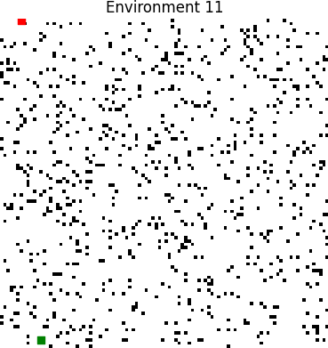
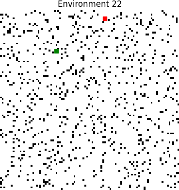

# TP3 Report
## Data plots
## Plot performance


## Plot used_time


## Environments
Green = Start pos

Red = Target pos








## Tabular data
### Performance of agents by environment
|   env |   ('performance', 'bfs') |   ('performance', 'dfs') |   ('performance', 'dijkstra') |   ('performance', 'random') |   ('used_time', 'bfs') |   ('used_time', 'dfs') |   ('used_time', 'dijkstra') |   ('used_time', 'random') |
|------:|-------------------------:|-------------------------:|------------------------------:|----------------------------:|-----------------------:|-----------------------:|----------------------------:|--------------------------:|
|     0 |                 1        |                 1        |                      1        |                 0.0749915   |                     24 |                   4042 |                          24 |                     10000 |
|     1 |                 1        |                 1        |                      1        |                 0.51773     |                     98 |                   2668 |                          98 |                     10000 |
|     2 |                 1        |                 1        |                      1        |                 0.000464272 |                      8 |                    356 |                           8 |                     10000 |
|     3 |                 1        |                 1        |                      1        |                 0.235564    |                     54 |                   1072 |                          54 |                     10000 |
|     4 |                 0.35966  |                 0.35966  |                      0.35966  |                 0.39313     |                  10000 |                  10000 |                       10000 |                     10000 |
|     5 |                 1        |                 1        |                      1        |                 0.0500206   |                     41 |                    565 |                          41 |                     10000 |
|     6 |                 1        |                 1        |                      1        |                 0.233412    |                     83 |                    553 |                          83 |                     10000 |
|     7 |                 1        |                 1        |                      1        |                 0.357676    |                    109 |                    965 |                         109 |                     10000 |
|     8 |                 1        |                 1        |                      1        |                 0.197314    |                     91 |                    113 |                          91 |                     10000 |
|     9 |                 1        |                 1        |                      1        |                 0.178075    |                     62 |                   2114 |                          62 |                     10000 |
|    10 |                 1        |                 1        |                      1        |                 0.0247896   |                     34 |                    940 |                          34 |                     10000 |
|    11 |                 1        |                 1        |                      1        |                 0.46012     |                     57 |                   3967 |                          57 |                     10000 |
|    12 |                 1        |                 1        |                      1        |                 0.313932    |                     68 |                   7292 |                          68 |                     10000 |
|    13 |                 1        |                 1        |                      1        |                 0.467005    |                     77 |                   7229 |                          77 |                     10000 |
|    14 |                 1        |                 1        |                      1        |                 0.296112    |                     18 |                   6070 |                          18 |                     10000 |
|    15 |                 0.367879 |                 0.367879 |                      0.367879 |                 0.218646    |                  10000 |                  10000 |                       10000 |                     10000 |
|    16 |                 1        |                 1        |                      1        |                 0.371146    |                     79 |                   2051 |                          79 |                     10000 |
|    17 |                 1        |                 1        |                      1        |                 0.308423    |                    150 |                    868 |                         150 |                     10000 |
|    18 |                 1        |                 1        |                      1        |                 0.0086816   |                     19 |                   3715 |                          19 |                     10000 |
|    19 |                 1        |                 1        |                      1        |                 0.619974    |                     62 |                   3522 |                          62 |                     10000 |
|    20 |                 1        |                 1        |                      1        |                 0.0401045   |                     41 |                   3615 |                          41 |                     10000 |
|    21 |                 1        |                 1        |                      1        |                 0.710645    |                    115 |                   6455 |                         115 |                     10000 |
|    22 |                 1        |                 1        |                      1        |                 0.633456    |                    113 |                   7471 |                         113 |                     10000 |
|    23 |                 1        |                 1        |                      1        |                 0.235236    |                     77 |                    271 |                          77 |                     10000 |
|    24 |                 1        |                 1        |                      1        |                 0.505873    |                    100 |                   3970 |                         100 |                     10000 |
|    25 |                 1        |                 1        |                      1        |                 0.611886    |                     75 |                   3995 |                          75 |                     10000 |
|    26 |                 1        |                 1        |                      1        |                 0.196255    |                     71 |                   2441 |                          71 |                     10000 |
|    27 |                 1        |                 1        |                      1        |                 0.386422    |                    152 |                   6116 |                         152 |                     10000 |
|    28 |                 1        |                 1        |                      1        |                 0.364337    |                     52 |                   1054 |                          52 |                     10000 |
|    29 |                 1        |                 1        |                      1        |                 0.459137    |                     82 |                    880 |                          82 |                     10000 |
### Used time / performance by environment
|   env |   ('used_time', 'mean') |   ('used_time', 'std') |   ('performance', 'mean') |   ('performance', 'std') |
|------:|------------------------:|-----------------------:|--------------------------:|-------------------------:|
|     0 |                 3522.5  |                4715.47 |                  0.768748 |                0.462504  |
|     1 |                 3216    |                4682.12 |                  0.879432 |                0.241135  |
|     2 |                 2593    |                4940.72 |                  0.750116 |                0.499768  |
|     3 |                 2795    |                4827.25 |                  0.808891 |                0.382218  |
|     4 |                10000    |                   0    |                  0.368027 |                0.0167352 |
|     5 |                 2661.75 |                4898.4  |                  0.762505 |                0.47499   |
|     6 |                 2679.75 |                4885.19 |                  0.808353 |                0.383294  |
|     7 |                 2795.75 |                4819.75 |                  0.839419 |                0.321162  |
|     8 |                 2573.75 |                4950.84 |                  0.799328 |                0.401343  |
|     9 |                 3059.5  |                4727.03 |                  0.794519 |                0.410963  |
|    10 |                 2752    |                4850.84 |                  0.756197 |                0.487605  |
|    11 |                 3520.25 |                4696.63 |                  0.86503  |                0.26994   |
|    12 |                 4357    |                5074.4  |                  0.828483 |                0.343034  |
|    13 |                 4345.75 |                5057.28 |                  0.866751 |                0.266498  |
|    14 |                 4026.5  |                4898.8  |                  0.824028 |                0.351944  |
|    15 |                10000    |                   0    |                  0.330571 |                0.0746166 |
|    16 |                 3052.25 |                4724.2  |                  0.842787 |                0.314427  |
|    17 |                 2792    |                4817.24 |                  0.827106 |                0.345788  |
|    18 |                 3438.25 |                4708.7  |                  0.75217  |                0.495659  |
|    19 |                 3411.5  |                4685.4  |                  0.904994 |                0.190013  |
|    20 |                 3424.25 |                4696.44 |                  0.760026 |                0.479948  |
|    21 |                 4171.25 |                4902.25 |                  0.927661 |                0.144678  |
|    22 |                 4424.25 |                5084.14 |                  0.908364 |                0.183272  |
|    23 |                 2606.25 |                4930.01 |                  0.808809 |                0.382382  |
|    24 |                 3542.5  |                4675.6  |                  0.876468 |                0.247064  |
|    25 |                 3536.25 |                4688.67 |                  0.902971 |                0.194057  |
|    26 |                 3145.75 |                4704.1  |                  0.799064 |                0.401873  |
|    27 |                 4105    |                4832.1  |                  0.846606 |                0.306789  |
|    28 |                 2789.5  |                4830.15 |                  0.841084 |                0.317832  |
|    29 |                 2761    |                4840.64 |                  0.864784 |                0.270432  |
### Used time / performance by agent
| agent_type   |   ('used_time', 'mean') |   ('used_time', 'std') |   ('performance', 'mean') |   ('performance', 'std') |
|:-------------|------------------------:|-----------------------:|--------------------------:|-------------------------:|
| bfs          |                 733.733 |                2519.1  |                  0.957585 |                 0.16142  |
| dfs          |                3479     |                2908.52 |                  0.957585 |                 0.16142  |
| dijkstra     |                 733.733 |                2519.1  |                  0.957585 |                 0.16142  |
| random       |               10000     |                   0    |                  0.315685 |                 0.199677 |
## Data
### Performance of agents by environment
```pd
           performance                               used_time                       
agent_type         bfs       dfs  dijkstra    random       bfs    dfs dijkstra random
env                                                                                  
0             1.000000  1.000000  1.000000  0.074992        24   4042       24  10000
1             1.000000  1.000000  1.000000  0.517730        98   2668       98  10000
2             1.000000  1.000000  1.000000  0.000464         8    356        8  10000
3             1.000000  1.000000  1.000000  0.235564        54   1072       54  10000
4             0.359660  0.359660  0.359660  0.393130     10000  10000    10000  10000
5             1.000000  1.000000  1.000000  0.050021        41    565       41  10000
6             1.000000  1.000000  1.000000  0.233412        83    553       83  10000
7             1.000000  1.000000  1.000000  0.357676       109    965      109  10000
8             1.000000  1.000000  1.000000  0.197314        91    113       91  10000
9             1.000000  1.000000  1.000000  0.178075        62   2114       62  10000
10            1.000000  1.000000  1.000000  0.024790        34    940       34  10000
11            1.000000  1.000000  1.000000  0.460120        57   3967       57  10000
12            1.000000  1.000000  1.000000  0.313932        68   7292       68  10000
13            1.000000  1.000000  1.000000  0.467005        77   7229       77  10000
14            1.000000  1.000000  1.000000  0.296112        18   6070       18  10000
15            0.367879  0.367879  0.367879  0.218646     10000  10000    10000  10000
16            1.000000  1.000000  1.000000  0.371146        79   2051       79  10000
17            1.000000  1.000000  1.000000  0.308423       150    868      150  10000
18            1.000000  1.000000  1.000000  0.008682        19   3715       19  10000
19            1.000000  1.000000  1.000000  0.619974        62   3522       62  10000
20            1.000000  1.000000  1.000000  0.040104        41   3615       41  10000
21            1.000000  1.000000  1.000000  0.710645       115   6455      115  10000
22            1.000000  1.000000  1.000000  0.633456       113   7471      113  10000
23            1.000000  1.000000  1.000000  0.235236        77    271       77  10000
24            1.000000  1.000000  1.000000  0.505873       100   3970      100  10000
25            1.000000  1.000000  1.000000  0.611886        75   3995       75  10000
26            1.000000  1.000000  1.000000  0.196255        71   2441       71  10000
27            1.000000  1.000000  1.000000  0.386422       152   6116      152  10000
28            1.000000  1.000000  1.000000  0.364337        52   1054       52  10000
29            1.000000  1.000000  1.000000  0.459137        82    880       82  10000
```
### Used time / performance by environment
```pd
    used_time              performance          
         mean          std        mean       std
env                                             
0     3522.50  4715.467138    0.768748  0.462504
1     3216.00  4682.122311    0.879432  0.241135
2     2593.00  4940.724238    0.750116  0.499768
3     2795.00  4827.246144    0.808891  0.382218
4    10000.00     0.000000    0.368027  0.016735
5     2661.75  4898.398880    0.762505  0.474990
6     2679.75  4885.193505    0.808353  0.383294
7     2795.75  4819.754999    0.839419  0.321162
8     2573.75  4950.844196    0.799328  0.401343
9     3059.50  4727.033002    0.794519  0.410963
10    2752.00  4850.838278    0.756197  0.487605
11    3520.25  4696.628108    0.865030  0.269940
12    4357.00  5074.403610    0.828483  0.343034
13    4345.75  5057.276169    0.866751  0.266498
14    4026.50  4898.800499    0.824028  0.351944
15   10000.00     0.000000    0.330571  0.074617
16    3052.25  4724.198795    0.842787  0.314427
17    2792.00  4817.238766    0.827106  0.345788
18    3438.25  4708.704519    0.752170  0.495659
19    3411.50  4685.397279    0.904994  0.190013
20    3424.25  4696.439600    0.760026  0.479948
21    4171.25  4902.250121    0.927661  0.144678
22    4424.25  5084.139611    0.908364  0.183272
23    2606.25  4930.014968    0.808809  0.382382
24    3542.50  4675.598892    0.876468  0.247064
25    3536.25  4688.674964    0.902971  0.194057
26    3145.75  4704.097177    0.799064  0.401873
27    4105.00  4832.099751    0.846606  0.306789
28    2789.50  4830.151240    0.841084  0.317832
29    2761.00  4840.639214    0.864784  0.270432
```
### Used time / performance by agent
```pd
               used_time              performance          
                    mean          std        mean       std
agent_type                                                 
bfs           733.733333  2519.098278    0.957585  0.161420
dfs          3479.000000  2908.515678    0.957585  0.161420
dijkstra      733.733333  2519.098278    0.957585  0.161420
random      10000.000000     0.000000    0.315685  0.199677
```

## Raw Data
```csv
,used_time,agent_type,performance,env
10,8,bfs,1.0,2
58,18,bfs,1.0,14
74,19,bfs,1.0,18
2,24,bfs,1.0,0
42,34,bfs,1.0,10
22,41,bfs,1.0,5
82,41,bfs,1.0,20
114,52,bfs,1.0,28
14,54,bfs,1.0,3
46,57,bfs,1.0,11
38,62,bfs,1.0,9
78,62,bfs,1.0,19
50,68,bfs,1.0,12
106,71,bfs,1.0,26
102,75,bfs,1.0,25
54,77,bfs,1.0,13
94,77,bfs,1.0,23
66,79,bfs,1.0,16
118,82,bfs,1.0,29
26,83,bfs,1.0,6
34,91,bfs,1.0,8
6,98,bfs,1.0,1
98,100,bfs,1.0,24
30,109,bfs,1.0,7
90,113,bfs,1.0,22
86,115,bfs,1.0,21
70,150,bfs,1.0,17
110,152,bfs,1.0,27
18,10000,bfs,0.35965961973616595,4
62,10000,bfs,0.36787944117144233,15
33,113,dfs,1.0,8
93,271,dfs,1.0,23
9,356,dfs,1.0,2
25,553,dfs,1.0,6
21,565,dfs,1.0,5
69,868,dfs,1.0,17
117,880,dfs,1.0,29
41,940,dfs,1.0,10
29,965,dfs,1.0,7
113,1054,dfs,1.0,28
13,1072,dfs,1.0,3
65,2051,dfs,1.0,16
37,2114,dfs,1.0,9
105,2441,dfs,1.0,26
5,2668,dfs,1.0,1
77,3522,dfs,1.0,19
81,3615,dfs,1.0,20
73,3715,dfs,1.0,18
45,3967,dfs,1.0,11
97,3970,dfs,1.0,24
101,3995,dfs,1.0,25
1,4042,dfs,1.0,0
57,6070,dfs,1.0,14
109,6116,dfs,1.0,27
85,6455,dfs,1.0,21
53,7229,dfs,1.0,13
49,7292,dfs,1.0,12
89,7471,dfs,1.0,22
17,10000,dfs,0.35965961973616595,4
61,10000,dfs,0.36787944117144233,15
11,8,dijkstra,1.0,2
59,18,dijkstra,1.0,14
75,19,dijkstra,1.0,18
3,24,dijkstra,1.0,0
43,34,dijkstra,1.0,10
23,41,dijkstra,1.0,5
83,41,dijkstra,1.0,20
115,52,dijkstra,1.0,28
15,54,dijkstra,1.0,3
47,57,dijkstra,1.0,11
39,62,dijkstra,1.0,9
79,62,dijkstra,1.0,19
51,68,dijkstra,1.0,12
107,71,dijkstra,1.0,26
103,75,dijkstra,1.0,25
55,77,dijkstra,1.0,13
95,77,dijkstra,1.0,23
67,79,dijkstra,1.0,16
119,82,dijkstra,1.0,29
27,83,dijkstra,1.0,6
35,91,dijkstra,1.0,8
7,98,dijkstra,1.0,1
99,100,dijkstra,1.0,24
31,109,dijkstra,1.0,7
91,113,dijkstra,1.0,22
87,115,dijkstra,1.0,21
71,150,dijkstra,1.0,17
111,152,dijkstra,1.0,27
19,10000,dijkstra,0.35965961973616595,4
63,10000,dijkstra,0.36787944117144233,15
8,10000,random,0.0004642716536946468,2
72,10000,random,0.008681601658853887,18
40,10000,random,0.02478955561673488,10
80,10000,random,0.04010445629537077,20
20,10000,random,0.05002058620701673,5
0,10000,random,0.07499152485770726,0
36,10000,random,0.17807481071185385,9
104,10000,random,0.19625471774646094,26
32,10000,random,0.19731375766266504,8
60,10000,random,0.21864627408075518,15
24,10000,random,0.23341225586109313,6
92,10000,random,0.23523577978126836,23
12,10000,random,0.23556423920265349,3
56,10000,random,0.29611194687022124,14
68,10000,random,0.3084234640137731,17
48,10000,random,0.31393163718181355,12
28,10000,random,0.357676004658025,7
112,10000,random,0.3643365898093783,28
64,10000,random,0.3711464123242116,16
108,10000,random,0.3864220767258962,27
16,10000,random,0.39312997686902407,4
116,10000,random,0.45913692187968785,29
44,10000,random,0.4601197564395,11
52,10000,random,0.4670048778615439,13
96,10000,random,0.5058726418894779,24
4,10000,random,0.5177298601707012,1
100,10000,random,0.6118858141904003,25
76,10000,random,0.6199742325972222,19
88,10000,random,0.6334558707183339,22
84,10000,random,0.7106447370838566,21

```
