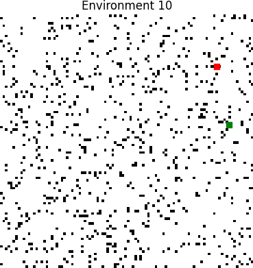
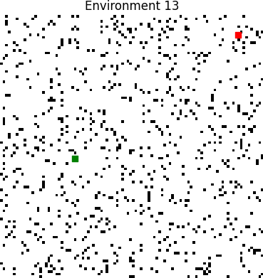
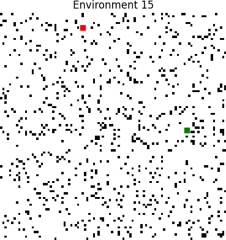
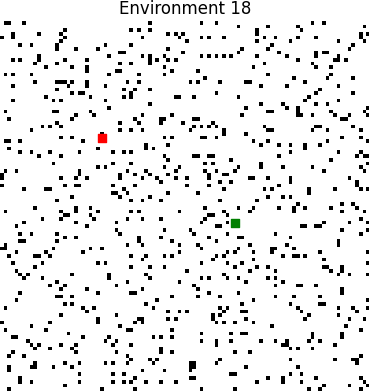
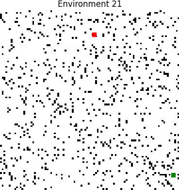
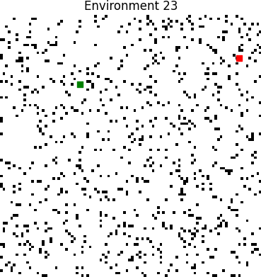
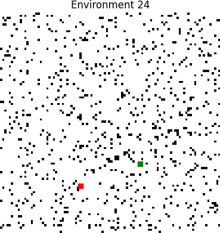

# TP3 Report
## Data plots
## Plot performance


## Plot used_time


## Environments
Green = Start pos

Red = Target pos






















## Tabular data
### Performance of agents by environment
|   env |   ('performance', 'bfs') |   ('performance', 'dfs') |   ('performance', 'dijkstra') |   ('performance', 'random') |   ('used_time', 'bfs') |   ('used_time', 'dfs') |   ('used_time', 'dijkstra') |   ('used_time', 'random') |
|------:|-------------------------:|-------------------------:|------------------------------:|----------------------------:|-----------------------:|-----------------------:|----------------------------:|--------------------------:|
|     0 |                 1        |                 1        |                      1        |                   0.630631  |                     80 |                   4760 |                          80 |                     10000 |
|     1 |                 1        |                 1        |                      1        |                   0.117264  |                     28 |                   4638 |                          28 |                     10000 |
|     2 |                 1        |                 1        |                      1        |                   0.0813415 |                     46 |                   6490 |                          46 |                     10000 |
|     3 |                 1        |                 1        |                      1        |                   0.472547  |                     70 |                   2502 |                          70 |                     10000 |
|     4 |                 1        |                 1        |                      1        |                   0.632224  |                    142 |                   7348 |                         142 |                     10000 |
|     5 |                 1        |                 1        |                      1        |                   0.0691822 |                     59 |                    617 |                          59 |                     10000 |
|     6 |                 1        |                 1        |                      1        |                   0.861261  |                    106 |                   4362 |                         106 |                     10000 |
|     7 |                 1        |                 1        |                      1        |                   0.465698  |                     48 |                   1568 |                          48 |                     10000 |
|     8 |                 1        |                 1        |                      1        |                   0.206146  |                     68 |                   3142 |                          68 |                     10000 |
|     9 |                 1        |                 1        |                      1        |                   0.451156  |                    103 |                   7593 |                         103 |                     10000 |
|    10 |                 1        |                 1        |                      1        |                   0.0421266 |                     38 |                   3674 |                          38 |                     10000 |
|    11 |                 1        |                 1        |                      1        |                   0.0726463 |                     33 |                   1663 |                          33 |                     10000 |
|    12 |                 1        |                 1        |                      1        |                   1         |                     81 |                   3637 |                          81 |                      3282 |
|    13 |                 1        |                 1        |                      1        |                   0.108764  |                     47 |                   6111 |                          47 |                     10000 |
|    14 |                 1        |                 1        |                      1        |                   0.279548  |                     75 |                   3311 |                          75 |                     10000 |
|    15 |                 1        |                 1        |                      1        |                   0.273463  |                     81 |                   2029 |                          81 |                     10000 |
|    16 |                 1        |                 1        |                      1        |                   0.183037  |                     49 |                   5195 |                          49 |                     10000 |
|    17 |                 1        |                 1        |                      1        |                   0.0752731 |                     51 |                   2293 |                          51 |                     10000 |
|    18 |                 1        |                 1        |                      1        |                   0.25788   |                     21 |                    767 |                          21 |                     10000 |
|    19 |                 1        |                 1        |                      1        |                   0.750374  |                     92 |                   4694 |                          92 |                     10000 |
|    20 |                 1        |                 1        |                      1        |                   0.419852  |                     51 |                   6569 |                          51 |                     10000 |
|    21 |                 1        |                 1        |                      1        |                   0.273661  |                     54 |                   3142 |                          54 |                     10000 |
|    22 |                 1        |                 1        |                      1        |                   0.143591  |                     45 |                   6321 |                          45 |                     10000 |
|    23 |                 1        |                 1        |                      1        |                   0.306245  |                     77 |                   2957 |                          77 |                     10000 |
|    24 |                 1        |                 1        |                      1        |                   0.304482  |                     64 |                   5818 |                          64 |                     10000 |
|    25 |                 1        |                 1        |                      1        |                   0.426932  |                     88 |                   2752 |                          88 |                     10000 |
|    26 |                 1        |                 1        |                      1        |                   0.526072  |                     73 |                   5597 |                          73 |                     10000 |
|    27 |                 0.345136 |                 0.345136 |                      0.345136 |                   0.279139  |                  10000 |                  10000 |                       10000 |                     10000 |
|    28 |                 1        |                 1        |                      1        |                   0.260139  |                     35 |                   3651 |                          35 |                     10000 |
|    29 |                 1        |                 1        |                      1        |                   0.216248  |                     60 |                   3274 |                          60 |                     10000 |
|    30 |                 1        |                 1        |                      1        |                   0.32674   |                    126 |                   6804 |                         126 |                     10000 |
|    31 |                 1        |                 1        |                      1        |                   0.300436  |                     85 |                   6055 |                          85 |                     10000 |
### Used time / performance by environment
|   env |   ('used_time', 'mean') |   ('used_time', 'std') |   ('performance', 'mean') |   ('performance', 'std') |
|------:|------------------------:|-----------------------:|--------------------------:|-------------------------:|
|     0 |                 3730    |                4726.48 |                  0.907658 |                0.184685  |
|     1 |                 3673.5  |                4744.62 |                  0.779316 |                0.441368  |
|     2 |                 4145.5  |                4945.83 |                  0.770335 |                0.459329  |
|     3 |                 3160.5  |                4701.59 |                  0.868137 |                0.263727  |
|     4 |                 4408    |                5043.53 |                  0.908056 |                0.183888  |
|     5 |                 2683.75 |                4884.59 |                  0.767296 |                0.465409  |
|     6 |                 3643.5  |                4688.61 |                  0.965315 |                0.0693695 |
|     7 |                 2916    |                4776.71 |                  0.866425 |                0.267151  |
|     8 |                 3319.5  |                4683.48 |                  0.801537 |                0.396927  |
|     9 |                 4449.75 |                5114.48 |                  0.862789 |                0.274422  |
|    10 |                 3437.5  |                4698.78 |                  0.760532 |                0.478937  |
|    11 |                 2932.25 |                4774.08 |                  0.768162 |                0.463677  |
|    12 |                 1770.25 |                1955.95 |                  1        |                0         |
|    13 |                 4051.25 |                4888.7  |                  0.777191 |                0.445618  |
|    14 |                 3365.25 |                4678.83 |                  0.819887 |                0.360226  |
|    15 |                 3047.75 |                4724.93 |                  0.818366 |                0.363269  |
|    16 |                 3823.25 |                4779.26 |                  0.795759 |                0.408481  |
|    17 |                 3098.75 |                4720.67 |                  0.768818 |                0.462363  |
|    18 |                 2702.25 |                4877.86 |                  0.81447  |                0.37106   |
|    19 |                 3719.5  |                4715.64 |                  0.937594 |                0.124813  |
|    20 |                 4167.75 |                4955.68 |                  0.854963 |                0.290074  |
|    21 |                 3312.5  |                4689.97 |                  0.818415 |                0.36317   |
|    22 |                 4102.75 |                4920.33 |                  0.785898 |                0.428204  |
|    23 |                 3277.75 |                4682.63 |                  0.826561 |                0.346878  |
|    24 |                 3986.5  |                4840.41 |                  0.82612  |                0.347759  |
|    25 |                 3232    |                4683.51 |                  0.856733 |                0.286534  |
|    26 |                 3935.75 |                4808.9  |                  0.881518 |                0.236964  |
|    27 |                10000    |                   0    |                  0.328637 |                0.0329984 |
|    28 |                 3430.25 |                4699.85 |                  0.815035 |                0.369931  |
|    29 |                 3348.5  |                4686.02 |                  0.804062 |                0.391876  |
|    30 |                 4264    |                4953.09 |                  0.831685 |                0.33663   |
|    31 |                 4056.25 |                4860.21 |                  0.825109 |                0.349782  |
### Used time / performance by agent
| agent_type   |   ('used_time', 'mean') |   ('used_time', 'std') |   ('performance', 'mean') |   ('performance', 'std') |
|:-------------|------------------------:|-----------------------:|--------------------------:|-------------------------:|
| bfs          |                 377.375 |                1756.14 |                  0.979535 |                 0.115765 |
| dfs          |                4354.19  |                2181.37 |                  0.979535 |                 0.115765 |
| dijkstra     |                 377.375 |                1756.14 |                  0.979535 |                 0.115765 |
| random       |                9790.06  |                1187.59 |                  0.337941 |                 0.237136 |
## Data
### Performance of agents by environment
```pd
           performance                               used_time                       
agent_type         bfs       dfs  dijkstra    random       bfs    dfs dijkstra random
env                                                                                  
0             1.000000  1.000000  1.000000  0.630631        80   4760       80  10000
1             1.000000  1.000000  1.000000  0.117264        28   4638       28  10000
2             1.000000  1.000000  1.000000  0.081342        46   6490       46  10000
3             1.000000  1.000000  1.000000  0.472547        70   2502       70  10000
4             1.000000  1.000000  1.000000  0.632224       142   7348      142  10000
5             1.000000  1.000000  1.000000  0.069182        59    617       59  10000
6             1.000000  1.000000  1.000000  0.861261       106   4362      106  10000
7             1.000000  1.000000  1.000000  0.465698        48   1568       48  10000
8             1.000000  1.000000  1.000000  0.206146        68   3142       68  10000
9             1.000000  1.000000  1.000000  0.451156       103   7593      103  10000
10            1.000000  1.000000  1.000000  0.042127        38   3674       38  10000
11            1.000000  1.000000  1.000000  0.072646        33   1663       33  10000
12            1.000000  1.000000  1.000000  1.000000        81   3637       81   3282
13            1.000000  1.000000  1.000000  0.108764        47   6111       47  10000
14            1.000000  1.000000  1.000000  0.279548        75   3311       75  10000
15            1.000000  1.000000  1.000000  0.273463        81   2029       81  10000
16            1.000000  1.000000  1.000000  0.183037        49   5195       49  10000
17            1.000000  1.000000  1.000000  0.075273        51   2293       51  10000
18            1.000000  1.000000  1.000000  0.257880        21    767       21  10000
19            1.000000  1.000000  1.000000  0.750374        92   4694       92  10000
20            1.000000  1.000000  1.000000  0.419852        51   6569       51  10000
21            1.000000  1.000000  1.000000  0.273661        54   3142       54  10000
22            1.000000  1.000000  1.000000  0.143591        45   6321       45  10000
23            1.000000  1.000000  1.000000  0.306245        77   2957       77  10000
24            1.000000  1.000000  1.000000  0.304482        64   5818       64  10000
25            1.000000  1.000000  1.000000  0.426932        88   2752       88  10000
26            1.000000  1.000000  1.000000  0.526072        73   5597       73  10000
27            0.345136  0.345136  0.345136  0.279139     10000  10000    10000  10000
28            1.000000  1.000000  1.000000  0.260139        35   3651       35  10000
29            1.000000  1.000000  1.000000  0.216248        60   3274       60  10000
30            1.000000  1.000000  1.000000  0.326740       126   6804      126  10000
31            1.000000  1.000000  1.000000  0.300436        85   6055       85  10000
```
### Used time / performance by environment
```pd
    used_time              performance          
         mean          std        mean       std
env                                             
0     3730.00  4726.478605    0.907658  0.184685
1     3673.50  4744.618109    0.779316  0.441368
2     4145.50  4945.828242    0.770335  0.459329
3     3160.50  4701.587072    0.868137  0.263727
4     4408.00  5043.529716    0.908056  0.183888
5     2683.75  4884.587828    0.767296  0.465409
6     3643.50  4688.608429    0.965315  0.069369
7     2916.00  4776.714631    0.866425  0.267151
8     3319.50  4683.484849    0.801537  0.396927
9     4449.75  5114.481621    0.862789  0.274422
10    3437.50  4698.777820    0.760532  0.478937
11    2932.25  4774.075364    0.768162  0.463677
12    1770.25  1955.954562    1.000000  0.000000
13    4051.25  4888.702376    0.777191  0.445618
14    3365.25  4678.829652    0.819887  0.360226
15    3047.75  4724.928315    0.818366  0.363269
16    3823.25  4779.256035    0.795759  0.408481
17    3098.75  4720.665375    0.768818  0.462363
18    2702.25  4877.859871    0.814470  0.371060
19    3719.50  4715.642162    0.937594  0.124813
20    4167.75  4955.683698    0.854963  0.290074
21    3312.50  4689.966986    0.818415  0.363170
22    4102.75  4920.327250    0.785898  0.428204
23    3277.75  4682.631979    0.826561  0.346878
24    3986.50  4840.405871    0.826120  0.347759
25    3232.00  4683.506379    0.856733  0.286534
26    3935.75  4808.899900    0.881518  0.236964
27   10000.00     0.000000    0.328637  0.032998
28    3430.25  4699.850733    0.815035  0.369931
29    3348.50  4686.024150    0.804062  0.391876
30    4264.00  4953.092771    0.831685  0.336630
31    4056.25  4860.206400    0.825109  0.349782
```
### Used time / performance by agent
```pd
            used_time              performance          
                 mean          std        mean       std
agent_type                                              
bfs          377.3750  1756.144967    0.979535  0.115765
dfs         4354.1875  2181.366299    0.979535  0.115765
dijkstra     377.3750  1756.144967    0.979535  0.115765
random      9790.0625  1187.585839    0.337941  0.237136
```

## Raw Data
```csv
,used_time,agent_type,performance,env
74,21,bfs,1.0,18
6,28,bfs,1.0,1
46,33,bfs,1.0,11
114,35,bfs,1.0,28
42,38,bfs,1.0,10
90,45,bfs,1.0,22
10,46,bfs,1.0,2
54,47,bfs,1.0,13
30,48,bfs,1.0,7
66,49,bfs,1.0,16
70,51,bfs,1.0,17
82,51,bfs,1.0,20
86,54,bfs,1.0,21
22,59,bfs,1.0,5
118,60,bfs,1.0,29
98,64,bfs,1.0,24
34,68,bfs,1.0,8
14,70,bfs,1.0,3
106,73,bfs,1.0,26
58,75,bfs,1.0,14
94,77,bfs,1.0,23
2,80,bfs,1.0,0
50,81,bfs,1.0,12
62,81,bfs,1.0,15
126,85,bfs,1.0,31
102,88,bfs,1.0,25
78,92,bfs,1.0,19
38,103,bfs,1.0,9
26,106,bfs,1.0,6
122,126,bfs,1.0,30
18,142,bfs,1.0,4
110,10000,bfs,0.3451357943546654,27
21,617,dfs,1.0,5
73,767,dfs,1.0,18
29,1568,dfs,1.0,7
45,1663,dfs,1.0,11
61,2029,dfs,1.0,15
69,2293,dfs,1.0,17
13,2502,dfs,1.0,3
101,2752,dfs,1.0,25
93,2957,dfs,1.0,23
33,3142,dfs,1.0,8
85,3142,dfs,1.0,21
117,3274,dfs,1.0,29
57,3311,dfs,1.0,14
49,3637,dfs,1.0,12
113,3651,dfs,1.0,28
41,3674,dfs,1.0,10
25,4362,dfs,1.0,6
5,4638,dfs,1.0,1
77,4694,dfs,1.0,19
1,4760,dfs,1.0,0
65,5195,dfs,1.0,16
105,5597,dfs,1.0,26
97,5818,dfs,1.0,24
125,6055,dfs,1.0,31
53,6111,dfs,1.0,13
89,6321,dfs,1.0,22
9,6490,dfs,1.0,2
81,6569,dfs,1.0,20
121,6804,dfs,1.0,30
17,7348,dfs,1.0,4
37,7593,dfs,1.0,9
109,10000,dfs,0.3451357943546654,27
75,21,dijkstra,1.0,18
7,28,dijkstra,1.0,1
47,33,dijkstra,1.0,11
115,35,dijkstra,1.0,28
43,38,dijkstra,1.0,10
91,45,dijkstra,1.0,22
11,46,dijkstra,1.0,2
55,47,dijkstra,1.0,13
31,48,dijkstra,1.0,7
67,49,dijkstra,1.0,16
71,51,dijkstra,1.0,17
83,51,dijkstra,1.0,20
87,54,dijkstra,1.0,21
23,59,dijkstra,1.0,5
119,60,dijkstra,1.0,29
99,64,dijkstra,1.0,24
35,68,dijkstra,1.0,8
15,70,dijkstra,1.0,3
107,73,dijkstra,1.0,26
59,75,dijkstra,1.0,14
95,77,dijkstra,1.0,23
3,80,dijkstra,1.0,0
51,81,dijkstra,1.0,12
63,81,dijkstra,1.0,15
127,85,dijkstra,1.0,31
103,88,dijkstra,1.0,25
79,92,dijkstra,1.0,19
39,103,dijkstra,1.0,9
27,106,dijkstra,1.0,6
123,126,dijkstra,1.0,30
19,142,dijkstra,1.0,4
111,10000,dijkstra,0.3451357943546654,27
48,3282,random,1.0,12
40,10000,random,0.04212660697503819,10
20,10000,random,0.06918217821577244,5
44,10000,random,0.07264627007046831,11
68,10000,random,0.0752730822954191,17
8,10000,random,0.08134153658821176,2
52,10000,random,0.1087644801870546,13
4,10000,random,0.11726372241310015,1
88,10000,random,0.14359140294114192,22
64,10000,random,0.18303729916526926,16
32,10000,random,0.20614625612678508,8
116,10000,random,0.21624837855995652,29
72,10000,random,0.257879758671326,18
112,10000,random,0.2601387842352727,28
60,10000,random,0.273462741767544,15
84,10000,random,0.2736609609059089,21
108,10000,random,0.27913891402769586,27
56,10000,random,0.2795483688491554,14
124,10000,random,0.30043583920237577,31
96,10000,random,0.3044819109321498,24
92,10000,random,0.3062447410281265,23
120,10000,random,0.3267403174179401,30
80,10000,random,0.4198518963792285,20
100,10000,random,0.4269320042101683,25
36,10000,random,0.4511561811023075,9
28,10000,random,0.4656983829929558,7
12,10000,random,0.4725466928311176,3
104,10000,random,0.5260715504469794,26
0,10000,random,0.6306307477197128,0
16,10000,random,0.6322235312051043,4
76,10000,random,0.7503742000729384,19
24,10000,random,0.8612610739316546,6

```
