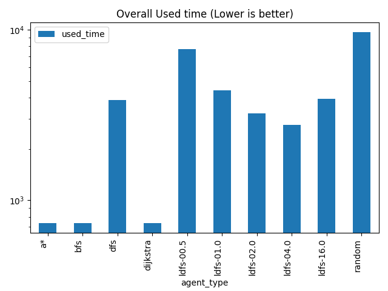
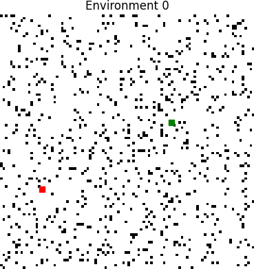
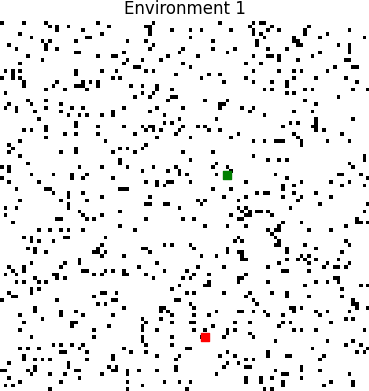
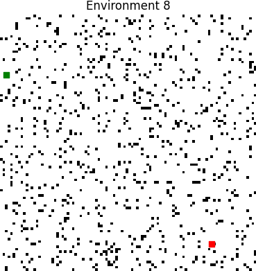
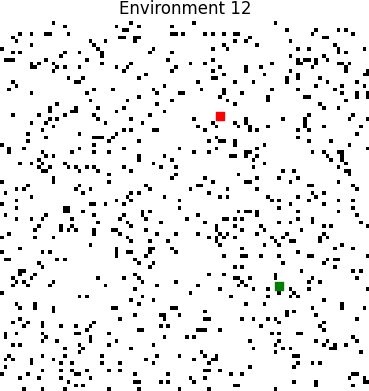
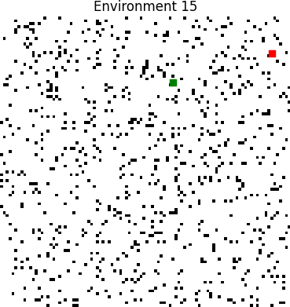
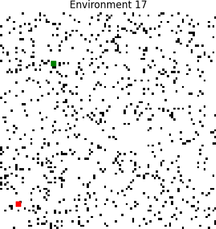
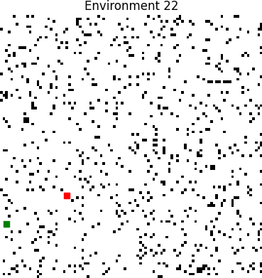
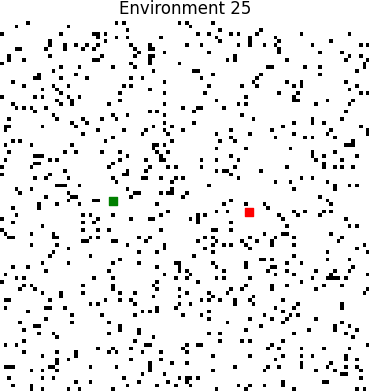

# TP4 Report (B)
## Data plots
## Performance Plot


## Used time Plot


## Overall Performance Plot


## Overall Used time Plot



## Environments
Green = Start pos

Red = Target pos






















## Tabular data
### Performance of agents by environment
|   env |   ('performance', 'a*') |   ('performance', 'bfs') |   ('performance', 'dfs') |   ('performance', 'dijkstra') |   ('performance', 'ldfs-00.5') |   ('performance', 'ldfs-01.0') |   ('performance', 'ldfs-02.0') |   ('performance', 'ldfs-04.0') |   ('performance', 'ldfs-16.0') |   ('performance', 'random') |   ('used_time', 'a*') |   ('used_time', 'bfs') |   ('used_time', 'dfs') |   ('used_time', 'dijkstra') |   ('used_time', 'ldfs-00.5') |   ('used_time', 'ldfs-01.0') |   ('used_time', 'ldfs-02.0') |   ('used_time', 'ldfs-04.0') |   ('used_time', 'ldfs-16.0') |   ('used_time', 'random') |
|------:|------------------------:|-------------------------:|-------------------------:|------------------------------:|-------------------------------:|-------------------------------:|-------------------------------:|-------------------------------:|-------------------------------:|----------------------------:|----------------------:|-----------------------:|-----------------------:|----------------------------:|-----------------------------:|-----------------------------:|-----------------------------:|-----------------------------:|-----------------------------:|--------------------------:|
|     0 |                       1 |                        1 |                        1 |                             1 |                       1        |                       0.258385 |                       1        |                       1        |                       1        |                 0.273385    |                    74 |                     66 |                   5334 |                          66 |                          110 |                        10000 |                          268 |                          958 |                         1506 |                     10000 |
|     1 |                       1 |                        1 |                        1 |                             1 |                       0.36179  |                       0.36179  |                       1        |                       1        |                       0.36179  |                 0.40839     |                    58 |                     58 |                   6916 |                          58 |                        10000 |                        10000 |                          596 |                         1194 |                        10000 |                     10000 |
|     2 |                       1 |                        1 |                        1 |                             1 |                       1        |                       1        |                       1        |                       1        |                       1        |                 4.45211e-07 |                     5 |                      5 |                   7153 |                           5 |                           29 |                          177 |                          177 |                          177 |                         1503 |                     10000 |
|     3 |                       1 |                        1 |                        1 |                             1 |                       1        |                       1        |                       1        |                       1        |                       1        |                 0.2916      |                    67 |                     67 |                   5369 |                          67 |                          109 |                          231 |                          249 |                          249 |                          249 |                     10000 |
|     4 |                       1 |                        1 |                        1 |                             1 |                       0.444196 |                       0.444196 |                       1        |                       1        |                       1        |                 0.152498    |                    67 |                     67 |                   1017 |                          67 |                        10000 |                        10000 |                          253 |                          415 |                         1017 |                     10000 |
|     5 |                       1 |                        1 |                        1 |                             1 |                       0.378086 |                       0.378086 |                       0.378086 |                       1        |                       0.378086 |                 0.307672    |                    44 |                     44 |                   4114 |                          44 |                        10000 |                        10000 |                        10000 |                          668 |                        10000 |                     10000 |
|     6 |                       1 |                        1 |                        1 |                             1 |                       0.367879 |                       1        |                       1        |                       1        |                       1        |                 0.390663    |                    78 |                     78 |                   4392 |                          78 |                        10000 |                          208 |                          408 |                          220 |                         3358 |                     10000 |
|     7 |                       1 |                        1 |                        1 |                             1 |                       1        |                       1        |                       1        |                       1        |                       1        |                 0.375379    |                    60 |                     60 |                   1942 |                          60 |                          110 |                          212 |                          254 |                          324 |                         1942 |                     10000 |
|     8 |                       1 |                        1 |                        1 |                             1 |                       0.367879 |                       1        |                       1        |                       1        |                       1        |                 0.13008     |                    51 |                     51 |                    631 |                          51 |                        10000 |                           85 |                           87 |                          387 |                          631 |                     10000 |
|     9 |                       1 |                        1 |                        1 |                             1 |                       0.369124 |                       0.369124 |                       0.369124 |                       0.369124 |                       0.369124 |                 0.61297     |                   104 |                    104 |                   7890 |                         104 |                        10000 |                        10000 |                        10000 |                        10000 |                        10000 |                     10000 |
|    10 |                       1 |                        1 |                        1 |                             1 |                       1        |                       1        |                       1        |                       1        |                       1        |                 0.0128536   |                    23 |                     23 |                   3341 |                          23 |                           71 |                          133 |                          353 |                          683 |                         2663 |                     10000 |
|    11 |                       1 |                        1 |                        1 |                             1 |                       0.284477 |                       0.284477 |                       0.284477 |                       1        |                       1        |                 0.0533748   |                    43 |                     43 |                   1845 |                          43 |                        10000 |                        10000 |                        10000 |                          531 |                         1845 |                     10000 |
|    12 |                       1 |                        1 |                        1 |                             1 |                       0.382016 |                       1        |                       1        |                       1        |                       1        |                 0.269993    |                    76 |                     76 |                   2336 |                          76 |                        10000 |                          144 |                          316 |                          152 |                         2336 |                     10000 |
|    13 |                       1 |                        1 |                        1 |                             1 |                       0.273269 |                       0.273269 |                       1        |                       1        |                       1        |                 0.210325    |                    70 |                     70 |                   5328 |                          70 |                        10000 |                        10000 |                          438 |                          804 |                         1302 |                     10000 |
|    14 |                       1 |                        1 |                        1 |                             1 |                       1        |                       0.417081 |                       1        |                       1        |                       1        |                 0.108226    |                    36 |                     36 |                    654 |                          36 |                           62 |                        10000 |                          250 |                          502 |                          654 |                     10000 |
|    15 |                       1 |                        1 |                        1 |                             1 |                       0.370274 |                       0.370274 |                       0.370274 |                       0.370274 |                       1        |                 1           |                    69 |                     69 |                   5167 |                          69 |                        10000 |                        10000 |                        10000 |                        10000 |                         3855 |                      5858 |
|    16 |                       1 |                        1 |                        1 |                             1 |                       0.383845 |                       0.383845 |                       0.383845 |                       0.383845 |                       0.383845 |                 0.204729    |                    67 |                     67 |                   6695 |                          67 |                        10000 |                        10000 |                        10000 |                        10000 |                        10000 |                     10000 |
|    17 |                       1 |                        1 |                        1 |                             1 |                       0.478995 |                       0.478995 |                       0.478995 |                       0.478995 |                       0.478995 |                 1           |                   115 |                    115 |                   7177 |                         115 |                        10000 |                        10000 |                        10000 |                        10000 |                        10000 |                      3550 |
|    18 |                       1 |                        1 |                        1 |                             1 |                       0.287433 |                       0.287433 |                       0.287433 |                       0.287433 |                       0.287433 |                 0.32963     |                   120 |                    118 |                   5150 |                         118 |                        10000 |                        10000 |                        10000 |                        10000 |                        10000 |                     10000 |
|    19 |                       1 |                        1 |                        1 |                             1 |                       1        |                       1        |                       1        |                       1        |                       1        |                 0.272879    |                    42 |                     42 |                   4848 |                          42 |                          106 |                          212 |                          420 |                          814 |                         3414 |                     10000 |
|    20 |                       1 |                        1 |                        1 |                             1 |                       0.262547 |                       0.262547 |                       0.262547 |                       1        |                       1        |                 0.0777687   |                    39 |                     39 |                   6333 |                          39 |                        10000 |                        10000 |                        10000 |                          849 |                         1083 |                     10000 |
|    21 |                       1 |                        1 |                        1 |                             1 |                       1        |                       1        |                       1        |                       1        |                       1        |                 0.208931    |                    78 |                     78 |                   2740 |                          78 |                           84 |                          152 |                          338 |                          590 |                         2718 |                     10000 |
|    22 |                       1 |                        1 |                        1 |                             1 |                       0.400885 |                       0.400885 |                       0.400885 |                       0.400885 |                       1        |                 0.32327     |                    55 |                     55 |                   3451 |                          55 |                        10000 |                        10000 |                        10000 |                        10000 |                         2439 |                     10000 |
|    23 |                       1 |                        1 |                        1 |                             1 |                       1        |                       1        |                       1        |                       1        |                       1        |                 0.00621771  |                    14 |                     14 |                   1428 |                          14 |                           52 |                          134 |                          172 |                          566 |                         1428 |                     10000 |
|    24 |                       1 |                        1 |                        1 |                             1 |                       1        |                       1        |                       1        |                       1        |                       1        |                 0.293545    |                    65 |                     65 |                   6011 |                          65 |                          149 |                          299 |                          603 |                          359 |                         4847 |                     10000 |
|    25 |                       1 |                        1 |                        1 |                             1 |                       0.372498 |                       1        |                       1        |                       1        |                       1        |                 0.247149    |                    78 |                     78 |                    404 |                          78 |                        10000 |                          196 |                          394 |                          404 |                          404 |                     10000 |
|    26 |                       1 |                        1 |                        1 |                             1 |                       0.415036 |                       0.415036 |                       0.415036 |                       1        |                       1        |                 0.512924    |                   126 |                    126 |                   3306 |                         126 |                        10000 |                        10000 |                        10000 |                          576 |                         3292 |                     10000 |
|    27 |                       1 |                        1 |                        1 |                             1 |                       0.372139 |                       0.372139 |                       0.372139 |                       0.372139 |                       0.372139 |                 0.706516    |                    77 |                     77 |                   6225 |                          77 |                        10000 |                        10000 |                        10000 |                        10000 |                        10000 |                     10000 |
|    28 |                       1 |                        1 |                        1 |                             1 |                       1        |                       0.329099 |                       0.329099 |                       1        |                       1        |                 0.2022      |                    31 |                     31 |                   6025 |                          31 |                          125 |                        10000 |                        10000 |                         1043 |                         4175 |                     10000 |
|    29 |                       1 |                        1 |                        1 |                             1 |                       1        |                       1        |                       1        |                       1        |                       1        |                 0.372151    |                    86 |                     86 |                    246 |                          86 |                          142 |                          246 |                          246 |                          246 |                          246 |                     10000 |
### Used time / performance by environment
|   env |   ('used_time', 'mean') |   ('used_time', 'std') |   ('performance', 'mean') |   ('performance', 'std') |
|------:|------------------------:|-----------------------:|--------------------------:|-------------------------:|
|     0 |                  2838.2 |                4098.53 |                  0.853177 |                 0.30955  |
|     1 |                  4888   |                4838.46 |                  0.749376 |                 0.323834 |
|     2 |                  1923.1 |                3598.4  |                  0.9      |                 0.316228 |
|     3 |                  1665.7 |                3355.68 |                  0.92916  |                 0.224016 |
|     4 |                  3290.3 |                4643.48 |                  0.804089 |                 0.325284 |
|     5 |                  5491.4 |                4896.96 |                  0.682002 |                 0.335857 |
|     6 |                  2882   |                4052.2  |                  0.875854 |                 0.261777 |
|     7 |                  1496.4 |                3080.19 |                  0.937538 |                 0.197522 |
|     8 |                  2197.4 |                4118.83 |                  0.849796 |                 0.32158  |
|     9 |                  6820.2 |                4680.14 |                  0.645859 |                 0.313698 |
|    10 |                  1731.3 |                3142.81 |                  0.901285 |                 0.312163 |
|    11 |                  4435   |                4835.1  |                  0.690681 |                 0.404864 |
|    12 |                  2551.2 |                4027.52 |                  0.865201 |                 0.285405 |
|    13 |                  3808.2 |                4544.98 |                  0.775686 |                 0.361585 |
|    14 |                  2223   |                4106.37 |                  0.852531 |                 0.319302 |
|    15 |                  5508.7 |                4377.11 |                  0.748109 |                 0.325189 |
|    16 |                  6689.6 |                4682.46 |                  0.612396 |                 0.33802  |
|    17 |                  6107.2 |                4608.84 |                  0.739498 |                 0.274594 |
|    18 |                  6550.6 |                4684.03 |                  0.57668  |                 0.364562 |
|    19 |                  1994   |                3271.06 |                  0.927288 |                 0.229936 |
|    20 |                  4838.2 |                4806.52 |                  0.686541 |                 0.408174 |
|    21 |                  1685.6 |                3109.01 |                  0.920893 |                 0.250158 |
|    22 |                  5605.5 |                4756.88 |                  0.692681 |                 0.324768 |
|    23 |                  1382.2 |                3079.41 |                  0.900622 |                 0.314262 |
|    24 |                  2246.3 |                3492.59 |                  0.929355 |                 0.223401 |
|    25 |                  2203.6 |                4111.54 |                  0.861965 |                 0.2925   |
|    26 |                  4755.2 |                4666.99 |                  0.775803 |                 0.290813 |
|    27 |                  6645.6 |                4680.08 |                  0.656721 |                 0.312477 |
|    28 |                  4146.1 |                4508.46 |                  0.78604  |                 0.346235 |
|    29 |                  1163   |                3105.89 |                  0.937215 |                 0.198543 |
### Used time / performance by agent
| agent_type   |   ('used_time', 'mean') |   ('used_time', 'std') |   ('performance', 'mean') |   ('performance', 'std') |
|:-------------|------------------------:|-----------------------:|--------------------------:|-------------------------:|
| a*           |                 63.9333 |                29.0907 |                  1        |                 0        |
| bfs          |                 63.6    |                28.9001 |                  1        |                 0        |
| dfs          |               4115.6    |              2331.15   |                  1        |                 0        |
| dijkstra     |                 63.6    |                28.9001 |                  1        |                 0        |
| ldfs-00.5    |               6038.3    |              4935.07   |                  0.619079 |                 0.319346 |
| ldfs-01.0    |               5747.63   |              4946.03   |                  0.636222 |                 0.327243 |
| ldfs-02.0    |               4194.07   |              4822.7    |                  0.744398 |                 0.320638 |
| ldfs-04.0    |               2757.03   |              4071.84   |                  0.855423 |                 0.26778  |
| ldfs-16.0    |               3896.9    |              3613.29   |                  0.85438  |                 0.269674 |
| random       |               9646.93   |              1377.39   |                  0.311844 |                 0.250053 |
## Data
### Performance of agents by environment
```pd
           performance                                                                                    used_time                                                                             
agent_type          a*  bfs  dfs dijkstra ldfs-00.5 ldfs-01.0 ldfs-02.0 ldfs-04.0 ldfs-16.0        random        a*  bfs   dfs dijkstra ldfs-00.5 ldfs-01.0 ldfs-02.0 ldfs-04.0 ldfs-16.0 random
env                                                                                                                                                                                             
0                  1.0  1.0  1.0      1.0  1.000000  0.258385  1.000000  1.000000  1.000000  2.733845e-01        74   66  5334       66       110     10000       268       958      1506  10000
1                  1.0  1.0  1.0      1.0  0.361790  0.361790  1.000000  1.000000  0.361790  4.083897e-01        58   58  6916       58     10000     10000       596      1194     10000  10000
2                  1.0  1.0  1.0      1.0  1.000000  1.000000  1.000000  1.000000  1.000000  4.452111e-07         5    5  7153        5        29       177       177       177      1503  10000
3                  1.0  1.0  1.0      1.0  1.000000  1.000000  1.000000  1.000000  1.000000  2.916003e-01        67   67  5369       67       109       231       249       249       249  10000
4                  1.0  1.0  1.0      1.0  0.444196  0.444196  1.000000  1.000000  1.000000  1.524975e-01        67   67  1017       67     10000     10000       253       415      1017  10000
5                  1.0  1.0  1.0      1.0  0.378086  0.378086  0.378086  1.000000  0.378086  3.076723e-01        44   44  4114       44     10000     10000     10000       668     10000  10000
6                  1.0  1.0  1.0      1.0  0.367879  1.000000  1.000000  1.000000  1.000000  3.906628e-01        78   78  4392       78     10000       208       408       220      3358  10000
7                  1.0  1.0  1.0      1.0  1.000000  1.000000  1.000000  1.000000  1.000000  3.753792e-01        60   60  1942       60       110       212       254       324      1942  10000
8                  1.0  1.0  1.0      1.0  0.367879  1.000000  1.000000  1.000000  1.000000  1.300797e-01        51   51   631       51     10000        85        87       387       631  10000
9                  1.0  1.0  1.0      1.0  0.369124  0.369124  0.369124  0.369124  0.369124  6.129702e-01       104  104  7890      104     10000     10000     10000     10000     10000  10000
10                 1.0  1.0  1.0      1.0  1.000000  1.000000  1.000000  1.000000  1.000000  1.285355e-02        23   23  3341       23        71       133       353       683      2663  10000
11                 1.0  1.0  1.0      1.0  0.284477  0.284477  0.284477  1.000000  1.000000  5.337482e-02        43   43  1845       43     10000     10000     10000       531      1845  10000
12                 1.0  1.0  1.0      1.0  0.382016  1.000000  1.000000  1.000000  1.000000  2.699931e-01        76   76  2336       76     10000       144       316       152      2336  10000
13                 1.0  1.0  1.0      1.0  0.273269  0.273269  1.000000  1.000000  1.000000  2.103255e-01        70   70  5328       70     10000     10000       438       804      1302  10000
14                 1.0  1.0  1.0      1.0  1.000000  0.417081  1.000000  1.000000  1.000000  1.082256e-01        36   36   654       36        62     10000       250       502       654  10000
15                 1.0  1.0  1.0      1.0  0.370274  0.370274  0.370274  0.370274  1.000000  1.000000e+00        69   69  5167       69     10000     10000     10000     10000      3855   5858
16                 1.0  1.0  1.0      1.0  0.383845  0.383845  0.383845  0.383845  0.383845  2.047286e-01        67   67  6695       67     10000     10000     10000     10000     10000  10000
17                 1.0  1.0  1.0      1.0  0.478995  0.478995  0.478995  0.478995  0.478995  1.000000e+00       115  115  7177      115     10000     10000     10000     10000     10000   3550
18                 1.0  1.0  1.0      1.0  0.287433  0.287433  0.287433  0.287433  0.287433  3.296303e-01       120  118  5150      118     10000     10000     10000     10000     10000  10000
19                 1.0  1.0  1.0      1.0  1.000000  1.000000  1.000000  1.000000  1.000000  2.728790e-01        42   42  4848       42       106       212       420       814      3414  10000
20                 1.0  1.0  1.0      1.0  0.262547  0.262547  0.262547  1.000000  1.000000  7.776874e-02        39   39  6333       39     10000     10000     10000       849      1083  10000
21                 1.0  1.0  1.0      1.0  1.000000  1.000000  1.000000  1.000000  1.000000  2.089308e-01        78   78  2740       78        84       152       338       590      2718  10000
22                 1.0  1.0  1.0      1.0  0.400885  0.400885  0.400885  0.400885  1.000000  3.232699e-01        55   55  3451       55     10000     10000     10000     10000      2439  10000
23                 1.0  1.0  1.0      1.0  1.000000  1.000000  1.000000  1.000000  1.000000  6.217706e-03        14   14  1428       14        52       134       172       566      1428  10000
24                 1.0  1.0  1.0      1.0  1.000000  1.000000  1.000000  1.000000  1.000000  2.935452e-01        65   65  6011       65       149       299       603       359      4847  10000
25                 1.0  1.0  1.0      1.0  0.372498  1.000000  1.000000  1.000000  1.000000  2.471490e-01        78   78   404       78     10000       196       394       404       404  10000
26                 1.0  1.0  1.0      1.0  0.415036  0.415036  0.415036  1.000000  1.000000  5.129237e-01       126  126  3306      126     10000     10000     10000       576      3292  10000
27                 1.0  1.0  1.0      1.0  0.372139  0.372139  0.372139  0.372139  0.372139  7.065157e-01        77   77  6225       77     10000     10000     10000     10000     10000  10000
28                 1.0  1.0  1.0      1.0  1.000000  0.329099  0.329099  1.000000  1.000000  2.021997e-01        31   31  6025       31       125     10000     10000      1043      4175  10000
29                 1.0  1.0  1.0      1.0  1.000000  1.000000  1.000000  1.000000  1.000000  3.721508e-01        86   86   246       86       142       246       246       246       246  10000
```
### Used time / performance by environment
```pd
    used_time              performance          
         mean          std        mean       std
env                                             
0      2838.2  4098.531927    0.853177  0.309550
1      4888.0  4838.463484    0.749376  0.323834
2      1923.1  3598.397558    0.900000  0.316228
3      1665.7  3355.680227    0.929160  0.224016
4      3290.3  4643.484540    0.804089  0.325284
5      5491.4  4896.963780    0.682002  0.335857
6      2882.0  4052.200609    0.875854  0.261777
7      1496.4  3080.186401    0.937538  0.197522
8      2197.4  4118.832364    0.849796  0.321580
9      6820.2  4680.138502    0.645859  0.313698
10     1731.3  3142.809573    0.901285  0.312163
11     4435.0  4835.095173    0.690681  0.404864
12     2551.2  4027.524765    0.865201  0.285405
13     3808.2  4544.983506    0.775686  0.361585
14     2223.0  4106.368739    0.852531  0.319302
15     5508.7  4377.107164    0.748109  0.325189
16     6689.6  4682.461489    0.612396  0.338020
17     6107.2  4608.839160    0.739498  0.274594
18     6550.6  4684.028945    0.576680  0.364562
19     1994.0  3271.061805    0.927288  0.229936
20     4838.2  4806.515827    0.686541  0.408174
21     1685.6  3109.008531    0.920893  0.250158
22     5605.5  4756.876829    0.692681  0.324768
23     1382.2  3079.408089    0.900622  0.314262
24     2246.3  3492.589935    0.929355  0.223401
25     2203.6  4111.542322    0.861965  0.292500
26     4755.2  4666.988484    0.775803  0.290813
27     6645.6  4680.080939    0.656721  0.312477
28     4146.1  4508.463090    0.786040  0.346235
29     1163.0  3105.894790    0.937215  0.198543
```
### Used time / performance by agent
```pd
              used_time              performance          
                   mean          std        mean       std
agent_type                                                
a*            63.933333    29.090742    1.000000  0.000000
bfs           63.600000    28.900066    1.000000  0.000000
dfs         4115.600000  2331.153460    1.000000  0.000000
dijkstra      63.600000    28.900066    1.000000  0.000000
ldfs-00.5   6038.300000  4935.070786    0.619079  0.319346
ldfs-01.0   5747.633333  4946.033649    0.636222  0.327243
ldfs-02.0   4194.066667  4822.703026    0.744398  0.320638
ldfs-04.0   2757.033333  4071.835158    0.855423  0.267780
ldfs-16.0   3896.900000  3613.286376    0.854380  0.269674
random      9646.933333  1377.391110    0.311844  0.250053
```

## Raw Data
```csv
,used_time,agent_type,performance,env
29,5,a*,1.0,2
239,14,a*,1.0,23
109,23,a*,1.0,10
289,31,a*,1.0,28
149,36,a*,1.0,14
209,39,a*,1.0,20
199,42,a*,1.0,19
119,43,a*,1.0,11
59,44,a*,1.0,5
89,51,a*,1.0,8
229,55,a*,1.0,22
19,58,a*,1.0,1
79,60,a*,1.0,7
249,65,a*,1.0,24
39,67,a*,1.0,3
49,67,a*,1.0,4
169,67,a*,1.0,16
159,69,a*,1.0,15
139,70,a*,1.0,13
9,74,a*,1.0,0
129,76,a*,1.0,12
279,77,a*,1.0,27
69,78,a*,1.0,6
219,78,a*,1.0,21
259,78,a*,1.0,25
299,86,a*,1.0,29
99,104,a*,1.0,9
179,115,a*,1.0,17
189,120,a*,1.0,18
269,126,a*,1.0,26
22,5,bfs,1.0,2
232,14,bfs,1.0,23
102,23,bfs,1.0,10
282,31,bfs,1.0,28
142,36,bfs,1.0,14
202,39,bfs,1.0,20
192,42,bfs,1.0,19
112,43,bfs,1.0,11
52,44,bfs,1.0,5
82,51,bfs,1.0,8
222,55,bfs,1.0,22
12,58,bfs,1.0,1
72,60,bfs,1.0,7
242,65,bfs,1.0,24
2,66,bfs,1.0,0
32,67,bfs,1.0,3
42,67,bfs,1.0,4
162,67,bfs,1.0,16
152,69,bfs,1.0,15
132,70,bfs,1.0,13
122,76,bfs,1.0,12
272,77,bfs,1.0,27
62,78,bfs,1.0,6
212,78,bfs,1.0,21
252,78,bfs,1.0,25
292,86,bfs,1.0,29
92,104,bfs,1.0,9
172,115,bfs,1.0,17
182,118,bfs,1.0,18
262,126,bfs,1.0,26
291,246,dfs,1.0,29
251,404,dfs,1.0,25
81,631,dfs,1.0,8
141,654,dfs,1.0,14
41,1017,dfs,1.0,4
231,1428,dfs,1.0,23
111,1845,dfs,1.0,11
71,1942,dfs,1.0,7
121,2336,dfs,1.0,12
211,2740,dfs,1.0,21
261,3306,dfs,1.0,26
101,3341,dfs,1.0,10
221,3451,dfs,1.0,22
51,4114,dfs,1.0,5
61,4392,dfs,1.0,6
191,4848,dfs,1.0,19
181,5150,dfs,1.0,18
151,5167,dfs,1.0,15
131,5328,dfs,1.0,13
1,5334,dfs,1.0,0
31,5369,dfs,1.0,3
241,6011,dfs,1.0,24
281,6025,dfs,1.0,28
271,6225,dfs,1.0,27
201,6333,dfs,1.0,20
161,6695,dfs,1.0,16
11,6916,dfs,1.0,1
21,7153,dfs,1.0,2
171,7177,dfs,1.0,17
91,7890,dfs,1.0,9
23,5,dijkstra,1.0,2
233,14,dijkstra,1.0,23
103,23,dijkstra,1.0,10
283,31,dijkstra,1.0,28
143,36,dijkstra,1.0,14
203,39,dijkstra,1.0,20
193,42,dijkstra,1.0,19
113,43,dijkstra,1.0,11
53,44,dijkstra,1.0,5
83,51,dijkstra,1.0,8
223,55,dijkstra,1.0,22
13,58,dijkstra,1.0,1
73,60,dijkstra,1.0,7
243,65,dijkstra,1.0,24
3,66,dijkstra,1.0,0
33,67,dijkstra,1.0,3
43,67,dijkstra,1.0,4
163,67,dijkstra,1.0,16
153,69,dijkstra,1.0,15
133,70,dijkstra,1.0,13
123,76,dijkstra,1.0,12
273,77,dijkstra,1.0,27
63,78,dijkstra,1.0,6
213,78,dijkstra,1.0,21
253,78,dijkstra,1.0,25
293,86,dijkstra,1.0,29
93,104,dijkstra,1.0,9
173,115,dijkstra,1.0,17
183,118,dijkstra,1.0,18
263,126,dijkstra,1.0,26
24,29,ldfs-00.5,1.0,2
234,52,ldfs-00.5,1.0,23
144,62,ldfs-00.5,1.0,14
104,71,ldfs-00.5,1.0,10
214,84,ldfs-00.5,1.0,21
194,106,ldfs-00.5,1.0,19
34,109,ldfs-00.5,1.0,3
4,110,ldfs-00.5,1.0,0
74,110,ldfs-00.5,1.0,7
284,125,ldfs-00.5,1.0,28
294,142,ldfs-00.5,1.0,29
244,149,ldfs-00.5,1.0,24
204,10000,ldfs-00.5,0.2625472286994637,20
134,10000,ldfs-00.5,0.27326892016171433,13
114,10000,ldfs-00.5,0.2844773196319303,11
184,10000,ldfs-00.5,0.2874331659869809,18
14,10000,ldfs-00.5,0.3617896311009055,1
64,10000,ldfs-00.5,0.36787944117144233,6
84,10000,ldfs-00.5,0.36787944117144233,8
94,10000,ldfs-00.5,0.3691236806634627,9
154,10000,ldfs-00.5,0.3702737482207685,15
274,10000,ldfs-00.5,0.3721386951408341,27
254,10000,ldfs-00.5,0.37249803968699186,25
54,10000,ldfs-00.5,0.3780856915432442,5
124,10000,ldfs-00.5,0.3820159702562047,12
164,10000,ldfs-00.5,0.38384541276947437,16
224,10000,ldfs-00.5,0.40088460195462766,22
264,10000,ldfs-00.5,0.41503627475169985,26
44,10000,ldfs-00.5,0.44419602906492384,4
174,10000,ldfs-00.5,0.47899532848986026,17
85,85,ldfs-01.0,1.0,8
105,133,ldfs-01.0,1.0,10
235,134,ldfs-01.0,1.0,23
125,144,ldfs-01.0,1.0,12
215,152,ldfs-01.0,1.0,21
25,177,ldfs-01.0,1.0,2
255,196,ldfs-01.0,1.0,25
65,208,ldfs-01.0,1.0,6
75,212,ldfs-01.0,1.0,7
195,212,ldfs-01.0,1.0,19
35,231,ldfs-01.0,1.0,3
295,246,ldfs-01.0,1.0,29
245,299,ldfs-01.0,1.0,24
5,10000,ldfs-01.0,0.25838523691298904,0
205,10000,ldfs-01.0,0.2625472286994637,20
135,10000,ldfs-01.0,0.27326892016171433,13
115,10000,ldfs-01.0,0.2844773196319303,11
185,10000,ldfs-01.0,0.2874331659869809,18
285,10000,ldfs-01.0,0.3290993759864657,28
15,10000,ldfs-01.0,0.3617896311009055,1
95,10000,ldfs-01.0,0.3691236806634627,9
155,10000,ldfs-01.0,0.3702737482207685,15
275,10000,ldfs-01.0,0.3721386951408341,27
55,10000,ldfs-01.0,0.3780856915432442,5
165,10000,ldfs-01.0,0.38384541276947437,16
225,10000,ldfs-01.0,0.40088460195462766,22
265,10000,ldfs-01.0,0.41503627475169985,26
145,10000,ldfs-01.0,0.4170810831020852,14
45,10000,ldfs-01.0,0.44419602906492384,4
175,10000,ldfs-01.0,0.47899532848986026,17
86,87,ldfs-02.0,1.0,8
236,172,ldfs-02.0,1.0,23
26,177,ldfs-02.0,1.0,2
296,246,ldfs-02.0,1.0,29
36,249,ldfs-02.0,1.0,3
146,250,ldfs-02.0,1.0,14
46,253,ldfs-02.0,1.0,4
76,254,ldfs-02.0,1.0,7
6,268,ldfs-02.0,1.0,0
126,316,ldfs-02.0,1.0,12
216,338,ldfs-02.0,1.0,21
106,353,ldfs-02.0,1.0,10
256,394,ldfs-02.0,1.0,25
66,408,ldfs-02.0,1.0,6
196,420,ldfs-02.0,1.0,19
136,438,ldfs-02.0,1.0,13
16,596,ldfs-02.0,1.0,1
246,603,ldfs-02.0,1.0,24
206,10000,ldfs-02.0,0.2625472286994637,20
116,10000,ldfs-02.0,0.2844773196319303,11
186,10000,ldfs-02.0,0.2874331659869809,18
286,10000,ldfs-02.0,0.3290993759864657,28
96,10000,ldfs-02.0,0.3691236806634627,9
156,10000,ldfs-02.0,0.3702737482207685,15
276,10000,ldfs-02.0,0.3721386951408341,27
56,10000,ldfs-02.0,0.3780856915432442,5
166,10000,ldfs-02.0,0.38384541276947437,16
226,10000,ldfs-02.0,0.40088460195462766,22
266,10000,ldfs-02.0,0.41503627475169985,26
176,10000,ldfs-02.0,0.47899532848986026,17
127,152,ldfs-04.0,1.0,12
27,177,ldfs-04.0,1.0,2
67,220,ldfs-04.0,1.0,6
297,246,ldfs-04.0,1.0,29
37,249,ldfs-04.0,1.0,3
77,324,ldfs-04.0,1.0,7
247,359,ldfs-04.0,1.0,24
87,387,ldfs-04.0,1.0,8
257,404,ldfs-04.0,1.0,25
47,415,ldfs-04.0,1.0,4
147,502,ldfs-04.0,1.0,14
117,531,ldfs-04.0,1.0,11
237,566,ldfs-04.0,1.0,23
267,576,ldfs-04.0,1.0,26
217,590,ldfs-04.0,1.0,21
57,668,ldfs-04.0,1.0,5
107,683,ldfs-04.0,1.0,10
137,804,ldfs-04.0,1.0,13
197,814,ldfs-04.0,1.0,19
207,849,ldfs-04.0,1.0,20
7,958,ldfs-04.0,1.0,0
287,1043,ldfs-04.0,1.0,28
17,1194,ldfs-04.0,1.0,1
187,10000,ldfs-04.0,0.2874331659869809,18
97,10000,ldfs-04.0,0.3691236806634627,9
157,10000,ldfs-04.0,0.3702737482207685,15
277,10000,ldfs-04.0,0.3721386951408341,27
167,10000,ldfs-04.0,0.38384541276947437,16
227,10000,ldfs-04.0,0.40088460195462766,22
177,10000,ldfs-04.0,0.47899532848986026,17
298,246,ldfs-16.0,1.0,29
38,249,ldfs-16.0,1.0,3
258,404,ldfs-16.0,1.0,25
88,631,ldfs-16.0,1.0,8
148,654,ldfs-16.0,1.0,14
48,1017,ldfs-16.0,1.0,4
208,1083,ldfs-16.0,1.0,20
138,1302,ldfs-16.0,1.0,13
238,1428,ldfs-16.0,1.0,23
28,1503,ldfs-16.0,1.0,2
8,1506,ldfs-16.0,1.0,0
118,1845,ldfs-16.0,1.0,11
78,1942,ldfs-16.0,1.0,7
128,2336,ldfs-16.0,1.0,12
228,2439,ldfs-16.0,1.0,22
108,2663,ldfs-16.0,1.0,10
218,2718,ldfs-16.0,1.0,21
268,3292,ldfs-16.0,1.0,26
68,3358,ldfs-16.0,1.0,6
198,3414,ldfs-16.0,1.0,19
158,3855,ldfs-16.0,1.0,15
288,4175,ldfs-16.0,1.0,28
248,4847,ldfs-16.0,1.0,24
188,10000,ldfs-16.0,0.2874331659869809,18
18,10000,ldfs-16.0,0.3617896311009055,1
98,10000,ldfs-16.0,0.3691236806634627,9
278,10000,ldfs-16.0,0.3721386951408341,27
58,10000,ldfs-16.0,0.3780856915432442,5
168,10000,ldfs-16.0,0.38384541276947437,16
178,10000,ldfs-16.0,0.47899532848986026,17
170,3550,random,1.0,17
150,5858,random,1.0,15
20,10000,random,4.452111415851756e-07,2
230,10000,random,0.006217705578411344,23
100,10000,random,0.012853554623847562,10
110,10000,random,0.05337482166329904,11
200,10000,random,0.07776874428104658,20
140,10000,random,0.10822561612807137,14
80,10000,random,0.13007971743344449,8
40,10000,random,0.1524975002439488,4
280,10000,random,0.2021997323239186,28
160,10000,random,0.20472857647923157,16
210,10000,random,0.20893079173069437,21
130,10000,random,0.2103254678771127,13
250,10000,random,0.2471490385649243,25
120,10000,random,0.2699931011234828,12
190,10000,random,0.2728790003069152,19
0,10000,random,0.27338451282700366,0
30,10000,random,0.2916003243432469,3
240,10000,random,0.29354518290306314,24
50,10000,random,0.3076723473393299,5
220,10000,random,0.32326994307968754,22
180,10000,random,0.32963026754038766,18
290,10000,random,0.3721507859634497,29
70,10000,random,0.37537920442596656,7
60,10000,random,0.3906627555836482,6
10,10000,random,0.40838967639215984,1
260,10000,random,0.5129236620224471,26
90,10000,random,0.6129701570574067,9
270,10000,random,0.7065156650726027,27

```
