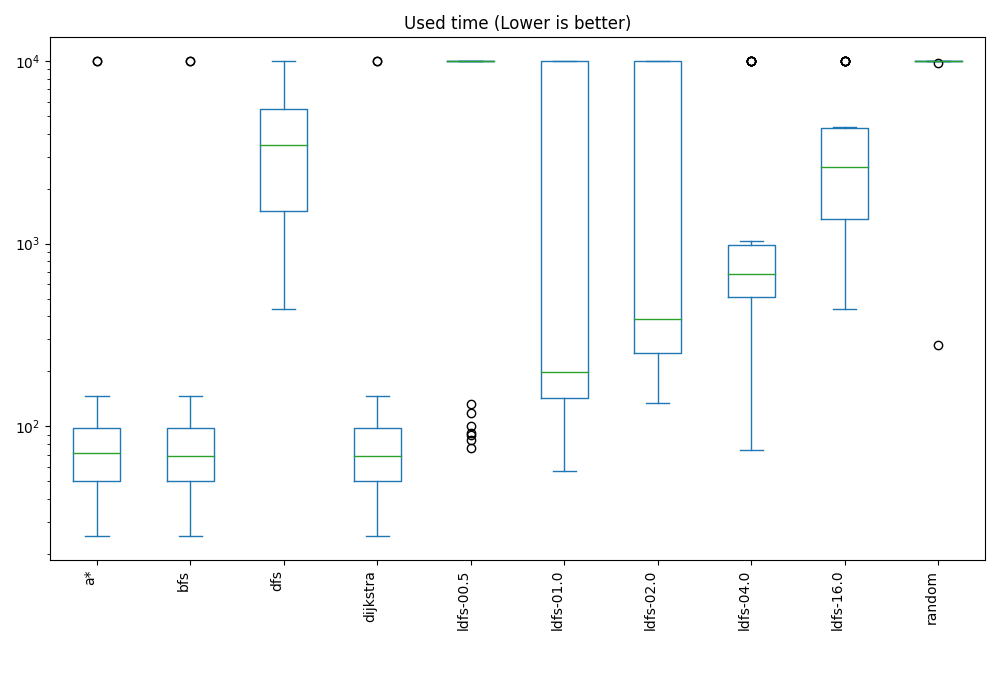
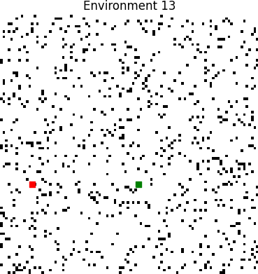

# TP4 Report (B)
## Data plots
## Performance Plot


## Used time Plot



## Explored Plot


## Overall Performance Plot


## Overall Used time Plot


## Overall Explored Plot


## Environments
Green = Start pos

Red = Target pos





## Tabular data
### Performance of agents by environment
|   env |   ('performance', 'a*') |   ('performance', 'bfs') |   ('performance', 'dfs') |   ('performance', 'dijkstra') |   ('performance', 'ldfs-00.5') |   ('performance', 'ldfs-01.0') |   ('performance', 'ldfs-02.0') |   ('performance', 'ldfs-04.0') |   ('performance', 'ldfs-16.0') |   ('performance', 'random') |   ('used_time', 'a*') |   ('used_time', 'bfs') |   ('used_time', 'dfs') |   ('used_time', 'dijkstra') |   ('used_time', 'ldfs-00.5') |   ('used_time', 'ldfs-01.0') |   ('used_time', 'ldfs-02.0') |   ('used_time', 'ldfs-04.0') |   ('used_time', 'ldfs-16.0') |   ('used_time', 'random') |
|------:|------------------------:|-------------------------:|-------------------------:|------------------------------:|-------------------------------:|-------------------------------:|-------------------------------:|-------------------------------:|-------------------------------:|----------------------------:|----------------------:|-----------------------:|-----------------------:|----------------------------:|-----------------------------:|-----------------------------:|-----------------------------:|-----------------------------:|-----------------------------:|--------------------------:|
|     0 |                       1 |                        1 |                        1 |                             1 |                       1        |                       1        |                       1        |                       1        |                       1        |                  0.366014   |                    56 |                     56 |                    836 |                          56 |                           94 |                          180 |                          204 |                          766 |                          836 |                     10000 |
|     1 |                       1 |                        1 |                        1 |                             1 |                       0.292345 |                       0.292345 |                       0.292345 |                       0.292345 |                       0.292345 |                  0.342152   |                    63 |                     63 |                   4595 |                          63 |                        10000 |                        10000 |                        10000 |                        10000 |                        10000 |                     10000 |
|     2 |                       1 |                        1 |                        1 |                             1 |                       0.39847  |                       1        |                       1        |                       1        |                       1        |                  0.420357   |                    94 |                     94 |                   3068 |                          94 |                        10000 |                          226 |                          452 |                          910 |                         3068 |                     10000 |
|     3 |                       1 |                        1 |                        1 |                             1 |                       0.523945 |                       0.523945 |                       0.523945 |                       0.523945 |                       0.523945 |                  0.474523   |                    90 |                     90 |                   3568 |                          90 |                        10000 |                        10000 |                        10000 |                        10000 |                        10000 |                     10000 |
|     4 |                       1 |                        1 |                        1 |                             1 |                       0.325203 |                       0.325203 |                       0.325203 |                       0.325203 |                       1        |                  0.389468   |                   142 |                    142 |                   3656 |                         142 |                        10000 |                        10000 |                        10000 |                        10000 |                         2302 |                     10000 |
|     5 |                       1 |                        1 |                        1 |                             1 |                       0.343259 |                       1        |                       1        |                       1        |                       1        |                  0.238583   |                    67 |                     65 |                    383 |                          65 |                        10000 |                          119 |                          335 |                          383 |                          383 |                     10000 |
|     6 |                       1 |                        1 |                        1 |                             1 |                       0.311481 |                       1        |                       1        |                       1        |                       1        |                  0.253236   |                   102 |                    102 |                   1024 |                         102 |                        10000 |                          166 |                          186 |                          668 |                         1024 |                     10000 |
|     7 |                       1 |                        1 |                        1 |                             1 |                       0.367879 |                       0.367879 |                       0.367879 |                       1        |                       1        |                  0.231155   |                    34 |                     34 |                    776 |                          34 |                        10000 |                        10000 |                        10000 |                          352 |                          776 |                     10000 |
|     8 |                       1 |                        1 |                        1 |                             1 |                       1        |                       1        |                       1        |                       1        |                       1        |                  0.00104337 |                    10 |                     10 |                   4926 |                          10 |                           92 |                           64 |                          412 |                          634 |                          568 |                     10000 |
|     9 |                       1 |                        1 |                        1 |                             1 |                       0.361699 |                       0.361699 |                       1        |                       1        |                       1        |                  0.312204   |                   107 |                    107 |                    775 |                         107 |                        10000 |                        10000 |                          409 |                          775 |                          775 |                     10000 |
|    10 |                       1 |                        1 |                        1 |                             1 |                       0.462866 |                       0.462866 |                       1        |                       1        |                       1        |                  0.335908   |                   101 |                    101 |                   1533 |                         101 |                        10000 |                        10000 |                          265 |                          513 |                         1533 |                     10000 |
|    11 |                       1 |                        1 |                        1 |                             1 |                       0.362004 |                       0.362004 |                       0.362004 |                       0.362004 |                       1        |                  0.24893    |                    50 |                     50 |                   5414 |                          50 |                        10000 |                        10000 |                        10000 |                        10000 |                         2520 |                     10000 |
|    12 |                       1 |                        1 |                        1 |                             1 |                       0.330414 |                       1        |                       1        |                       1        |                       1        |                  0.051629   |                    43 |                     43 |                    205 |                          43 |                        10000 |                           55 |                          121 |                          205 |                          205 |                     10000 |
|    13 |                       1 |                        1 |                        1 |                             1 |                       1        |                       1        |                       1        |                       1        |                       1        |                  0.174593   |                    30 |                     30 |                   4788 |                          30 |                           88 |                          236 |                          486 |                          968 |                         3954 |                     10000 |
|    14 |                       1 |                        1 |                        1 |                             1 |                       1        |                       1        |                       1        |                       1        |                       1        |                  0.294034   |                    45 |                     45 |                   3717 |                          45 |                          117 |                          211 |                          477 |                          953 |                         3717 |                     10000 |
|    15 |                       1 |                        1 |                        1 |                             1 |                       0.488693 |                       0.488693 |                       1        |                       1        |                       1        |                  0.318449   |                    80 |                     80 |                   2852 |                          80 |                        10000 |                        10000 |                          304 |                          564 |                         2400 |                     10000 |
|    16 |                       1 |                        1 |                        1 |                             1 |                       0.367879 |                       1        |                       1        |                       1        |                       1        |                  0.232767   |                    84 |                     84 |                    710 |                          84 |                        10000 |                          142 |                          264 |                          572 |                          710 |                     10000 |
|    17 |                       1 |                        1 |                        1 |                             1 |                       0.369608 |                       0.369608 |                       0.369608 |                       0.369608 |                       0.369608 |                  0.684342   |                    78 |                     78 |                   5962 |                          78 |                        10000 |                        10000 |                        10000 |                        10000 |                        10000 |                     10000 |
|    18 |                       1 |                        1 |                        1 |                             1 |                       1        |                       1        |                       1        |                       1        |                       1        |                  0.15274    |                    39 |                     39 |                   2997 |                          39 |                          109 |                          225 |                          171 |                          953 |                         2997 |                     10000 |
|    19 |                       1 |                        1 |                        1 |                             1 |                       1        |                       1        |                       1        |                       1        |                       1        |                  0.00495488 |                    20 |                     20 |                   6158 |                          20 |                          112 |                          208 |                          406 |                          890 |                         3634 |                     10000 |
|    20 |                       1 |                        1 |                        1 |                             1 |                       0.364059 |                       1        |                       1        |                       1        |                       1        |                  0.362346   |                   109 |                    109 |                   2255 |                         109 |                        10000 |                          117 |                          357 |                          177 |                         2255 |                     10000 |
|    21 |                       1 |                        1 |                        1 |                             1 |                       0.368638 |                       0.368638 |                       0.368638 |                       0.368638 |                       1        |                  0.417985   |                    51 |                     51 |                   4007 |                          51 |                        10000 |                        10000 |                        10000 |                        10000 |                         2735 |                     10000 |
|    22 |                       1 |                        1 |                        1 |                             1 |                       0.377188 |                       0.377188 |                       1        |                       1        |                       1        |                  0.552921   |                   162 |                    162 |                   1462 |                         162 |                        10000 |                        10000 |                          358 |                          574 |                         1462 |                     10000 |
|    23 |                       1 |                        1 |                        1 |                             1 |                       0.378138 |                       0.378138 |                       1        |                       1        |                       1        |                  0.429539   |                   123 |                    123 |                   1277 |                         123 |                        10000 |                        10000 |                          361 |                          721 |                         1277 |                     10000 |
|    24 |                       1 |                        1 |                        1 |                             1 |                       0.358826 |                       1        |                       1        |                       1        |                       1        |                  0.114364   |                    46 |                     46 |                   5480 |                          46 |                        10000 |                          168 |                          364 |                          432 |                         3134 |                     10000 |
|    25 |                       1 |                        1 |                        1 |                             1 |                       0.347526 |                       0.347526 |                       1        |                       1        |                       1        |                  0.423998   |                   146 |                    146 |                   1582 |                         146 |                        10000 |                        10000 |                          386 |                          416 |                         1582 |                     10000 |
|    26 |                       1 |                        1 |                        1 |                             1 |                       1        |                       1        |                       1        |                       1        |                       1        |                  0.0142279  |                    20 |                     20 |                   1806 |                          20 |                           58 |                          120 |                          218 |                          476 |                         1806 |                     10000 |
|    27 |                       1 |                        1 |                        1 |                             1 |                       0.36132  |                       0.36132  |                       1        |                       1        |                       1        |                  0.389964   |                   143 |                    143 |                    291 |                         143 |                        10000 |                        10000 |                          291 |                          291 |                          291 |                     10000 |
|    28 |                       1 |                        1 |                        1 |                             1 |                       1        |                       1        |                       1        |                       1        |                       1        |                  0.377651   |                    83 |                     83 |                    365 |                          83 |                          123 |                          269 |                          365 |                          365 |                          365 |                     10000 |
|    29 |                       1 |                        1 |                        1 |                             1 |                       1        |                       1        |                       1        |                       1        |                       1        |                  0.405238   |                    73 |                     73 |                   3593 |                          73 |                          117 |                          251 |                          529 |                         1059 |                         3593 |                     10000 |
### Used time / performance by environment
|   env |   ('used_time', 'mean') |   ('used_time', 'std') |   ('performance', 'mean') |   ('performance', 'std') |
|------:|------------------------:|-----------------------:|--------------------------:|-------------------------:|
|     0 |                  1308.4 |                3072.42 |                  0.936601 |                 0.200484 |
|     1 |                  6478.4 |                4730.86 |                  0.580388 |                 0.361462 |
|     2 |                  2800.6 |                3965.15 |                  0.881883 |                 0.249067 |
|     3 |                  6383.8 |                4775.24 |                  0.709425 |                 0.250539 |
|     4 |                  5638.4 |                4723.59 |                  0.669028 |                 0.349401 |
|     5 |                  2180   |                4123.85 |                  0.858184 |                 0.29999  |
|     6 |                  2337.4 |                4055.21 |                  0.856472 |                 0.302895 |
|     7 |                  4200.6 |                4998.68 |                  0.733479 |                 0.346333 |
|     8 |                  1672.6 |                3286.28 |                  0.900104 |                 0.315898 |
|     9 |                  3305.5 |                4627.7  |                  0.80356  |                 0.316585 |
|    10 |                  3414.7 |                4576.05 |                  0.826164 |                 0.282027 |
|    11 |                  5808.4 |                4693.9  |                  0.669694 |                 0.349801 |
|    12 |                  2092   |                4168.46 |                  0.838204 |                 0.347367 |
|    13 |                  2061   |                3288.38 |                  0.917459 |                 0.261017 |
|    14 |                  1932.7 |                3188.15 |                  0.929403 |                 0.223246 |
|    15 |                  3636   |                4498.38 |                  0.829584 |                 0.278281 |
|    16 |                  2265   |                4084.44 |                  0.860065 |                 0.296724 |
|    17 |                  6619.6 |                4682.98 |                  0.653238 |                 0.313435 |
|    18 |                  1756.9 |                3128.75 |                  0.915274 |                 0.267927 |
|    19 |                  2146.8 |                3432.74 |                  0.900495 |                 0.314661 |
|    20 |                  2548.8 |                4019.6  |                  0.872641 |                 0.268498 |
|    21 |                  5689.5 |                4712.16 |                  0.689253 |                 0.327886 |
|    22 |                  3434.2 |                4556.73 |                  0.83073  |                 0.276716 |
|    23 |                  3400.5 |                4574.36 |                  0.818582 |                 0.292446 |
|    24 |                  2971.6 |                4108.28 |                  0.847319 |                 0.326997 |
|    25 |                  3440.4 |                4558.61 |                  0.811905 |                 0.303576 |
|    26 |                  1454.4 |                3085.15 |                  0.901423 |                 0.311728 |
|    27 |                  3159.3 |                4720.97 |                  0.81126  |                 0.304    |
|    28 |                  1210.1 |                3091.16 |                  0.937765 |                 0.196804 |
|    29 |                  1936.1 |                3159.26 |                  0.940524 |                 0.18808  |
### Used time / performance by agent
| agent_type   |   ('used_time', 'mean') |   ('used_time', 'std') |   ('performance', 'mean') |   ('performance', 'std') |
|:-------------|------------------------:|-----------------------:|--------------------------:|-------------------------:|
| a*           |                 76.3667 |                40.7418 |                  1        |                 0        |
| bfs          |                 76.3    |                40.7593 |                  1        |                 0        |
| dfs          |               2668.7    |              1890.9    |                  1        |                 0        |
| dijkstra     |                 76.3    |                40.7593 |                  1        |                 0        |
| ldfs-00.5    |               7030.33   |              4613.8    |                  0.562048 |                 0.295226 |
| ldfs-01.0    |               4758.57   |              4986.95   |                  0.712902 |                 0.315039 |
| ldfs-02.0    |               2590.7    |              4158.48   |                  0.853654 |                 0.271831 |
| ldfs-04.0    |               2487.23   |              3827.52   |                  0.874725 |                 0.256971 |
| ldfs-16.0    |               2663.4    |              2735.54   |                  0.93953  |                 0.187092 |
| random       |              10000      |                 0      |                  0.30051  |                 0.161589 |
## Data
### Performance of agents by environment
```pd
           performance                                                                                used_time                                                                             
agent_type          a*  bfs  dfs dijkstra ldfs-00.5 ldfs-01.0 ldfs-02.0 ldfs-04.0 ldfs-16.0    random        a*  bfs   dfs dijkstra ldfs-00.5 ldfs-01.0 ldfs-02.0 ldfs-04.0 ldfs-16.0 random
env                                                                                                                                                                                         
0                  1.0  1.0  1.0      1.0  1.000000  1.000000  1.000000  1.000000  1.000000  0.366014        56   56   836       56        94       180       204       766       836  10000
1                  1.0  1.0  1.0      1.0  0.292345  0.292345  0.292345  0.292345  0.292345  0.342152        63   63  4595       63     10000     10000     10000     10000     10000  10000
2                  1.0  1.0  1.0      1.0  0.398470  1.000000  1.000000  1.000000  1.000000  0.420357        94   94  3068       94     10000       226       452       910      3068  10000
3                  1.0  1.0  1.0      1.0  0.523945  0.523945  0.523945  0.523945  0.523945  0.474523        90   90  3568       90     10000     10000     10000     10000     10000  10000
4                  1.0  1.0  1.0      1.0  0.325203  0.325203  0.325203  0.325203  1.000000  0.389468       142  142  3656      142     10000     10000     10000     10000      2302  10000
5                  1.0  1.0  1.0      1.0  0.343259  1.000000  1.000000  1.000000  1.000000  0.238583        67   65   383       65     10000       119       335       383       383  10000
6                  1.0  1.0  1.0      1.0  0.311481  1.000000  1.000000  1.000000  1.000000  0.253236       102  102  1024      102     10000       166       186       668      1024  10000
7                  1.0  1.0  1.0      1.0  0.367879  0.367879  0.367879  1.000000  1.000000  0.231155        34   34   776       34     10000     10000     10000       352       776  10000
8                  1.0  1.0  1.0      1.0  1.000000  1.000000  1.000000  1.000000  1.000000  0.001043        10   10  4926       10        92        64       412       634       568  10000
9                  1.0  1.0  1.0      1.0  0.361699  0.361699  1.000000  1.000000  1.000000  0.312204       107  107   775      107     10000     10000       409       775       775  10000
10                 1.0  1.0  1.0      1.0  0.462866  0.462866  1.000000  1.000000  1.000000  0.335908       101  101  1533      101     10000     10000       265       513      1533  10000
11                 1.0  1.0  1.0      1.0  0.362004  0.362004  0.362004  0.362004  1.000000  0.248930        50   50  5414       50     10000     10000     10000     10000      2520  10000
12                 1.0  1.0  1.0      1.0  0.330414  1.000000  1.000000  1.000000  1.000000  0.051629        43   43   205       43     10000        55       121       205       205  10000
13                 1.0  1.0  1.0      1.0  1.000000  1.000000  1.000000  1.000000  1.000000  0.174593        30   30  4788       30        88       236       486       968      3954  10000
14                 1.0  1.0  1.0      1.0  1.000000  1.000000  1.000000  1.000000  1.000000  0.294034        45   45  3717       45       117       211       477       953      3717  10000
15                 1.0  1.0  1.0      1.0  0.488693  0.488693  1.000000  1.000000  1.000000  0.318449        80   80  2852       80     10000     10000       304       564      2400  10000
16                 1.0  1.0  1.0      1.0  0.367879  1.000000  1.000000  1.000000  1.000000  0.232767        84   84   710       84     10000       142       264       572       710  10000
17                 1.0  1.0  1.0      1.0  0.369608  0.369608  0.369608  0.369608  0.369608  0.684342        78   78  5962       78     10000     10000     10000     10000     10000  10000
18                 1.0  1.0  1.0      1.0  1.000000  1.000000  1.000000  1.000000  1.000000  0.152740        39   39  2997       39       109       225       171       953      2997  10000
19                 1.0  1.0  1.0      1.0  1.000000  1.000000  1.000000  1.000000  1.000000  0.004955        20   20  6158       20       112       208       406       890      3634  10000
20                 1.0  1.0  1.0      1.0  0.364059  1.000000  1.000000  1.000000  1.000000  0.362346       109  109  2255      109     10000       117       357       177      2255  10000
21                 1.0  1.0  1.0      1.0  0.368638  0.368638  0.368638  0.368638  1.000000  0.417985        51   51  4007       51     10000     10000     10000     10000      2735  10000
22                 1.0  1.0  1.0      1.0  0.377188  0.377188  1.000000  1.000000  1.000000  0.552921       162  162  1462      162     10000     10000       358       574      1462  10000
23                 1.0  1.0  1.0      1.0  0.378138  0.378138  1.000000  1.000000  1.000000  0.429539       123  123  1277      123     10000     10000       361       721      1277  10000
24                 1.0  1.0  1.0      1.0  0.358826  1.000000  1.000000  1.000000  1.000000  0.114364        46   46  5480       46     10000       168       364       432      3134  10000
25                 1.0  1.0  1.0      1.0  0.347526  0.347526  1.000000  1.000000  1.000000  0.423998       146  146  1582      146     10000     10000       386       416      1582  10000
26                 1.0  1.0  1.0      1.0  1.000000  1.000000  1.000000  1.000000  1.000000  0.014228        20   20  1806       20        58       120       218       476      1806  10000
27                 1.0  1.0  1.0      1.0  0.361320  0.361320  1.000000  1.000000  1.000000  0.389964       143  143   291      143     10000     10000       291       291       291  10000
28                 1.0  1.0  1.0      1.0  1.000000  1.000000  1.000000  1.000000  1.000000  0.377651        83   83   365       83       123       269       365       365       365  10000
29                 1.0  1.0  1.0      1.0  1.000000  1.000000  1.000000  1.000000  1.000000  0.405238        73   73  3593       73       117       251       529      1059      3593  10000
```
### Used time / performance by environment
```pd
    used_time              performance          
         mean          std        mean       std
env                                             
0      1308.4  3072.416754    0.936601  0.200484
1      6478.4  4730.859288    0.580388  0.361462
2      2800.6  3965.148623    0.881883  0.249067
3      6383.8  4775.235882    0.709425  0.250539
4      5638.4  4723.587224    0.669028  0.349401
5      2180.0  4123.851921    0.858184  0.299990
6      2337.4  4055.207248    0.856472  0.302895
7      4200.6  4998.681164    0.733479  0.346333
8      1672.6  3286.280444    0.900104  0.315898
9      3305.5  4627.696817    0.803560  0.316585
10     3414.7  4576.053784    0.826164  0.282027
11     5808.4  4693.899000    0.669694  0.349801
12     2092.0  4168.461587    0.838204  0.347367
13     2061.0  3288.383764    0.917459  0.261017
14     1932.7  3188.153560    0.929403  0.223246
15     3636.0  4498.378177    0.829584  0.278281
16     2265.0  4084.444230    0.860065  0.296724
17     6619.6  4682.979280    0.653238  0.313435
18     1756.9  3128.747724    0.915274  0.267927
19     2146.8  3432.740428    0.900495  0.314661
20     2548.8  4019.595690    0.872641  0.268498
21     5689.5  4712.158912    0.689253  0.327886
22     3434.2  4556.728402    0.830730  0.276716
23     3400.5  4574.360969    0.818582  0.292446
24     2971.6  4108.284075    0.847319  0.326997
25     3440.4  4558.605128    0.811905  0.303576
26     1454.4  3085.153380    0.901423  0.311728
27     3159.3  4720.973371    0.811260  0.304000
28     1210.1  3091.163695    0.937765  0.196804
29     1936.1  3159.262658    0.940524  0.188080
```
### Used time / performance by agent
```pd
               used_time              performance          
                    mean          std        mean       std
agent_type                                                 
a*             76.366667    40.741814    1.000000  0.000000
bfs            76.300000    40.759302    1.000000  0.000000
dfs          2668.700000  1890.901831    1.000000  0.000000
dijkstra       76.300000    40.759302    1.000000  0.000000
ldfs-00.5    7030.333333  4613.801397    0.562048  0.295226
ldfs-01.0    4758.566667  4986.946953    0.712902  0.315039
ldfs-02.0    2590.700000  4158.478868    0.853654  0.271831
ldfs-04.0    2487.233333  3827.516839    0.874725  0.256971
ldfs-16.0    2663.400000  2735.541964    0.939530  0.187092
random      10000.000000     0.000000    0.300510  0.161589
```

## Raw Data
```csv
,used_time,explored,agent_type,performance,env
89,10,11,a*,1.0,8
199,20,21,a*,1.0,19
269,20,21,a*,1.0,26
139,30,31,a*,1.0,13
79,34,35,a*,1.0,7
189,39,40,a*,1.0,18
129,43,44,a*,1.0,12
149,45,46,a*,1.0,14
249,46,47,a*,1.0,24
119,50,51,a*,1.0,11
219,51,53,a*,1.0,21
9,56,57,a*,1.0,0
19,63,66,a*,1.0,1
59,67,68,a*,1.0,5
299,73,75,a*,1.0,29
179,78,79,a*,1.0,17
159,80,82,a*,1.0,15
289,83,84,a*,1.0,28
169,84,89,a*,1.0,16
39,90,91,a*,1.0,3
29,94,95,a*,1.0,2
109,101,102,a*,1.0,10
69,102,103,a*,1.0,6
99,107,108,a*,1.0,9
209,109,110,a*,1.0,20
239,123,128,a*,1.0,23
49,142,143,a*,1.0,4
279,143,148,a*,1.0,27
259,146,148,a*,1.0,25
229,162,163,a*,1.0,22
82,10,335,bfs,1.0,8
192,20,1022,bfs,1.0,19
262,20,1208,bfs,1.0,26
132,30,2541,bfs,1.0,13
72,34,3329,bfs,1.0,7
182,39,3864,bfs,1.0,18
122,43,4759,bfs,1.0,12
142,45,5001,bfs,1.0,14
242,46,2408,bfs,1.0,24
112,50,6379,bfs,1.0,11
212,51,4586,bfs,1.0,21
2,56,6529,bfs,1.0,0
12,63,6922,bfs,1.0,1
52,65,11892,bfs,1.0,5
292,73,7771,bfs,1.0,29
172,78,8479,bfs,1.0,17
152,80,9583,bfs,1.0,15
282,83,9067,bfs,1.0,28
162,84,13711,bfs,1.0,16
32,90,7916,bfs,1.0,3
22,94,13859,bfs,1.0,2
102,101,12388,bfs,1.0,10
62,102,15307,bfs,1.0,6
92,107,14580,bfs,1.0,9
202,109,14368,bfs,1.0,20
232,123,14994,bfs,1.0,23
42,142,15395,bfs,1.0,4
272,143,16269,bfs,1.0,27
252,146,16084,bfs,1.0,25
222,162,16271,bfs,1.0,22
121,205,211,dfs,1.0,12
271,291,16452,dfs,1.0,27
281,365,377,dfs,1.0,28
51,383,392,dfs,1.0,5
161,710,16052,dfs,1.0,16
91,775,15699,dfs,1.0,9
71,776,823,dfs,1.0,7
1,836,881,dfs,1.0,0
61,1024,1133,dfs,1.0,6
231,1277,1320,dfs,1.0,23
221,1462,1506,dfs,1.0,22
101,1533,1590,dfs,1.0,10
251,1582,1658,dfs,1.0,25
261,1806,2008,dfs,1.0,26
201,2255,2363,dfs,1.0,20
151,2852,3032,dfs,1.0,15
181,2997,3228,dfs,1.0,18
21,3068,3249,dfs,1.0,2
31,3568,3772,dfs,1.0,3
291,3593,12922,dfs,1.0,29
41,3656,3856,dfs,1.0,4
141,3717,4042,dfs,1.0,14
211,4007,4331,dfs,1.0,21
11,4595,4916,dfs,1.0,1
131,4788,5110,dfs,1.0,13
81,4926,5193,dfs,1.0,8
111,5414,6029,dfs,1.0,11
241,5480,5863,dfs,1.0,24
171,5962,10478,dfs,1.0,17
191,6158,6611,dfs,1.0,19
83,10,198,dijkstra,1.0,8
193,20,590,dijkstra,1.0,19
263,20,699,dijkstra,1.0,26
133,30,1424,dijkstra,1.0,13
73,34,1854,dijkstra,1.0,7
183,39,2191,dijkstra,1.0,18
123,43,2653,dijkstra,1.0,12
143,45,2777,dijkstra,1.0,14
243,46,1357,dijkstra,1.0,24
113,50,3554,dijkstra,1.0,11
213,51,2596,dijkstra,1.0,21
3,56,3616,dijkstra,1.0,0
13,63,3845,dijkstra,1.0,1
53,65,6581,dijkstra,1.0,5
293,73,4307,dijkstra,1.0,29
173,78,4675,dijkstra,1.0,17
153,80,5300,dijkstra,1.0,15
283,83,5027,dijkstra,1.0,28
163,84,7541,dijkstra,1.0,16
33,90,4367,dijkstra,1.0,3
23,94,7640,dijkstra,1.0,2
103,101,6823,dijkstra,1.0,10
63,102,8447,dijkstra,1.0,6
93,107,8028,dijkstra,1.0,9
203,109,7925,dijkstra,1.0,20
233,123,8194,dijkstra,1.0,23
43,142,8430,dijkstra,1.0,4
273,143,8927,dijkstra,1.0,27
253,146,8869,dijkstra,1.0,25
223,162,8933,dijkstra,1.0,22
264,58,1540,ldfs-00.5,1.0,26
134,88,4044,ldfs-00.5,1.0,13
84,92,2894,ldfs-00.5,1.0,8
4,94,2384,ldfs-00.5,1.0,0
184,109,3135,ldfs-00.5,1.0,18
194,112,1424,ldfs-00.5,1.0,19
144,117,2091,ldfs-00.5,1.0,14
294,117,2771,ldfs-00.5,1.0,29
284,123,1315,ldfs-00.5,1.0,28
14,10000,1358,ldfs-00.5,0.2923453990846928,1
64,10000,4234,ldfs-00.5,0.3114811537388712,6
44,10000,828,ldfs-00.5,0.32520339378926194,4
124,10000,596,ldfs-00.5,0.33041404663501495,12
54,10000,3165,ldfs-00.5,0.3432589881870305,5
254,10000,5338,ldfs-00.5,0.3475256433121505,25
244,10000,2266,ldfs-00.5,0.35882557127774645,24
274,10000,3913,ldfs-00.5,0.3613195805569191,27
94,10000,5885,ldfs-00.5,0.3616993866283367,9
114,10000,2009,ldfs-00.5,0.36200356684336443,11
204,10000,4091,ldfs-00.5,0.3640588762509288,20
74,10000,811,ldfs-00.5,0.36787944117144233,7
164,10000,2971,ldfs-00.5,0.36787944117144233,16
214,10000,1433,ldfs-00.5,0.36863756523469887,21
174,10000,709,ldfs-00.5,0.36960838486505876,17
224,10000,2677,ldfs-00.5,0.37718802607018276,22
234,10000,1758,ldfs-00.5,0.3781383942686414,23
24,10000,4659,ldfs-00.5,0.39847041152338203,2
104,10000,1286,ldfs-00.5,0.46286598021492364,10
154,10000,1003,ldfs-00.5,0.488693047897163,15
34,10000,227,ldfs-00.5,0.5239452476774887,3
125,55,136,ldfs-01.0,1.0,12
85,64,7020,ldfs-01.0,1.0,8
205,117,982,ldfs-01.0,1.0,20
55,119,3927,ldfs-01.0,1.0,5
265,120,2575,ldfs-01.0,1.0,26
165,142,572,ldfs-01.0,1.0,16
65,166,515,ldfs-01.0,1.0,6
245,168,5215,ldfs-01.0,1.0,24
5,180,3363,ldfs-01.0,1.0,0
195,208,5962,ldfs-01.0,1.0,19
145,211,7201,ldfs-01.0,1.0,14
185,225,5562,ldfs-01.0,1.0,18
25,226,7055,ldfs-01.0,1.0,2
135,236,6158,ldfs-01.0,1.0,13
295,251,4558,ldfs-01.0,1.0,29
285,269,518,ldfs-01.0,1.0,28
15,10000,997,ldfs-01.0,0.2923453990846928,1
45,10000,1554,ldfs-01.0,0.32520339378926194,4
255,10000,10205,ldfs-01.0,0.3475256433121505,25
275,10000,9166,ldfs-01.0,0.3613195805569191,27
95,10000,9231,ldfs-01.0,0.3616993866283367,9
115,10000,2471,ldfs-01.0,0.36200356684336443,11
75,10000,1319,ldfs-01.0,0.36787944117144233,7
215,10000,2288,ldfs-01.0,0.36863756523469887,21
175,10000,2507,ldfs-01.0,0.36960838486505876,17
225,10000,5262,ldfs-01.0,0.37718802607018276,22
235,10000,6780,ldfs-01.0,0.3781383942686414,23
105,10000,4314,ldfs-01.0,0.46286598021492364,10
155,10000,3771,ldfs-01.0,0.488693047897163,15
35,10000,712,ldfs-01.0,0.5239452476774887,3
126,121,201,ldfs-02.0,1.0,12
186,171,7925,ldfs-02.0,1.0,18
66,186,1962,ldfs-02.0,1.0,6
6,204,3506,ldfs-02.0,1.0,0
266,218,2513,ldfs-02.0,1.0,26
166,264,1044,ldfs-02.0,1.0,16
106,265,1431,ldfs-02.0,1.0,10
276,291,763,ldfs-02.0,1.0,27
156,304,3252,ldfs-02.0,1.0,15
56,335,493,ldfs-02.0,1.0,5
206,357,2151,ldfs-02.0,1.0,20
226,358,3339,ldfs-02.0,1.0,22
236,361,1731,ldfs-02.0,1.0,23
246,364,7573,ldfs-02.0,1.0,24
286,365,377,ldfs-02.0,1.0,28
256,386,1437,ldfs-02.0,1.0,25
196,406,10204,ldfs-02.0,1.0,19
96,409,1487,ldfs-02.0,1.0,9
86,412,5767,ldfs-02.0,1.0,8
26,452,4826,ldfs-02.0,1.0,2
146,477,4493,ldfs-02.0,1.0,14
136,486,8367,ldfs-02.0,1.0,13
296,529,4734,ldfs-02.0,1.0,29
16,10000,2090,ldfs-02.0,0.2923453990846928,1
46,10000,2981,ldfs-02.0,0.32520339378926194,4
116,10000,3845,ldfs-02.0,0.36200356684336443,11
76,10000,2221,ldfs-02.0,0.36787944117144233,7
216,10000,3023,ldfs-02.0,0.36863756523469887,21
176,10000,3436,ldfs-02.0,0.36960838486505876,17
36,10000,2411,ldfs-02.0,0.5239452476774887,3
207,177,2439,ldfs-04.0,1.0,20
127,205,211,ldfs-04.0,1.0,12
277,291,2697,ldfs-04.0,1.0,27
77,352,1602,ldfs-04.0,1.0,7
287,365,377,ldfs-04.0,1.0,28
57,383,392,ldfs-04.0,1.0,5
257,416,3441,ldfs-04.0,1.0,25
247,432,9492,ldfs-04.0,1.0,24
267,476,2225,ldfs-04.0,1.0,26
107,513,2505,ldfs-04.0,1.0,10
157,564,4794,ldfs-04.0,1.0,15
167,572,603,ldfs-04.0,1.0,16
227,574,2882,ldfs-04.0,1.0,22
87,634,8317,ldfs-04.0,1.0,8
67,668,1632,ldfs-04.0,1.0,6
237,721,1826,ldfs-04.0,1.0,23
7,766,929,ldfs-04.0,1.0,0
97,775,1241,ldfs-04.0,1.0,9
197,890,10277,ldfs-04.0,1.0,19
27,910,4798,ldfs-04.0,1.0,2
147,953,6232,ldfs-04.0,1.0,14
187,953,4924,ldfs-04.0,1.0,18
137,968,7515,ldfs-04.0,1.0,13
297,1059,5349,ldfs-04.0,1.0,29
17,10000,5102,ldfs-04.0,0.2923453990846928,1
47,10000,4567,ldfs-04.0,0.32520339378926194,4
117,10000,7667,ldfs-04.0,0.36200356684336443,11
217,10000,2729,ldfs-04.0,0.36863756523469887,21
177,10000,7089,ldfs-04.0,0.36960838486505876,17
37,10000,3600,ldfs-04.0,0.5239452476774887,3
128,205,211,ldfs-16.0,1.0,12
278,291,7787,ldfs-16.0,1.0,27
288,365,377,ldfs-16.0,1.0,28
58,383,392,ldfs-16.0,1.0,5
88,568,9070,ldfs-16.0,1.0,8
168,710,8441,ldfs-16.0,1.0,16
98,775,8073,ldfs-16.0,1.0,9
78,776,823,ldfs-16.0,1.0,7
8,836,881,ldfs-16.0,1.0,0
68,1024,1133,ldfs-16.0,1.0,6
238,1277,1320,ldfs-16.0,1.0,23
228,1462,1506,ldfs-16.0,1.0,22
108,1533,1590,ldfs-16.0,1.0,10
258,1582,1658,ldfs-16.0,1.0,25
268,1806,2008,ldfs-16.0,1.0,26
208,2255,2363,ldfs-16.0,1.0,20
48,2302,4505,ldfs-16.0,1.0,4
158,2400,3817,ldfs-16.0,1.0,15
118,2520,7558,ldfs-16.0,1.0,11
218,2735,4894,ldfs-16.0,1.0,21
188,2997,3228,ldfs-16.0,1.0,18
28,3068,3249,ldfs-16.0,1.0,2
248,3134,6021,ldfs-16.0,1.0,24
298,3593,7160,ldfs-16.0,1.0,29
198,3634,7489,ldfs-16.0,1.0,19
148,3717,4042,ldfs-16.0,1.0,14
138,3954,5156,ldfs-16.0,1.0,13
18,10000,6973,ldfs-16.0,0.2923453990846928,1
178,10000,9079,ldfs-16.0,0.36960838486505876,17
38,10000,5443,ldfs-16.0,0.5239452476774887,3
80,10000,10000,random,0.0010433687222004989,8
190,10000,10000,random,0.004954875499820931,19
260,10000,10000,random,0.014227945070715028,26
120,10000,10000,random,0.05162902986081822,12
240,10000,10000,random,0.11436370926966301,24
180,10000,10000,random,0.1527396038066598,18
130,10000,10000,random,0.1745926848223802,13
70,10000,10000,random,0.23115536398733683,7
160,10000,10000,random,0.2327665461551412,16
50,10000,10000,random,0.2385829329220673,5
110,10000,10000,random,0.24892986790405766,11
60,10000,10000,random,0.2532359208709801,6
140,10000,10000,random,0.29403364584685504,14
90,10000,10000,random,0.31220394862611645,9
150,10000,10000,random,0.31844905529504314,15
100,10000,10000,random,0.3359077461680924,10
10,10000,10000,random,0.3421519445361081,1
200,10000,10000,random,0.36234645533182114,20
0,10000,10000,random,0.3660143916654564,0
280,10000,10000,random,0.3776512516534473,28
40,10000,10000,random,0.3894679063153298,4
270,10000,10000,random,0.389963579048709,27
290,10000,10000,random,0.40523786088323843,29
210,10000,10000,random,0.41798471708345675,21
20,10000,10000,random,0.42035655452793846,2
250,10000,10000,random,0.4239978550363476,25
230,10000,10000,random,0.42953861343832944,23
30,10000,10000,random,0.47452269522332174,3
220,10000,10000,random,0.5529207583202339,22
170,10000,10000,random,0.6843416745704644,17

```
