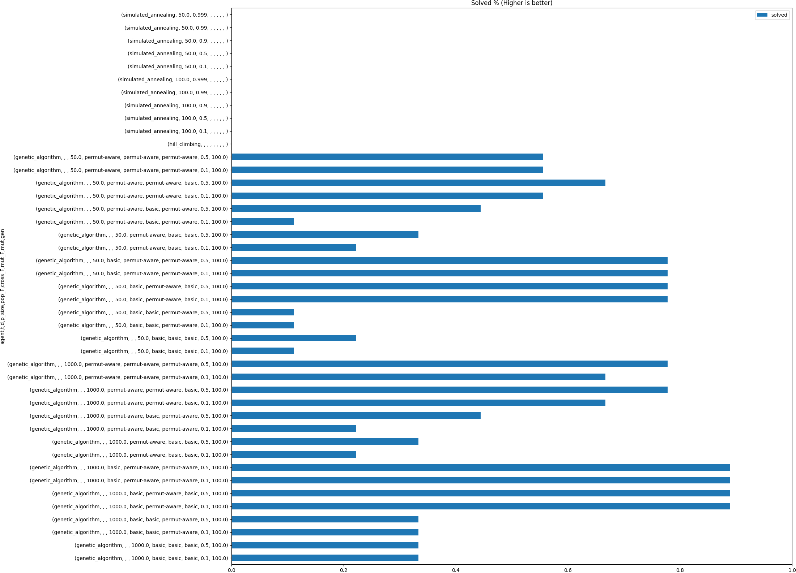

# TP5 Report
## A - Ejecuciones
### 1. Porcentaje de veces que se llega a un estado optimo

{ width=100% }

### 2. Tiempo de ejecucion

{ width=100% }

{ width=100% }

### 3. Cantidad de estados visitados

{ width=100% }

### 4. Csv

Ver `code/results.csv`

### 5. Tiempos de ejecucion

Ver punto 3

# B - Funcion H

# C - Conclusion

El algoritmo mas adecuado para este problema sin duda no es uno de busqueda local.

El problema es que el espacio de estados es muy grande y no se puede garantizar que
se llegue a un estado optimo.

Dicho esto, dentro de los algoritmos de busqueda local analizados, el que mejor
se comporta es el de Algoritmos Geneticos.

Este algoritmo es el mas versatil y el mas poderoso ya que podemos permitirle un bajo tiempo de ejecucion si es requerido y proporciona una solucion aceptable.

Sin embargo, si se dispone de mas tiempo, este le es beneficioso al algoritmo y puede mejorar su solucion.

Especificamente los parametros que mejor funcionan parecen ser los siguientes:

- Poblacion: 1000
- Generaciones: 100
- Mutacion: 0.5
- Crossover: 100
- Inicializacion de la poblacion: aleatoria
- Seleccion: tomamos 2 individuos al azar, pesados por su fitness, y aplicamos el operador de cruzamiento
- Operador de cruzamiento: Tomamos un subconjunto contiguo de la solucion de uno de los padres y lo copiamos en el hijo. Luego, completamos el hijo con los valores faltantes del otro padre, en el orden en que aparecen en el mismo.
- Operador de mutacion: Tomamos dos posiciones al azar y las intercambiamos
- Funcion de fitness: La cantidad de pares de reinas que tiene la solucion
- Condicion de corte: Si la solucion es valida o si se llego a la cantidad de generaciones maxima

Cabe destacar que si requerimos mayor performance, es mejor utilizar:
- poblacion de 50
- operador de mutacion: Elegir un gen al azar y cambiarlo por otro valor al azar

Estos resultados eran bastante esperables, pero lo que no lo era tanto es que ganara la inicializacion aleatoria por sobre la inicializacion de permutaciones.
