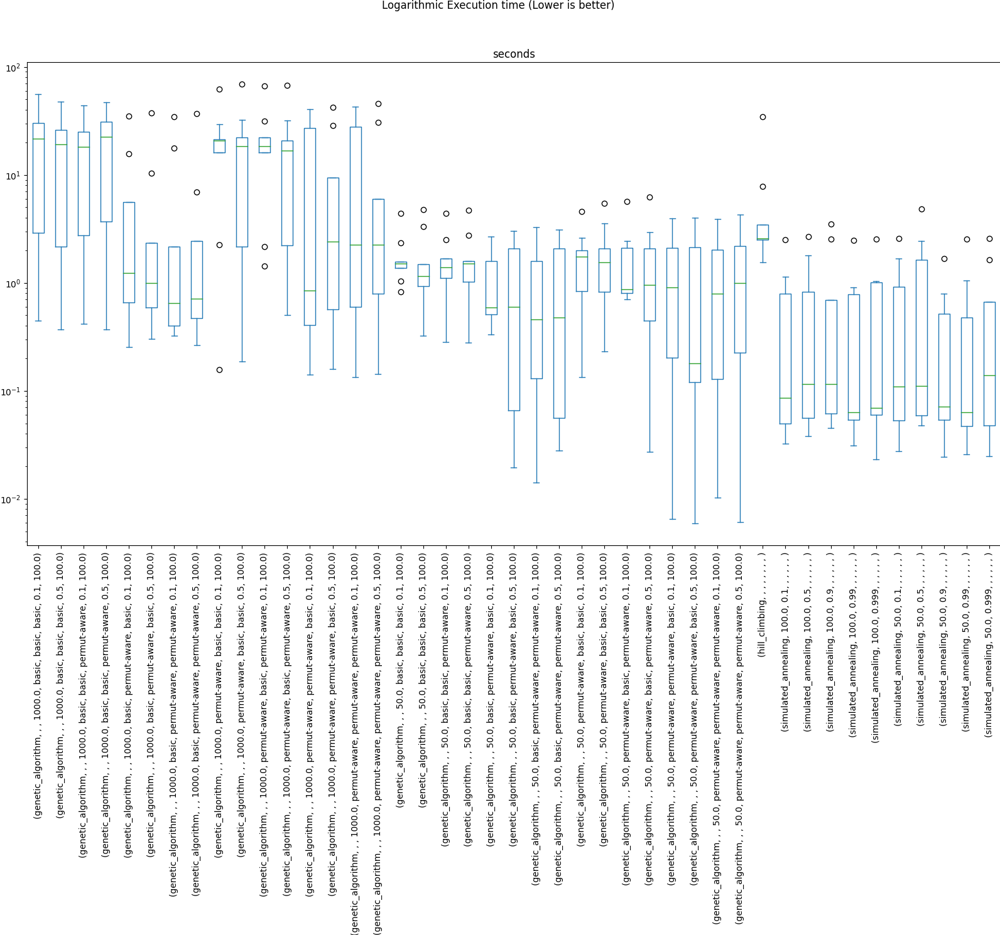
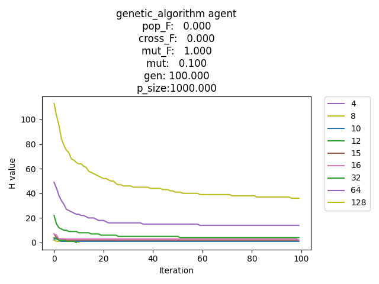

# TP5 Report

Todos estos resultados son en base a 128 ejecuciones de cada combinacion de parametros de cada algoritmo

## A - Ejecuciones

### 1. Porcentaje de veces que se llega a un estado optimo

### 2. Tiempo de ejecucion

### 3. Cantidad de estados visitados

### 4. Csv

Ver `code/results.csv`

### 5. Tiempos de ejecucion

Ver punto 3

# B - Funcion H

# C - Conclusion

El algoritmo mas adecuado para este problema sin duda no es uno de busqueda local.

El problema es que el espacio de estados es muy grande y no se puede garantizar que
se llegue a un estado optimo.

Dicho esto, dentro de los algoritmos de busqueda local analizados, el que mejor
se comporta es el de Algoritmos Geneticos.

Este algoritmo es el mas versatil y el mas poderoso ya que podemos permitirle un bajo tiempo de ejecucion si es
requerido y proporciona una solucion aceptable.

Sin embargo, si se dispone de mas tiempo, este le es beneficioso al algoritmo y puede mejorar su solucion.

Especificamente los parametros que mejor funcionan parecen ser los siguientes:

| Parametro                      | Valor                                                                                                                                                                                                       |
|--------------------------------|-------------------------------------------------------------------------------------------------------------------------------------------------------------------------------------------------------------|
| Poblacion                      | 1000                                                                                                                                                                                                        |
| Generaciones                   | 100                                                                                                                                                                                                         |
| Mutacion                       | [0.5] o [0.1]                                                                                                                                                                                               |
| Crossover                      | 100                                                                                                                                                                                                         |
| Inicializacion de la poblacion | aleatoria                                                                                                                                                                                                   |
| Seleccion                      | tomamos 2 individuos al azar, pesados por su fitness, y aplicamos el operador de cruzamiento                                                                                                                |
| Operador de cruzamiento        | Tomamos un subconjunto contiguo de la solucion de uno de los padres y lo copiamos en el hijo. Luego, completamos el hijo con los valores faltantes del otro padre, en el orden en que aparecen en el mismo. |
| Operador de mutacion           | [Tomamos dos posiciones al azar y las intercambiamos] o [Tomamos un elemento al azar y le asignamos un valor al azar]                                                                                       |
| Funcion de fitness             | La cantidad de pares de reinas que tiene la solucion                                                                                                                                                        |
| Condicion de corte             | Si la solucion es valida o si se llego a la cantidad de generaciones maxima                                                                                                                                 |

No parecen ser importantes: la funcion de mutacion, el factor de mutacion.

Al menos, las dos implementaciones y valores que probamos tienen la misma performance en este problema

Cabe destacar que si requerimos mayor velocidad, es mejor utilizar:

- poblacion de 50

Estos resultados eran bastante esperables, pero lo que no lo era tanto es que ganara la inicializacion aleatoria por
sobre la inicializacion con permutaciones.

Aunque esto es asi, si no nos interesa que la solucion sea perfecta, sino que sea aceptable, se pueden aplicar
algoritmos de simulated annealing y hill climbing, los cuales convergen muy rapido comparativamente.
