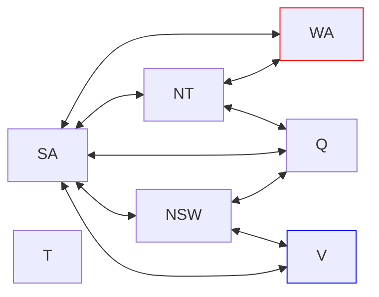

# Tp 6 - CSP

## 1. Sudoku

Se toman los 81 parametros.

Los dominios son los numeros del 1 al 9.

Las restricciones son las siguientes:

- Cada fila debe tener numeros distintos.
- Cada columna debe tener numeros distintos.
- Cada cuadrado de 3x3 debe tener numeros distintos.
- Cada casilla debe tener un numero.

A estas se le suman las restricciones del caso

Los numeros que ya se conocen no se pueden cambiar.

## 2. AC3

WA -> NT, SA
NT -> WA, Q, SA
SA -> WA, NT, Q, NSW, V
Q -> NT, SA, NSW
NSW -> Q, SA, V
V -> SA, NSW
T

WA = red
V = blue

| Variable | R G B |
|----------|-------|
| WA       | 1 0 0 |
| NT       | 0 1 1 |
| Q        | 1 1 1 |
| NSW      | 1 1 0 |
| V        | 0 0 1 |
| SA       | 0 1 0 |
| T        | 1 1 1 |
