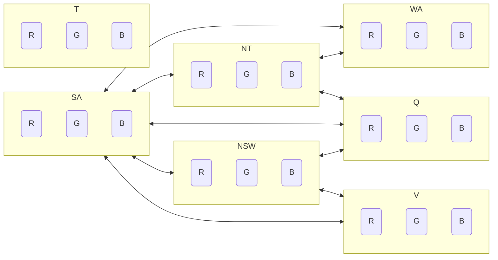
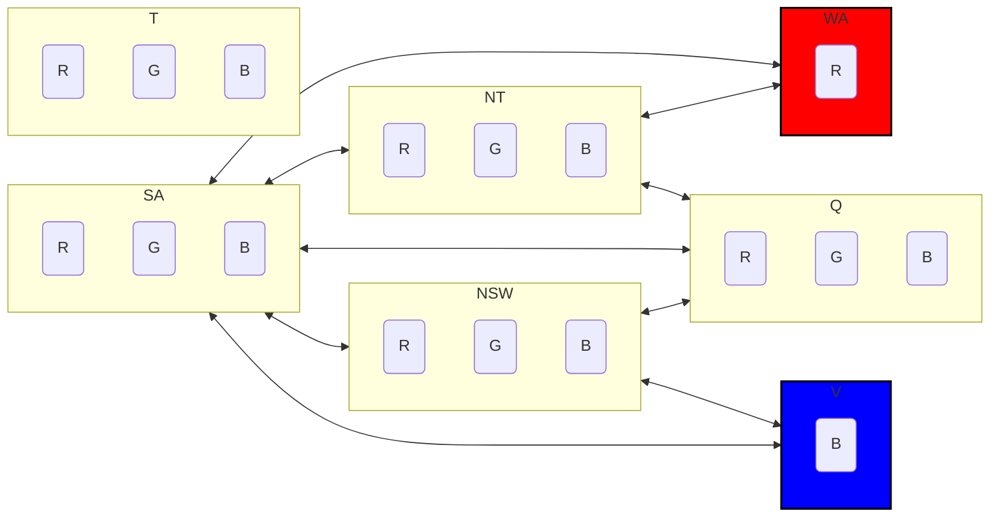
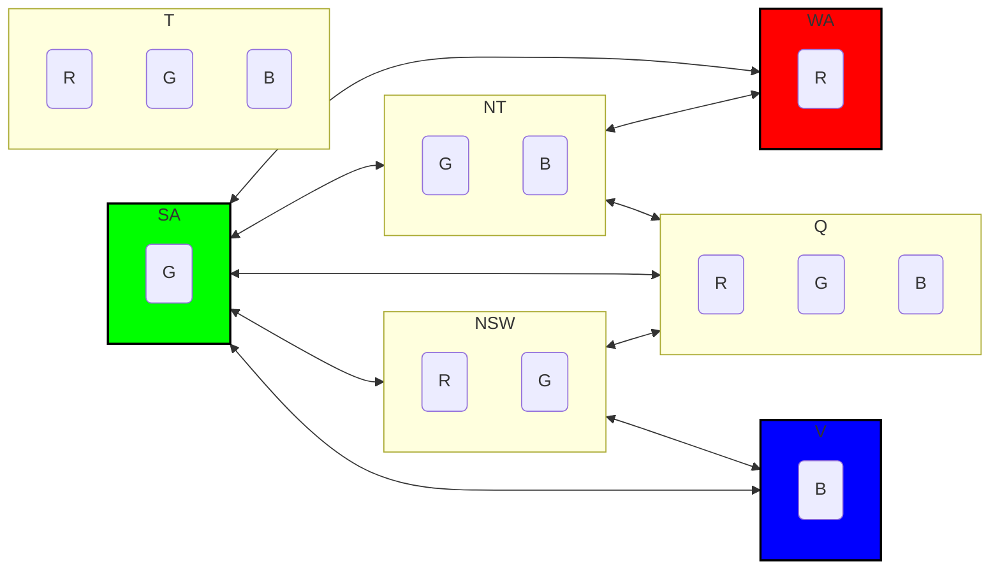
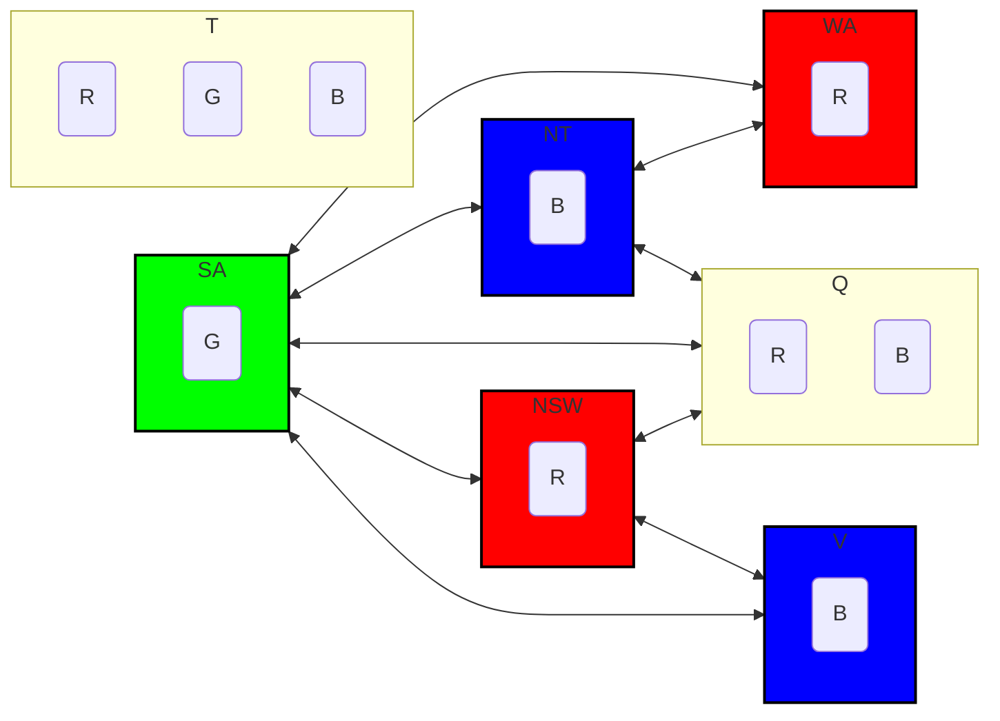
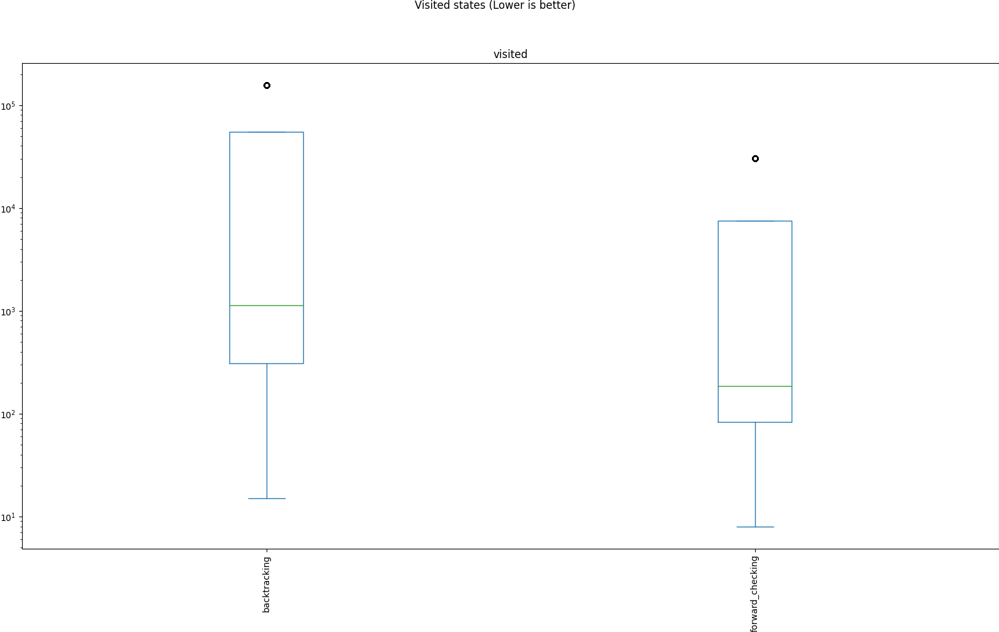
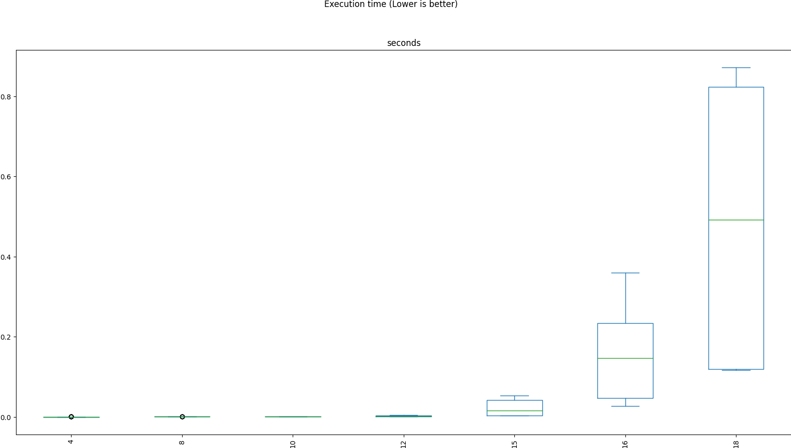
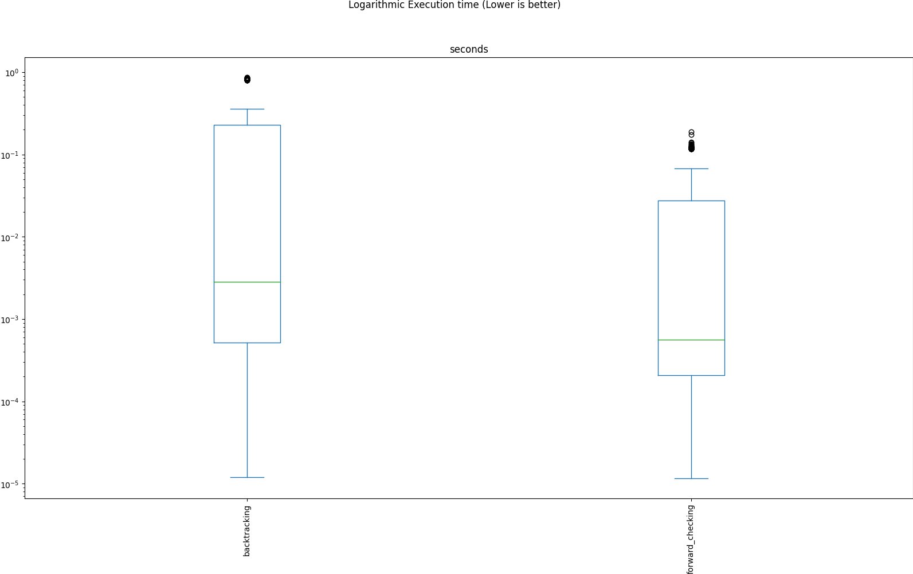

# Tp 6 - CSP

## 1. Sudoku

Se toman los 81 parametros.

Los dominios son los numeros del 1 al 9.

Las restricciones son las siguientes:

- Cada fila debe tener numeros distintos.
- Cada columna debe tener numeros distintos.
- Cada cuadrado de 3x3 debe tener numeros distintos.
- Cada casilla debe tener un numero.

A estas se le suman las restricciones del caso

Los numeros que ya se conocen no se pueden cambiar.

## 2. AC3

```mermaid
graph LR
    subgraph WA
        WA_R(R)
    end
    subgraph NT
        NT_B(B)
    end
    subgraph Q
    end
    subgraph NSW
        NSW_R(R)
    end
    subgraph V
        V_B(B)
    end
    subgraph SA
        SA_G(G)
    end
    subgraph T
        T_R(R)
        T_G(G)
        T_B(B)
    end
    SA <--> WA & NT & Q & NSW & V
    NT <--> WA & Q
    NSW <--> Q & V
    style WA fill:#ff0000,stroke:#000,stroke-width:2px
    style V fill:#0000ff,stroke:#000,stroke-width:2px
    style SA fill:#00ff00,stroke:#000,stroke-width:2px
    style NT fill:#0000ff,stroke:#000,stroke-width:2px
    style NSW fill:#ff0000,stroke:#000,stroke-width:2px
    style Q fill:#000000,stroke:#000,stroke-width:2px
```

# 3
En el AC-3 comun (No en hiperarcoconsistencia) obtenemos una complejidad de O(cd^3)
c = cantidad de restricciones
d = cardinalidad del dominio
En el peor caso.

AIMA 3rd edition, pag 210
# 4
Esta optimizacion occuparia mas espacio a cambio de menos tiempo de ejcucion, ya que implicaria, para cada arco, guardar un numero de valores restantes consistentes.
Este numero se podria ir actualizando a medida que se van eliminando valores de los dominios.
Esto nos permitiria, en el caso de que el numero de valores restantes consistentes sea 0, no tener que agregar el arco a la cola de arcos a revisar.
# 5
En el caso de arboles estructurados, 2-consistencia es suficiente para garantizar la consistencia global.
Esto se debe a que, en un arbol, no hay ciclos, por lo que no hay caminos de longitud mayor a 2.

Dicho de otro modo, podemos ordenar los nodos de un arbol de manera topologica y recorrerlos de izquierda a derecha, y en cada nodo, solo necesitamos chequear que los nodos anteriores sean consistentes con el nodo actual.

# 6

