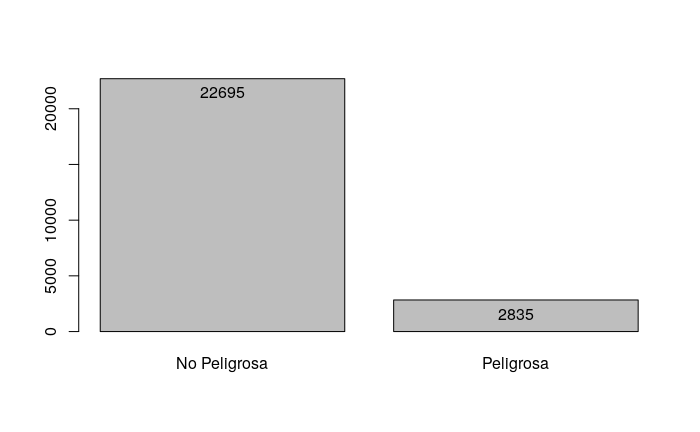
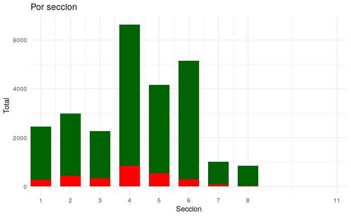
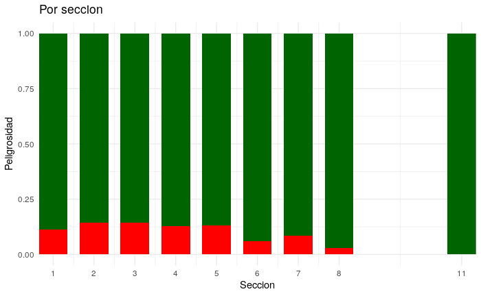
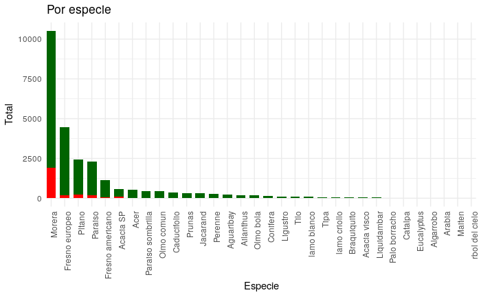
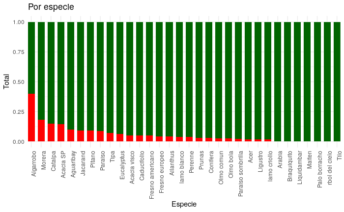
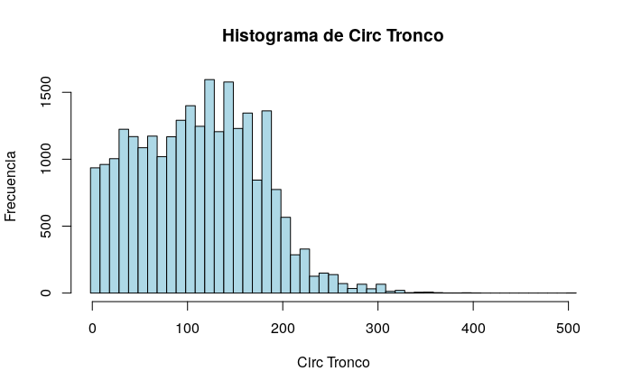
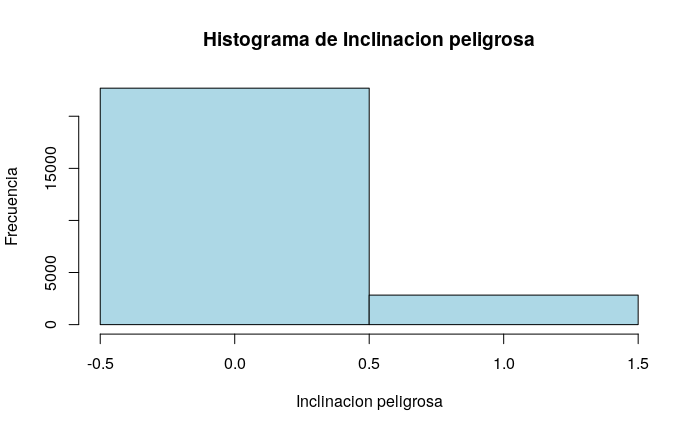
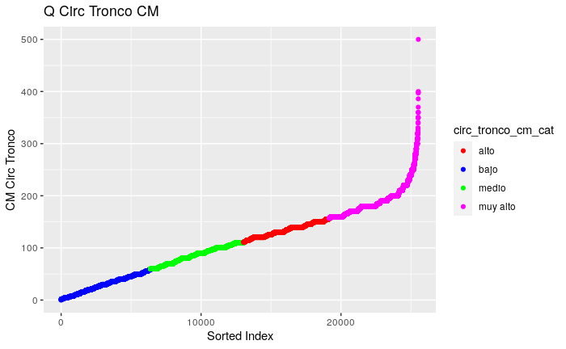

# 2.a

Parecen haber muchos (22695 vs 2835) mas ejemplares con inclinacion no peligrosa

# 2.b

La seccion mas peligrosa parece ser la seccion 3.

Cabe destacar que no tenemos informacion para las secciones 9 y 10 y muy poca info de las secciones 7 y 8

# 2.c

Al parecer tenemos muchisima informacion de Moreras, en comparacion de otras especies.

Aun asi, los algarrobos parecen presentar una inclinacion peligrosa con mayor frequencia.

Dicho esto, solo tenemos 5 ejemplares de algarrobo en nuestro dataset de entrenamiento.

# 3.b

# 3.c

No es una pregunta.

No tiene mucho sentido hacer esto, ya que solo nos da la suma total por clase, que ya contamos antes.

