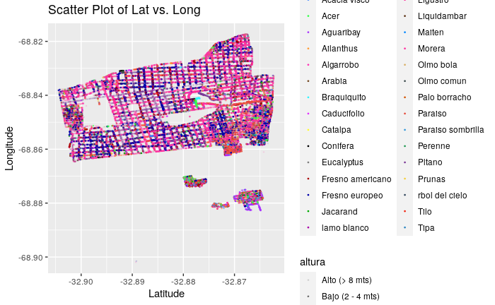
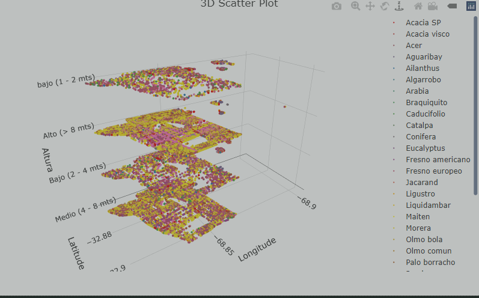

# Reporte arbolado

## Modelos utilizados

### R

Se intento con rpart, ranger, caret, xgboost y randomForest, pero no se pudo obtener un resultado satisfactorio.

La mayor parte de los modelos entrenados con R fueron llevados a cabo
por [Micaela Del Longo](https://github.com/MicaKil/ia-uncuyo-2023/blob/main/tp7-ml/tp7-reporte-arbolado.md)

Los otros, se pueden encontrar en [kaggle.md](kaggle.md).

Entre ellos, los mejores resultados fueron obtenidos con undersampling y randomForest.

| description             | accuracy  | precision | sensitivity | specificity | 
|-------------------------|-----------|-----------|-------------|-------------|
| undersample+rpart       | 0.5747415 | 0.9422263 | 0.5525009   | 0.7432796   |
| weights + rpart         | 0.5623629 | 0.9419074 | 0.5377794   | 0.7486559   |
| undersample+rf          | 0.7853338 | 0.9154984 | 0.8339837   | 0.4166667   |
| weighted+rf             | 0.7842369 | 0.9363096 | 0.8109259   | 0.5819892   |
| weighted+undersample+rf | 0.356628  | 0.9835859 | 0.2763391   | 0.9650538   |
| cv+rf                   | 0.1164394 | NaN       | 0           | 1           |

Tambien se realizaron varios analisis de la distribucion de datos

### Python

Se intentó con pytorch las siguientes arquitecturas secuenciales:

- 1 capa oculta de 128 neuronas
- 2 capas ocultas de 128 neuronas con y sin dropout
- 10 capas ocultas de 16 neuronas con y sin dropout
- 2 capas ocultas de 1024 neuronas con y sin dropout

Se probaron distintos learning_rate:

- 0.01
- 0.0001
- 0.00001
- 0.000005

Se experimento con distintos batch_size:

- 8
- 16
- 32
- 64

Se probaron varios metodos para lidiar con las clases desbalanceadas

- class_weight: Usando BCEWithLogitsLoss (Con diferentes pesos para cada clase)
- oversampling
- undersampling
- bootstrapping
- bootstrapping + oversampling

Las metricas utilizadas fueron:

- accuracy
- bce
- auc

Se utilizó un 80% del dataset para entrenamiento y un 20% para validacion.

#### Columnas

Se utilizaron todas las columnas del dataset, excepto las que no aportaban informacion (id, ultima_modificacion)

Las columnas categoricas se convirtieron a one-hot-encoding.

Los encoders fueron entrenados en el dataset completo, ya que existian especies que no estaban presentes en el dataset
de entrenamiento, pero sí en el de test.

También se experimento con feature engineering:

- Se agregó una columna que indicaba la "peligrosidad" esperada de una especie, basado en la cantidad de ejemplares de
  esa especie que tenian inclinacion peligrosa en el conjunto de entrenamiento.
- Se agregó una columna similar para otras variables categoricas - como la seccion.

#### Resultados

Los mejores modelos fueron submiteados, pero no se obtuvo un resultado satisfactorio.

En el mejor de los casos logrando 69 auc en el set de validacion.

