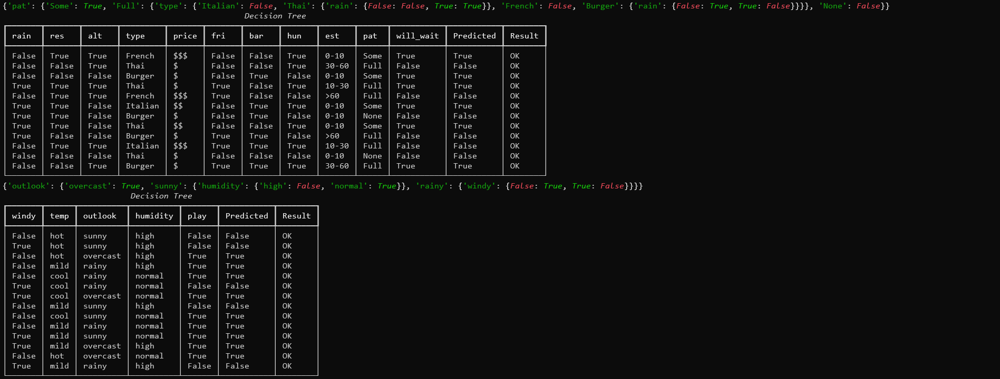

# Tree results

# Real valued decision tree Summary

Continuous or integer-valued attributes have an infinite set of possible values.
To avoid infinitely many branches, we find the split point that gives the highest information gain.
Efficient methods exist for finding good split points:

- sort the values of the attribute
- consider only split points that are between two examples (with different y values)

This can be optimized by keeping track of positive and negative examples for each possible split point.

Splitting is costly.
